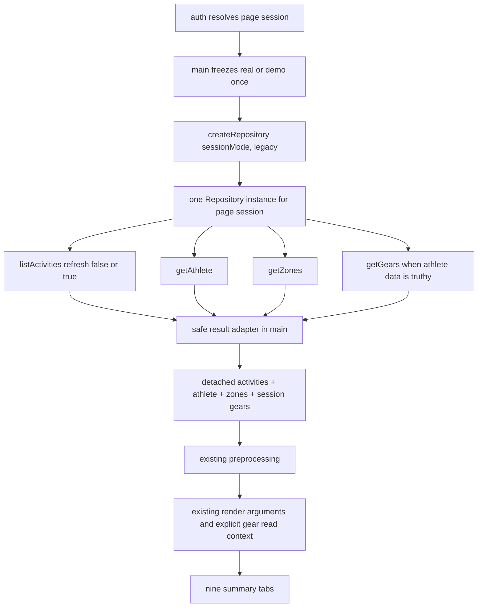

# PR-04A：汇总页面消费者迁移

## Metadata

| Field | Value |
| --- | --- |
| Status | In review |
| Base branch | `integration/v2` |
| Base SHA | `2178858f29d6c8efe5cf45de5ff07443387d2577` |
| Feature branch | `codex/v2/summary-consumers` |
| Worktree | `/Users/wangchuanliang/Documents/StravaStats-worktrees/summary-consumers` |
| Owner | XiChuan9 |
| Reviewer | Control tower + independent review |
| Related PRD | Sections 4.1, 5, 8.4, 8.6, 11.2, 19 |
| Related plan | Sprint 2 / PR-04A |
| Related ADRs | ADR-0003 (Accepted) |
| Dependencies | PR-00, PR-01, PR-02, and PR-03 merged into `integration/v2` |
| Pull request | Draft [#8](https://github.com/XiChuan9/StravaStats/pull/8) |
| Investigation Gate | Completed / PASS |
| Implementation Gate | Approved by control tower |
| Implementation | B1/B1.1, B2, and B3/B3.1-B3.4 completed; Final Review pending |
| A3 | Completed |
| A3.1 | Completed / Accepted |
| A3.2 | Completed / Accepted |
| A3.3 | Completed / Accepted |
| A3.4 | Completed / Accepted |
| A3.5 | Completed / Accepted |
| A3.6 | Completed / Accepted |
| B1 | Completed / PASS |
| B1.1 | Completed / PASS |
| B2 | Completed / PASS |
| B3.1 | Completed / PASS |
| B3.2 | Completed / PASS |
| B3.3 | Completed / PASS |
| B3.4 | Completed / PASS |
| B3 | Completed / PASS |
| Final Review | Pending |

## Goal

Determine the smallest safe migration that routes the summary-page consumers through the
PR-03 Repository boundary or an explicit application-layer read context while preserving
all observable output, analysis, navigation, and visual behavior.

## Why now

PR-03 has implemented the Legacy/Demo Repository, Factory, Connector boundary, cache
ownership, success envelope, and error contract. ADR-0003 requires consumers to stop
choosing providers, stores, caches, and APIs. PR-04A is the first consumer migration and
also owns the browser application-path verification deferred by PR-02 and PR-03.

## Investigation questions

- Which listed summary consumers actually depend on provider APIs or provider-owned cache?
- Where do initialize, refresh, Demo, authentication, metadata, and preprocessing flows
  currently cross source/storage boundaries?
- Should the composition root construct one Repository per page session or per operation?
- Should tabs receive Repository methods or already-loaded detached data/read context?
- How should `data`, `source`, `warnings`, and `partial` be adapted without exposing private
  payloads or changing UI output?
- Which activity, athlete, zone, and gear reads/writes become redundant after PR-03 cache
  ownership moves into LegacyRepository?
- How can browser-native ESM, application-path, network, storage, Cache Storage, IndexedDB,
  and Service Worker gates run against isolated synthetic/offline state?
- What exact files and tests are minimally necessary for implementation?

## Confirmed current-state facts

- `integration/v2` and `origin/integration/v2` both resolve to the fixed base SHA above.
- ADR-0003 is Accepted and requires Repository/read-projection consumer boundaries.
- PR-03 freezes seven Repository methods and the exact success envelope
  `{ data, source, warnings, partial }`.
- PR-03 keeps activities cache ownership in `main.js` only until PR-04A; the implemented
  LegacyRepository is cache-aware and owns the future read/write path.
- PR-02/PR-03 browser dynamic-import and application-path checks remain `Not run` and are
  explicitly carried into PR-04A.
- A0-A2 passed control-tower review. No A2.1 is required.
- A3 freezes decisions and implementation scope only; it does not start implementation.
- The pull request remains Draft. Ready, merge, PR-04B, PR-04C, and PR-05 are not authorized.

## A3 authorization boundary

- A3 records control-tower decisions and freezes the total and phase-specific scopes.
- `Approved for implementation` did not itself authorize immediate B1 execution. B1 later
  received separate control-tower authorization for local implementation only.
- A3.1 and B2 passed control-tower review. B2 Finalization completed, and B3 later received
  separate authorization for local browser evidence only.
- The control tower accepted the first B3 `Blocked / correction required` evidence, confirmed
  the Speed Insights remote-module root cause, and approved A3.2 plus the exact four-path B3.1
  correction and full browser rerun.
- A3.2 expands the total allowlist from ten to eleven paths only by adding
  `js/shared/utils/speed-insights.js`. It also approves complete isolated CDP evidence as the
  equivalent execution surface for the unavailable Manual DevTools UI.
- The control tower independently accepted the A3.2 scope and B3.1 Speed Insights correction,
  including its focused 12/12 and full 700/700 regressions. A3.3 is separately approved to
  split browser evidence into a Legacy root-page inventory and a strict PR-04A smoke/application
  surface. This decision does not add a twelfth total path or a fifth A3.3 path.
- Under A3.3, `/` is not a fully-offline assertion. Existing root-page D3, Chart.js,
  Cal-Heatmap, Leaflet, GTM/Analytics, VDOT, and local Analytics resources are recorded as a
  `Legacy External Resource Inventory`; they do not contaminate or relax the separately
  profiled smoke surface. The strict PR-04A browser gate remains zero-external on the served
  smoke/application-module surface.
- `External Runtime & Privacy Hardening` is a follow-up governance item covering CDN
  localization and version pinning, GTM/Analytics, the VDOT iframe, privacy copy, a truly
  offline root page, and root visual regression. It is outside PR-04A and no related product
  file may be changed here.
- The control tower accepted A3.4 and the B3.2 single-Run regression and Gear harness
  corrections. It confirmed that the remaining missing Run Plus session label is a harness
  contract defect, not a product defect: Run Plus does not embed Gear Gantt and its current
  gear filter remains the sole frozen PR-04C `tabs/api.js/getCachedGears()` exception.
- A3.5 authorizes B3.3 to correct only this Task Brief and the browser harness, then rerun the
  full isolated smoke surface. Product code is prohibited. The total allowlist remains exactly
  eleven paths, and B3.3 has exactly two authorized paths.
- After local implementation of each authorized phase, stop and return evidence for
  control-tower review before staging, committing, or pushing that phase implementation.
- Ready, merge, PR-04B, PR-04C, and PR-05 remain unauthorized.
- If implementation requires a new Repository public capability, a twelfth total path, or a
  path outside the authorized phase allowlist, stop and request a new control-tower decision.

## In scope

- Read-only inventory of `main.js`, Dashboard, Activities, Calendar, Run/Bike/Swim summary,
  Map, Gear, Wrapped, `js/tabs/index.js`, and `js/tabs/api.js`.
- Read-only call-graph, direct API/storage boundary, cache ownership, output parity, browser
  carry-over, testing, risk, and minimal-scope analysis.
- Design-only candidate rules for `js/tabs/AGENTS.md`; do not create it in A0-A2.
- A0-A2 documentation updates to this Task Brief only.

## Out of scope

- Product or test implementation before separately authorized B phases.
- PR-04B detail pages under `js/pages/**`.
- PR-04C `js/tabs/run-plus.js` and Run Plus / NSM.
- Trends (`js/tabs/athlete.js`), Planner, Weather, AI Chat, analysis changes, visual changes,
  routing, copy, HTML, CSS, and Service Worker changes.
- Canonical Repository/IndexedDB v2, import/decoder/storage/migration, shadow writer,
  parity framework, feature-mode expansion, server proxy hardening, version/dependency update.
- Real Strava network, credentials, accounts, private fixtures, or browser-profile data.

## Frozen total Allowed files

Under A3.2, the control tower freezes the following as the complete PR-04A total allowlist.
There is no twelfth path. This total allowlist does not override a narrower phase-specific
allowlist:

```text
docs/tasks/pr-04a-summary-consumers.md
js/tabs/AGENTS.md
js/app/main.js
js/tabs/run-analysis.js
js/tabs/gear.js
js/tabs/index.js
js/shared/utils/speed-insights.js
tests/consumers/summary-consumers.test.js
tests/consumers/summary-boundaries.test.js
tests/consumers/summary-browser-smoke.html
tests/legacy/demo-isolation.test.js
```

Per-file justification:

| Allowed path | Planned change | Why it cannot be completed elsewhere | Test mapping |
| --- | --- | --- | --- |
| Task Brief | Record A3/B evidence and closure only | Durable execution contract | All evidence |
| `js/tabs/AGENTS.md` | Add the A2-designed consumer boundary rules | Required nested governance belongs in this directory | Boundary source audit |
| `js/app/main.js` | Construct one Repository per page session; unwrap results; remove direct services/activity-cache ownership; inject detached activities/athlete/zones/gears; preserve loading/render/error behavior | Composition/source choice must remain at the composition root | lifecycle, call-count, envelope, error, Demo tests |
| `js/tabs/run-analysis.js` | Remove `getCachedGears` and `strava_gears`; consume the current session gear read context while keeping render inputs/outputs stable | Gear Gantt is implemented here; main alone cannot remove this tab-owned cache read | gear label/order and static-boundary tests |
| `js/tabs/gear.js` | Remove provider cache reads; accept current session gears; retain `gear-custom-*` and `gearEditMode` | Gear cards/charts repeatedly call the local `getGears()` helper in this module | custom-data, order, empty, and boundary tests |
| `js/tabs/index.js` | Re-export the explicit Run summary read-context setter without changing existing render exports | Keeps `main.js` on the established tab public entry while allowing the Run Plus shared renderer to see the same session gears without editing `run-plus.js` | exact export/import and Run Plus regression |
| `js/shared/utils/speed-insights.js` | Remove the cross-origin module dependency; keep local development offline and production telemetry same-origin and idempotent | The first B3 run proved that this existing utility makes the actual `main.js` graph depend on `esm.sh`; neither the harness nor main can correct that boundary | Speed Insights static/runtime boundary and full browser network gates |
| `summary-consumers.test.js` | Deterministic orchestration, envelope, call-count, error, injection, output-input parity tests | New PR-04A behavior has no focused test home | main and consumer matrix |
| `summary-boundaries.test.js` | Static import/API/storage boundary allow/deny matrix | Prevents future provider/cache regression across exact consumer files | direct API/storage audit |
| `summary-browser-smoke.html` | Served `<script type="module">` synthetic harness for native browser imports and DOM-reported probe results | Controlled `playwright.evaluate` cannot load modules; no dependency may be added | browser application-path gate |
| `tests/legacy/demo-isolation.test.js` | Replace pre-PR-04A main cache-loader assertions with Repository construction/list/metadata assertions and preserve Demo/Run Plus guards | Existing tests compile `loadActivitiesForSession` markers and will become stale; this is the established Demo privacy regression suite | Demo zero real I/O, PR-01/PR-03 regression |

Explicitly excluded after investigation because no product diff is needed:

```text
js/tabs/dashboard.js
js/tabs/activities.js
js/tabs/calendar.js
js/tabs/bike-analysis.js
js/tabs/swim-analysis.js
js/tabs/maps.js
js/tabs/wrapped.js
```

`js/tabs/api.js` is also excluded: after PR-04A it remains an intentional PR-04C carry-over
used only by `run-plus.js`. Deleting or changing it would require modifying the prohibited
PR-04C consumer. The control tower accepts only this scoped exception; no other tab may use it.

## Prohibited files and operations

All paths outside the frozen eleven-path total allowlist are prohibited. In A3, the only
allowed path was this Task Brief. Prohibited paths include, without limitation:

```text
AGENTS.md
package.json
package-lock.json
index.html
styles/**
sw.js
api/**
.github/**
js/app/auth.js
js/app/auth-lifecycle.js
js/app/feature-flags.js
js/connectors/**
js/repository/**
js/services/**
js/demo/**
js/data/**
js/shared/** except `js/shared/utils/speed-insights.js`
js/pages/**
js/models/**
js/analysis/**
js/tabs/api.js
js/tabs/run-plus.js
js/tabs/athlete.js
js/tabs/planner.js
js/tabs/weather.js
js/tabs/ai-chat.js
docs/architecture/**
docs/product/**
docs/engineering/**
docs/migrations/**
all other Task Briefs
```

Also prohibited: rebase, amend, force-push, merge, Ready conversion, branch/worktree deletion,
real tokens/network/accounts/private data, private fixture enumeration, existing browser-profile
mutation, Legacy cache deletion, IndexedDB v2 creation, migration, dependency changes, and
`git add .` / `git add -A`.

The following investigated consumers need no product diff and remain explicitly excluded:

```text
js/tabs/dashboard.js
js/tabs/activities.js
js/tabs/calendar.js
js/tabs/bike-analysis.js
js/tabs/swim-analysis.js
js/tabs/maps.js
js/tabs/wrapped.js
```

## Interfaces and expected outputs

- Existing public Repository entry remains `js/repository/index.js`.
- Existing factory remains `createRepository({ sessionMode, mode: 'legacy' })`.
- Existing public methods and `{ data, source, warnings, partial }` success envelope remain
  unchanged unless the control tower separately approves a contract expansion.
- Summary consumers must preserve activity order, filters, totals, chart datasets, maps,
  labels, empty/error behavior, Demo output, DOM identifiers/classes, routes, and styles.
- Provider-owned activity/athlete/zones/gears data must originate from Repository/read context.
- UI preferences and user overrides may remain in UI-owned storage only with an explicit,
  documented boundary; Demo must never fall back to real provider storage.

## A3 frozen implementation contract

This section is the authoritative implementation contract and supersedes any A2 wording such
as “candidate”, “proposal”, or “recommendation”. It approves scope and decisions only; it does
not authorize B1, B2, or B3 execution.

### Repository lifecycle and composition boundary

- Each authenticated or Demo page session creates exactly one Repository with:

  ```js
  createRepository({
    sessionMode,
    mode: 'legacy'
  })
  ```

- `sessionMode` is frozen during initialize. Refresh reuses the same Repository and must not
  call `isDemoMode()` to reselect the source or create a second Repository.
- Login, logout, or Demo/Real switching continues to rely on the existing reload/new page
  session to create a new Repository.
- `main.js` is the only composition root:

  ```text
  auth/session
  → freeze sessionMode
  → create Repository
  → Repository methods
  → main result adapter
  → preprocessing/session context
  → summary renderers
  ```

- Activities, athlete, zones, and gears are provider-owned and come only from Repository.
- Tabs receive detached data/read context from main. They neither construct nor retain a
  Repository reference and cannot select Connector, provider, services API, Repository
  implementation, activity/metadata cache, IndexedDB, or Token storage.

### Cache ownership and frozen Repository contract

- Activities cache reads/writes belong only to LegacyRepository.
- Metadata and gear cache operations belong only to LegacyRepository/LegacyCacheAdapter.
- main no longer calls `getCachedActivities`, `saveCachedActivities`, `fetchAllActivities`,
  `fetchAthleteData`, `fetchTrainingZones`, `fetchAllGears`, or `setCachedGears`, and does not
  repeat the aggregate gear write.
- DemoRepository performs zero real Token, Connector, activity-cache, and metadata-cache I/O.
- No Legacy data is deleted, cleaned, or migrated.
- The PR-03 public API remains frozen: `createRepository`, `listActivities`, `getAthlete`,
  `getZones`, and `getGears`, with `{ data, source, warnings, partial }`.
- Do not add or change any public export/method, success field, `source`, warning/error code,
  Factory mode, or Connector contract. A real need for expansion is a stop condition.

### Main result adapter and error parity

The control tower approves a private, testable application result adapter in `main.js`. It:

- validates the envelope shape and fails closed for malformed envelopes;
- does not sort, normalize, mutate, or reorder Repository data;
- uses `source` only for approved generic loading copy;
- observes warnings only through stable safe fields or counts, never payload, activity name,
  ID, location, HR, Power, Token, raw error, or private data;
- handles `partial` per operation; activity partial/malformed data cannot reach preprocessing,
  while gear partial may use the successful Repository items without storage fallback;
- does not retry Repository operations in main;
- never turns `TOKEN_WRITE_FAILED` into false-success data;
- does not delete Local Library or invent logout behavior for 401/403.

Initialize retains the current athlete/zones timeout plus `Promise.allSettled` optionality;
each may independently degrade to `null`, and gear remains optional. Refresh retains the
current required athlete/zones behavior and optional gear behavior. Preprocessing failures
continue to the existing generic top-level error. User-visible errors, loading copy, routes,
and page structure remain unchanged except an approved safe source-copy substitution backed by
exact parity evidence.

### Preprocessing identity correction

PR-04A does not modify `js/shared/preprocessing/**`, but main must always pass an explicit
Repository-derived athlete context that prevents preprocessing from reading the real
`strava_athlete_data` fallback.

- Demo may use an explicit safe Demo display identity. Missing, malformed, empty, or ID-only
  Demo athlete data receives an anonymous, non-persistent Demo preprocessing context containing
  no real identity. It is not rendered, persisted, or logged.
- Real mode preserves valid Repository `id`, `max_hr`, and all existing preprocessing fields.
  A missing athlete receives a non-persistent local sentinel. An ID-only or identity-incomplete
  athlete receives a new object preserving Repository fields plus a non-identity sentinel.
- Repository return objects are never mutated. Sentinels are never rendered, stored, or logged.
- Tests must send at least one non-empty synthetic activity through
  `preprocessActivities → applyIndoorSwimPool20mCorrection → isTargetAthleteAlexGascon` and prove
  for Demo and Real missing-identity cases: zero `strava_athlete_data` reads, normal activity
  return, preserved Repository ID/max_hr, no persistence, and no identity leakage.
- Open-Meteo and preprocessing weather algorithms remain unchanged. `strava_demo_mode` and
  Open-Meteo behavior are a recorded Legacy enrichment carry-over, not Repository contract.
  B3 must prove Demo external fetch, Token, Connector, and real-cache I/O are all zero. Any
  Demo Open-Meteo or external request blocks PR-04A Final Review.

### Run and Gear session context

The internal Run boundary is frozen as `setRunSessionGears(gears)`.

- It accepts only Repository session gears, stores a detached read-only array snapshot, and
  fails closed to `[]` for non-array input.
- It never reads `getCachedGears()` or `strava_gears` and never falls back to real storage.
- Initialize and refresh clear it before loading. Failures leave it empty. Successful gears are
  set before any Run or Run Plus render.
- `js/tabs/index.js` only re-exports this internal boundary. The actual Run Gear Gantt verifies
  the injected labels, activity gear order, duplicate last-write behavior, ID fallback, detached
  snapshot, and zero `strava_gears` reads.
- `run-plus.js` remains unchanged and imports the same queryless `run-analysis.js` module
  instance. Its embedded `renderRunAnalysisTab()` must complete safely, including the one-Run
  regression degradation, but Run Plus does not embed Gear Gantt and therefore is not required
  to display the session-context gear label in its DOM or chart configs.
- Tests cover re-auth, refresh failure, empty/malformed gears, duplicate IDs, and stale-context
  prevention.

`renderGearTab` receives the current session gear snapshot. Its handlers and rerenders use only
that snapshot and never provider cache. `gear-custom-*`, `gearEditMode`, price/durationKm,
sort/filter, retired state, labels, charts, notifications, order, and duplicate behavior remain
unchanged. Missing/malformed Demo gears become `[]` without real-storage fallback.

### `tabs/api.js` PR-04C exception

`js/tabs/api.js` is prohibited in PR-04A and temporarily remains solely for PR-04C
`js/tabs/run-plus.js`. Static tests must prove Run, Gear, and every other PR-04A summary
consumer no longer imports it and that `run-plus.js` is its only remaining importer. This
exception authorizes no other provider-cache consumer. Until PR-04C, the Run Plus gear filter
may read only `strava_demo_mode` and `strava_demo_gears` on the Demo path; it must never read
real `strava_gears`, Token, Connector, provider network, or a real provider-cache fallback.
Migrating that filter to Repository/session context belongs to PR-04C, not PR-04A.

### Frozen phase-specific allowlists

A3 allows only:

```text
docs/tasks/pr-04a-summary-consumers.md
```

B1 scope, completed and accepted by the control tower:

```text
docs/tasks/pr-04a-summary-consumers.md
js/tabs/AGENTS.md
js/app/main.js
tests/consumers/summary-consumers.test.js
tests/consumers/summary-boundaries.test.js
tests/legacy/demo-isolation.test.js
```

B2 scope, completed and accepted by the control tower:

```text
docs/tasks/pr-04a-summary-consumers.md
js/app/main.js
js/tabs/run-analysis.js
js/tabs/gear.js
js/tabs/index.js
tests/consumers/summary-consumers.test.js
tests/consumers/summary-boundaries.test.js
tests/legacy/demo-isolation.test.js
```

B3 initial scope, authorized and accepted as `Blocked / correction required`:

```text
docs/tasks/pr-04a-summary-consumers.md
tests/consumers/summary-browser-smoke.html
```

A3.2/B3.1 correction and full-rerun scope, separately authorized:

```text
docs/tasks/pr-04a-summary-consumers.md
js/shared/utils/speed-insights.js
tests/consumers/summary-boundaries.test.js
tests/consumers/summary-browser-smoke.html
```

The CDP equivalent-evidence exception is approved for this rerun. Manual DevTools UI is no
longer a blocker, but Network, Runtime/Console, Page/DOM, Storage/Application, screenshot, and
browser-isolation evidence must all be present in the isolated CDP record. B3.1 and the rerun
are not yet Completed/PASS or accepted for Finalization.

Each B phase requires separate authorization and must stop for control-tower review after its
local implementation. No implementation may be staged, committed, or pushed before that
review authorizes publication. If B3 finds a product defect, stop and request a separate
correction phase; do not reopen B1/B2 paths implicitly.

### A3.1 B2 phase-allowlist correction — Completed / Accepted

The control tower approved A3.1 before B2 implementation because the frozen B2 lifecycle
contract requires the composition root to clear and set Run session gear context and inject
`sessionGears` into Gear rendering. A3.1 adds `js/app/main.js` to the B2 phase allowlist. This is
not a total-scope expansion: `main.js` was already one of the ten frozen PR-04A paths, the total
allowlist remained ten paths at A3.1, and B2 was limited to the eight paths above. A3.2 later
expanded the total scope to eleven paths solely for the accepted B3 Speed Insights blocker.

B2 implements `setRunSessionGears(gears)`, re-exports it only through `js/tabs/index.js`, clears
both main and Run gear state before initialize/refresh loads, sets successful session gears
before any Run/Run Plus/Gear render, and injects the same current session snapshot into
`renderGearTab`. Control-tower code re-verification and an independent focused run of 71/71
tests passed. B2 is `Completed / PASS`; this does not authorize B3, Ready, or merge.

## Acceptance criteria

- A0 evidence includes exact SHAs, ahead/behind, object-existence audit, actual results from
  all five baseline commands, and final clean V2 status.
- A2 contains the ten-consumer matrix, current/target call graphs, static audit, storage
  classification, Repository lifecycle/envelope/error recommendation, call-count matrix,
  gear injection, output parity, browser plan, tests, risks, exact candidate Allowed files,
  prohibited files, phased proposal, decisions, and `Not run` items.
- A0-A2 passed control-tower review; no A2.1 is required.
- Investigation Gate is `Completed / PASS`; Implementation Gate is `Approved by control tower`.
- A3 is Completed; B1 and B1.1 are `Completed / PASS` after control-tower re-review.
- A3.1 and B2 are Completed/PASS after control-tower review. The first B3 blocker is accepted;
  A3.2/B3.1 and the complete rerun are authorized locally but not yet reviewed.
- The B1 change is limited to the exact six-path B1 allowlist.
- Draft PR remains Draft and is neither marked Ready nor merged.

## Required automated checks

At A0 and after each documentation commit, record actual results for:

```text
npm ci
npm run check:syntax
npm run check:privacy
npm test
git diff --check
```

Also audit exact changed/staged/untracked paths and wait for GitHub Actions at each pushed
head. Future B-phase tests must be offline, deterministic, synthetic, dependency-free, use
existing `node:test`, and never enumerate or read `tests/fixtures/private/**`.

## Manual/browser verification

A3 approves the B3 served `<script type="module">` synthetic/offline plan for native browser
ESM imports, exact validator exports/calls, application-path module loading, network
instrumentation, local/session storage, IndexedDB, Cache Storage and Service Worker snapshots.
Nothing not actually run may be reported as Pass; Node and direct module-URL loading are not
substitutes for browser ESM execution.

## Privacy and security impact

A0-A3 are documentation-only. They read no real Token, account, activity, GPS, heart-rate,
power, device, private fixture, or existing browser-profile data. No external activity data
or payload is logged. Browser probing, if any, must use an isolated fresh profile and fully
synthetic/offline inputs.

## Migration impact

A0-A3 perform no migration, do not create IndexedDB v2, and do not read, modify, clean, or
delete Legacy cache or any existing browser storage.

## Rollback procedure

The only repository change in A0-A3 is this Task Brief in ordinary commits. Roll back with an
ordinary revert commit. Do not delete the branch or worktree as an investigation rollback and
do not clear any browser or Legacy storage.

## A0 baseline evidence

Executed 2026-08-01 in Asia/Shanghai on macOS 15.7.3 (24G419), Node v25.8.1,
npm 11.11.0.

| Audit | Actual result |
| --- | --- |
| Main repository | `/Users/wangchuanliang/Documents/StravaStats`; `main`; clean |
| V2 worktree | `/Users/wangchuanliang/Documents/StravaStats-worktrees/v2`; locked as `Long-lived v2 integration worktree`; clean |
| Local `integration/v2` | `2178858f29d6c8efe5cf45de5ff07443387d2577` |
| `origin/integration/v2` after `git fetch origin --prune` | `2178858f29d6c8efe5cf45de5ff07443387d2577` |
| Local/remote ahead/behind | `0/0` |
| Feature worktree before A1 | Absent |
| Local feature branch before A1 | Absent |
| Remote feature branch before A1 | Absent |
| Task Brief before A1 | Absent |
| Same base/head PR before A1 | Absent (`gh pr list --repo XiChuan9/StravaStats ...` returned `[]`) |
| `npm ci` | Pass; added 6 packages; audited 7; 0 vulnerabilities |
| `npm run check:syntax` | Pass; 131 files |
| `npm run check:privacy` | Pass |
| `npm test` | Pass; 650 tests, 650 pass, 0 fail/skipped/todo |
| `git diff --check` | Pass; no output |
| V2 final status | Clean; `integration/v2...origin/integration/v2` |

The initial sandboxed fetch and `npm ci` attempts returned filesystem `EPERM`; each required
command was re-run unchanged with the approved repository/worktree permission and then passed.
This was an environment permission boundary, not a repository failure.

## A1 evidence

- Worktree: `/Users/wangchuanliang/Documents/StravaStats-worktrees/summary-consumers`.
- Branch: `codex/v2/summary-consumers`.
- Starting HEAD: exact fixed base `2178858f29d6c8efe5cf45de5ff07443387d2577`.
- Git automatically set the new branch to track the base remote; that incorrect temporary
  upstream was immediately unset before any file change. The first normal push then set the
  correct upstream `origin/codex/v2/summary-consumers`.
- Initial Task Brief commit:
  `c82ce35573f654e278446f6a768b3392d79af168`
  (`docs(v2): define PR-04A summary consumer investigation`).
- Push: normal `git push -u origin codex/v2/summary-consumers`; no force push.
- Draft PR: [#8](https://github.com/XiChuan9/StravaStats/pull/8),
  `integration/v2` <- `codex/v2/summary-consumers`.
- A1 CI Run:
  [30692237511](https://github.com/XiChuan9/StravaStats/actions/runs/30692237511).
- A1 CI Job:
  [91348880469](https://github.com/XiChuan9/StravaStats/actions/runs/30692237511/job/91348880469).
- A1 CI head: `c82ce35573f654e278446f6a768b3392d79af168`.
- Install, syntax, privacy, and tests steps: `success`; overall: `success`.
- A1 local recheck: 131 syntax files, privacy Pass, 650/650 tests, diff check Pass.

## A2 summary consumer inventory

There are ten inventory rows: one composition root plus nine summary page categories.

| Consumer | Actual path / entry | Current input and data source | Direct boundary findings | Proposed injection / actual diff need |
| --- | --- | --- | --- | --- |
| Composition root | `js/app/main.js`; DOMContentLoaded -> `initializeApp()` / `refreshActivities()` | Auth callback, `isDemoMode()`, activities via Demo or `getCachedActivities`/`fetchAllActivities`/`saveCachedActivities`; athlete/zones/gears via services; then preprocessing and tab render | Imports services facade and activity cache; owns activity cache read/write and duplicate aggregate gear write; reads UI settings/filters; no direct `/api/strava-*` literal | Construct/reuse one Repository per page session; unwrap results; inject detached session context. **Modify.** |
| Dashboard | `js/tabs/dashboard.js`; `renderDashboardTab(allActivities, from, to)` | Preprocessed activities and date filters from main | No API, services, provider cache, fetch, IndexedDB, Token, or Repository. `dashboard_readiness_hrv` and `training_goals` are user data | Continue injected activities. Preserve HRV/goals. **No product diff.** |
| Activities | `js/tabs/activities.js`; `renderActivitiesTab(allActivities)` | Preprocessed activities from main | No API/storage/fetch/Repository hit in audit | Continue injected activities. **No product diff.** |
| Calendar | `js/tabs/calendar.js`; `renderCalendarTab(allActivities)` | Preprocessed activities from main | No API/storage/fetch/Repository hit | Continue injected activities. **No product diff.** |
| Run summary | `js/tabs/run-analysis.js`; `renderRunAnalysisTab(allActivities, from, to, gearFilter, window, options)` | Activities from main; gear Gantt names from `getCachedGears()` then raw `strava_gears` fallback | Imports `./api.js` -> services; provider cache read and localStorage fallback | Receive current session gears through an explicit read context set by main; never Repository/provider/cache in tab. **Modify.** |
| Bike summary | `js/tabs/bike-analysis.js`; `renderBikeAnalysisTab(...)` | Activities/filters/window from main | No API/storage/fetch/Repository hit | Continue injected activities. **No product diff.** |
| Swim summary | `js/tabs/swim-analysis.js`; `renderSwimAnalysisTab(...)` | Activities/filters/window from main | No API/storage/fetch/Repository hit | Continue injected activities. **No product diff.** |
| Map | `js/tabs/maps.js`; `renderMapTab(activities, from, to)` | Activities/polylines and filters from main | No provider API/cache/storage/fetch/Repository; Leaflet tile construction is visual map infrastructure, not Strava data selection | Continue injected activities. **No product diff.** |
| Gear | `js/tabs/gear.js`; `renderGearTab(allActivities)` | Activity usage from main; gear metadata from `getCachedGears()` / raw `strava_gears`; user custom metadata from `gear-custom-*` | Provider cache dependency plus legitimate user/UI storage | Inject `sessionGears`; preserve user/UI keys. **Modify.** |
| Wrapped | `js/tabs/wrapped.js`; `renderWrappedTab(allActivities, options)` | Activities from main; local option recursion only | No API/storage/fetch/Repository hit | Continue injected activities. **No product diff.** |

`js/tabs/index.js` is the existing export surface and needs only the proposed read-context
setter export. `js/tabs/api.js` is a one-line `getCachedGears` re-export. After Run/Gear are
migrated, only out-of-scope `run-plus.js` still imports it.

## Static direct API and storage audit

Command family:

```text
rg -n -i "/api/strava-|fetch\s*\(|localStorage|sessionStorage|indexedDB|
strava_tokens|Authorization|services/api|tabs/api|activity-cache|
getCachedActivities|saveCachedActivities|getCachedGears|strava_gears|
createRepository|isDemoMode|demo/index|DemoRepository" <exact A2 scope>
```

Exact findings in the required scope:

| Pattern | Findings |
| --- | --- |
| `/api/strava-`, `fetch(`, `Authorization`, `strava_tokens` | No hits in main + nine summary tabs + `tabs/index.js` + `tabs/api.js` |
| `indexedDB` / `sessionStorage` | No hits in the same scope |
| `createRepository` | No current hit; confirms consumer wiring has not started |
| Activity cache | `main.js` imports and calls `getCachedActivities` / `saveCachedActivities` in the loader used by initialize and refresh |
| Demo choice | `main.js` imports `getDemoActivities` / `isDemoMode`; `isDemoMode()` occurs twice, once in initialize and once in refresh |
| Provider gear cache | Run and Gear import `getCachedGears` through `tabs/api.js`; both also read raw `strava_gears` |
| UI settings | `main.js`: `dashboard_settings` and `dashboard_filters` reads/writes |
| User readiness/goals | Dashboard: `dashboard_readiness_hrv` get/remove/set and `training_goals` get/set |
| User gear metadata/UI state | Gear: `gear-custom-${gearId}` get/set and `gearEditMode` get/set |

Broader call-graph inspection (outside the summary scan) confirms that `services/api.js` owns
direct `/api/strava-*`, Authorization, Token, and metadata cache behavior, while
`services/activity-cache.js` owns Legacy activity IndexedDB/localStorage. PR-03's Connector,
LegacyRepository, and cache adapter already encapsulate these capabilities.

Resolved preprocessing boundary: `js/shared/preprocessing/core.js` reads
`strava_athlete_data` when the injected athlete lacks identity and reads
`strava_demo_mode` to suppress direct Open-Meteo weather fetches. This is neither a summary
tab nor Strava API call, but the Demo-mode read conflicts with a literal interpretation of
“session mode only at composition root.” `js/shared/**` remains prohibited. A3 requires main to
pass the explicit non-persistent Repository-derived athlete/sentinel context described above,
so identity fallback is never reached. The `strava_demo_mode`/Open-Meteo behavior remains the
explicit Legacy enrichment carry-over and is guarded by the B3 zero-external-I/O blocker.

## Provider, UI, user, and Demo storage classification

| Class | Keys / storage | Owner after PR-04A | Rule |
| --- | --- | --- | --- |
| Provider-owned activities | Legacy activity IndexedDB entry and fallback `strava_activities`, timestamp, cache version | LegacyRepository through injected activity cache | main/tab direct reads and writes become zero |
| Provider-owned metadata | `strava_athlete_data`, `strava_training_zones`, aggregate/per-ID `strava_gears` keys and timestamps | LegacyRepository/LegacyCacheAdapter | main/tab direct reads/writes become zero; main must not call `setCachedGears` |
| Authentication | `strava_tokens` | Connector/auth lifecycle only | tabs/main summary loader do not read/write; Token failure remains redacted |
| Session source flag | `strava_demo_mode` | auth + composition root; preprocessing exception pending A3 | Freeze once for the page session; refresh must not reselect source |
| Demo provider namespace | Frozen nine `strava_demo_*` / `strava_tokens_demo` keys | Demo provider/DemoRepository/auth | no fallback to any real key, Connector, activity cache, or metadata cache |
| UI preference | `dashboard_settings`, `dashboard_filters`, `gearEditMode` | main/Gear UI | Preserve exact keys and behavior; not provider data |
| User analysis input | `dashboard_readiness_hrv`, `training_goals` | Dashboard | Preserve; do not migrate/delete or confuse with provider cache |
| User custom metadata | `gear-custom-*` | Gear UI/UserOverride candidate for future architecture | Preserve price/durationKm, labels, and writes exactly; do not move in PR-04A |
| Out-of-scope feature state | Run Plus/NSM keys, Planner, AI key, etc. | Their existing modules | No read, migration, or modification in PR-04A |

## Current initialize and refresh call graph

```mermaid
flowchart TD
    Auth[handleAuth / loginWithDemo] --> Init[initializeApp]
    Init --> Mode[isDemoMode: freeze only for this call]
    Mode --> Loader[loadActivitiesForSession]
    Loader -->|Demo| DemoActivities[getDemoActivities]
    Loader -->|Real initialize| ActivityCache[getCachedActivities]
    ActivityCache -->|miss| Facade[fetchAllActivities]
    Loader -->|Real refresh| Facade
    Facade --> Connector[StravaApiConnector]
    Connector --> ActivityApi[/api/strava-activities]
    Facade --> CacheWrite[saveCachedActivities]
    DemoActivities --> Metadata
    CacheWrite --> Metadata[fetchAthleteData + fetchTrainingZones]
    Metadata --> GearFacade[fetchAllGears athlete]
    GearFacade --> GearCache[per-ID/provider cache and network]
    GearFacade --> DuplicateWrite[main setCachedGears aggregate write]
    DuplicateWrite --> Prep[preprocessActivities]
    Prep --> Render[setup + Run eager render + lazy summary tabs]

    Refresh[refreshActivities] --> Mode2[isDemoMode reselected]
    Mode2 --> Loader2[list path refresh]
    Loader2 --> Metadata2[athlete then zones required]
    Metadata2 --> Gear2[gear optional]
    Gear2 --> Prep2[preprocess]
    Prep2 --> Reset[clear renderedTabs and rerender]
```

Authentication/error behavior today:

- `handleAuth` chooses OAuth, persisted Demo, valid real Token, expiry, or unauthenticated path
  before calling initialize.
- Activity failure or preprocessing failure reaches the top-level generic `handleError`.
- Initialize athlete/zones use two 8-second races and `Promise.allSettled`; failures are optional.
- Initialize gears are attempted only when athlete is truthy and are optional.
- Refresh athlete/zones are sequential required calls; failure aborts refresh; gear remains optional.
- Connector refresh Token write failure withholds data; 401/403 are generic app errors and do
  not clear Local Library.

## Frozen target call graph



Frozen decisions:

- Construct exactly one Repository per authenticated/Demo page session, not once per operation
  and not once per refresh. This preserves PR-03 athlete memo/coalescing and gives a stable
  source boundary.
- Freeze `sessionMode` when initialize starts; create the Repository then. Refresh reuses both
  values and calls `listActivities({ refresh: true })`. Source-mode changes already reload via
  login/logout and therefore create a new page session.
- Tabs do not hold Repository and never call `createRepository`. Main loads detached data and
  injects a read context. This best matches ADR-0003 and minimizes output changes.
- No new public Repository method/export/source/warning/error is needed. Discovery of such a
  need is a stop condition.

## Frozen Repository success envelope and error policy

Add a private/testable application helper in `js/app/main.js`; do not add a Repository API.
For every result it must:

1. validate only the frozen `{ data, source, warnings, partial }` envelope shape;
2. return `data` without sorting, normalizing, or cloning again (Repository already detaches);
3. use `source` only for approved generic loading text (`cache`, `network`, `demo`, `mixed`);
4. observe warnings only as `{ code, operation, retryable, itemIndex? }` or aggregated counts;
5. never log data, payload, raw errors, Token, IDs, activity names, locations, or health data;
6. treat `partial` by operation, not as a generic error.

Operation policy:

| Result | Frozen handling |
| --- | --- |
| Activities complete | Preserve array order and current loading count/message; preprocess |
| Activities unexpected partial/shape | Fail closed into existing generic initialization/refresh error |
| Athlete/zones warning/failure | Preserve current optional initialize behavior; null context and generic warning |
| Gear complete | Inject ordered array |
| Gear partial | Inject successful items in Repository order, show/log only safe generic partial warning, never fallback or aggregate-write |
| Empty gear array | Legitimate complete empty state; not partial |
| `UNAUTHENTICATED` / `FORBIDDEN` | Preserve generic error and Local Library; do not invent logout/cache deletion in PR-04A |
| `TOKEN_WRITE_FAILED` | Operation fails with no false-success data and no main retry/write |
| Rate/network/provider/response errors | Use stable code only for safe control flow; no raw cause/payload |
| Preprocessing failure | Preserve existing generic top-level error; do not render partial processed output |

## Initialize, refresh, Demo, and call-count matrix

The counts below are frozen observable contracts. Metadata network/Token counts are conditional
on cache state and gear cardinality, so the exact formula is recorded instead of a false fixed
number.

| Scenario | Repository construction | listActivities | Activity cache R/N/W | Metadata/Gear | Demo provider | Token/network |
| --- | ---: | ---: | --- | --- | --- | --- |
| Real initialize cache hit | 1 per page session | 1 with `refresh:false` | `1/0/0` | getAthlete 1; getZones 1; getGears 1 only if athlete data truthy | 0 | activity Token/network 0; each metadata miss owns exactly one Connector request |
| Real initialize cache miss/empty/expired/version mismatch | same instance | 1 with `refresh:false` | `1/1/1` | same policy | 0 | activity Token read 1, network 1, refreshed Token write 0 or 1 |
| Real initialize activity cache read failure | same | 1 | `1 failed/1/1`; safe `CACHE_READ_FAILED` | same policy after activity success | 0 | one activity Connector request |
| Real refresh | 0 new; reuse session instance | 1 with `refresh:true` | `0/1/1` | preserve current required athlete/zones refresh semantics; gear optional | 0 | one activity Connector request plus conditional metadata requests |
| Demo initialize | 1 DemoRepository | 1 with `refresh:false` | `0/0/0` real cache | getAthlete/getZones once; getGears only if athlete data truthy | activities/athlete/zones/gears only | Connector 0; Token R/W 0; real metadata R/W 0 |
| Demo refresh | reuse DemoRepository | 1 with `refresh:true` | `0/0/0` | same calls, Demo-only | Demo namespace only | Connector/network/Token/real cache 0 |
| Athlete/zones initialize failure | same | unchanged | unchanged | each promise settles independently after existing timeout; missing value injected as null | no fallback real in Demo | no main retry |
| Gear item failure | same | unchanged | unchanged | one getGears; successful items retained; `partial:true`; aggregate write 0, successful per-ID writes may exist inside Repository | no real fallback | one request per missing gear ID only |
| Token write failure | same | one attempted operation | activity cache write 0 because Repository has no success data | downstream loading not started if activities fail | n/a | one network; one failed Token write; no second write |
| 401/403 | same | one attempted operation | no activity cache write | initialization/refresh stops if activity call; metadata remains operation-specific | n/a | one request; no cache/library deletion |
| Other Repository error | same | one attempted operation | no false-success write | current generic optional/top-level behavior | n/a | no duplicate request by main |
| Preprocessing failure | same | already complete | Repository ownership unchanged | already loaded context remains memory-only | isolated | zero retry; generic error |

For any Connector-backed public operation: Token read is exactly one per actual network request;
refreshed Token write is at most one and occurs only when the response supplies valid refreshed
tokens. `getGears()` aggregate hit causes zero gear-item network/cache reads; aggregate miss
preserves shoes-before-bikes order, duplicate IDs, per-ID one-read/at-most-one-network/write,
and safe item-index warnings. main performs no extra activity/metadata cache read or write.

## Frozen Gear and metadata injection

- main stores only the Repository-returned `sessionGears` array for the current page session.
- main must remove `fetchAllGears` and `setCachedGears`; Repository owns aggregate/per-ID cache.
- `buildSessionGearNameMap()` remains order-compatible: Repository preserves shoes then bikes
  and duplicates; the current `Map` continues last-write-wins for duplicate IDs.
- Run summary receives an explicit module read context before any main/Run Plus render. Its
  gear Gantt keeps activity-derived gear ID order, current labels, datasets, and ID fallback.
- Gear tab accepts current session gears when rendered and its internal helpers use only that
  array. No `getCachedGears()` or `strava_gears` fallback remains in PR-04A consumers.
- Demo missing/malformed gears becomes empty; it never falls back to real gears.
- `gear-custom-*` price/durationKm remains user-owned and unchanged.
- `gearEditMode` remains UI state and unchanged.
- Gear `type` inference, sort (`lastUse` default), retired filter, duplicate behavior, card
  labels, charts, HTML, classes, and notification behavior remain unchanged.
- `tabs/api.js` remains only because `run-plus.js` is prohibited; boundary tests must assert
  Run/Gear no longer import it while recording the PR-04C exception.

## Summary output parity freeze

No implementation may change algorithms, numeric thresholds, chart configuration, HTML/CSS,
copy, routes, or navigation.

| Page | Observable outputs that must remain identical for the same synthetic input |
| --- | --- |
| Dashboard | Input order; effective date windows; totals/current-vs-previous; TSS/PMC, readiness, HRV, goals; chart labels/datasets; cards; empty/error states; DOM IDs/classes |
| Activities | Row order after existing sort; grouping/aggregation; visible columns/cells; filters; CSV content/order; links; empty state |
| Calendar | Date grouping, streaks, period totals, sport colors/icons, calendar cells and activity links |
| Run | Date/gear filters; run order; summary cards; all current chart datasets; tables/top runs; gear Gantt month/gear order and labels; Run Plus embedded render compatibility |
| Bike | Sport/type filters, gear filter, totals, histograms/scatters/trends/Eddington datasets, tables and labels |
| Swim | Pool/open-water classification, pool estimate, pace/efficiency, all charts/Eddington/tables and labels |
| Map | Filter result, marker/polyline count/order/coordinates, popups, tile behavior, empty state |
| Gear | Gear order/duplicates/labels, filters, retired/edit modes, custom values, metrics, cards, cumulative/Gantt datasets, empty/error state |
| Wrapped | Year options, category/type totals, streaks, records, best week/month, top activities, chart/table/export output |
| Shared shell | Routes, active tab, lazy/eager render sequence, DOM IDs/classes, visual styles, loading/error copy and Demo output |

Any discovered existing defect (including unrelated UI quirks or the preprocessing weather/
identity fallback) is backlog evidence only and must not be fixed opportunistically.

## Frozen candidate `js/tabs/AGENTS.md` rules for B1

The rule design was frozen in A3 and the file is created locally under the separate B1
authorization:

- Tabs do not call `/api/strava-*` or read/write Token/Authorization.
- Tabs do not select provider, Repository implementation, Connector, cache, IndexedDB, or
  storage implementation and do not call `createRepository`.
- Provider activity/athlete/zones/gears data comes only from injected Repository/read context.
- UI preferences/filter state and user overrides must use explicit names/ownership and must
  never be confused with provider cache.
- Demo input must never fall back to real storage or Connector.
- Tests and evidence must use synthetic deterministic data; no private fixtures or payload logs.
- Boundary migration must not change algorithms, thresholds, HTML, CSS, routes, copy, chart
  configuration, DOM IDs/classes, ordering, or visual output.
- Missing capabilities and partial metadata degrade through existing empty/fallback behavior.
- Each changed page requires focused browser application-path evidence and parity evidence;
  visual checks not run must be marked `Not run`.
- Nested rules add to and never weaken root `AGENTS.md`.

## Browser application-path carry-over plan

### A2 capability probe

- Server actually started with `npm run dev` at fixed
  `http://127.0.0.1:3001` from the feature worktree, then stopped.
- Direct module URL `/js/data/contracts/index.js` loaded in the in-app browser: Pass.
- Browser native dynamic import through controlled `playwright.evaluate`: `Not run`; the
  execution surface returned exactly `module loading is not available in playwright.evaluate`.
- Exact exports and three validator calls in browser: `Not run`.
- Full app/storage/network/Service Worker instrumentation: `Not run` in A2.
- No user profile storage was inspected, written, or cleared; no app page was initialized.

### B3 executable plan

1. Use feature worktree `npm run dev`, fixed port `3001` and paths `/`,
   `/js/data/contracts/index.js`, and `/tests/consumers/summary-browser-smoke.html`.
2. Use a new disposable browser profile/context created specifically for the test; never attach
   to, inspect, mutate, or clear the user's existing profile. Delete nothing as part of the test.
3. The served smoke HTML uses `<script type="module">` (not `evaluate import`) to import the
   exact contract public entry, actual served application/consumer modules, and any approved
   application orchestration helper. It writes only synthetic pass/fail records to its own DOM.
4. Inline synthetic activities contain no real names, GPS, HR, Power, device, or IDs. Demo data
   uses only the frozen Demo namespace. Real synthetic mode uses isolated seeded Legacy cache
   objects and a fake Repository/orchestration seam; no actual provider network is allowed.
5. Install fetch, XMLHttpRequest, and WebSocket sentinels before application import. Record only
   method/origin/path and counts, never headers/body/payload. Demo must record zero requests.
6. Snapshot before/after: localStorage/sessionStorage key names and byte counts, IndexedDB
   database names/versions, Cache Storage keys, and Service Worker scope/script/status. Because
   the profile is disposable and synthetic, snapshots contain no user data.
7. Demo assertion: only approved Demo keys plus explicitly expected UI keys may change; real
   Token/activity/athlete/zones/gears keys, Connector, external fetch, XHR, WebSocket, and real
   cache I/O remain zero; no real IndexedDB is created or modified.
8. Real synthetic assertion: all provider-data calls are observed at the injected Repository
   seam; main/tab direct storage/API counts are zero; `listActivities({refresh:true})` is used on
   refresh; no actual network is permitted.
9. Validator assertion: exact exports are
   `validateCanonicalActivity`, `validateCanonicalStreamSet`, and
   `validateImportedActivityBundle`; invoke all three with valid inline synthetic values and
   require `{ok:true, errors:[], warnings:[]}`.
10. Capture DOM result JSON, console errors, network count, and storage snapshots as evidence.
    Use Manual DevTools Network/Application panels in the same disposable profile to confirm
    the automated evidence; do not use a real account.
11. If the controlled browser still cannot execute module loading, the served module harness is
    the required alternative execution surface. If that also cannot run, B3 is blocked; Node
    tests are not a substitute.
12. A fake Repository seam is supplemental contract evidence only. It cannot by itself prove
    actual application-path loading or replace the actual served app/consumer-module evidence.
13. Navigate the synthetic Run and Gear paths and compare observable input order, labels,
    duplicate behavior, empty/error states, DOM contracts, and visual/navigation output.

Merge blockers: served native ESM imports, exact validator calls, application orchestration
load, Demo zero real I/O, Real synthetic Repository-only boundary, before/after snapshots,
console/network cleanliness, and synthetic visual/navigation parity for changed Run/Gear paths.
Manual DevTools is required unless the control tower explicitly accepts equivalent automated
evidence. Real Strava account/network/private-data testing, user's existing profile, Safari/
Firefox matrix, and production Service Worker deployment remain `Not run` and are not required
for PR-04A.

## Frozen testing matrix for authorized B phases

All tests remain offline, deterministic, synthetic, dependency-free, and use `node:test` plus
existing tools.

| Test area | Required assertions |
| --- | --- |
| Composition root | Factory called once per page session with exact `{sessionMode, mode:'legacy'}`; refresh reuses instance; tabs never construct Repository |
| Activity paths | initialize cache hit/miss/read/write warning and refresh `listActivities({refresh:true})`; main direct cache R/W zero |
| Envelope | exact data/source/warnings/partial handling; safe logging; malformed/partial fail-closed policy |
| Errors | 401/403, Token read/encode/write, network/rate/provider/response, metadata optionality, preprocessing failure; no Local Library deletion |
| Metadata | athlete/zones injection; initialize timeout/allSettled parity; refresh parity; gear complete/empty/partial/error |
| Gear consumers | Run/Gear do not read `strava_gears`; order, duplicate IDs, labels, custom data, edit mode, datasets unchanged |
| Preprocessing identity | A non-empty synthetic activity reaches `preprocessActivities → applyIndoorSwimPool20mCorrection → isTargetAthleteAlexGascon`; Demo/Real missing identity reads real athlete cache zero times, preserves Repository ID/max_hr, and persists/logs no sentinel or identity |
| Demo/Real Factory | exact branch selection at initialization, stable through refresh |
| Demo isolation | Connector construction 0; Token/network/real activity and metadata cache I/O 0; no real fallback |
| Static boundary | summary tabs contain no Token, Authorization, `/api/strava-*`, fetch, IndexedDB, provider cache, Repository creation; UI/user key allowlist remains explicit; `tabs/api.js` has only `run-plus.js` as importer |
| Side effects | Repository/factory/consumer import and constructor zero I/O; no logging of payloads |
| Browser | native ESM/validators/application path, network/storage/SW snapshots, Demo and Real synthetic smoke |
| Regression | all PR-03 Repository/Connector tests; all PR-01 Demo/Auth tests; existing 650-test suite |

Focused commands for separately authorized B-phase implementation:

```text
node --test tests/consumers/summary-consumers.test.js
node --test tests/consumers/summary-boundaries.test.js
node --test tests/legacy/demo-isolation.test.js
node --test tests/repository/*.test.js
node --test tests/legacy/auth-lifecycle.test.js tests/legacy/demo-isolation.test.js
npm ci
npm run check:syntax
npm run check:privacy
npm test
git diff --check
```

## Risk register

### P0

- Demo mode can leak into real cache/Token/Connector if session mode is reselected or a tab
  falls back; merge blocker is zero-real-I/O browser + Node evidence.
- Leaving main cache ownership after Repository wiring would double read/write and can return
  stale or conflicting data; remove all main activity and aggregate gear cache operations.
- A required eighth Repository API or Repository/Connector/Factory modification is outside the
  frozen PR-03 contract and immediately blocks implementation.
- `run-analysis.js` is shared by Run Plus. The public setter and embedded renderer must use the
  same queryless ESM module instance, and one-Run regression degradation must not break the
  embedded render. Session gear labels are verified by the actual Run Gear Gantt; Run Plus does
  not embed that chart and retains its separately bounded PR-04C Demo gear-filter exception.
- A missing-identity preprocessing context can fall back to real athlete storage unless main's
  explicit Repository-derived sentinel contract is tested through the real preprocessing path.

### P1

- Dropping `warnings`/`partial` can hide gear loss; logging payloads can leak privacy. Observe
  only stable safe fields.
- Changing initialize/refresh metadata optionality, timeout order, or 401/403 behavior changes
  visible error/empty states.
- Gear Repository order, duplicate IDs, Map last-write behavior, and user custom overrides can
  drift during injection.
- A module-level read context can retain stale gears across re-auth/failed refresh unless main
  clears it before load and resets it on failure.
- Controlled browser module-loading limitation requires the served harness; without it the
  carried browser gate remains blocked.

### P2

- `tabs/api.js` and Run Plus provider cache remain an explicit PR-04C backlog; broad directory
  scans need a scoped exception until that PR.
- Existing direct Open-Meteo preprocessing remains a recorded Legacy enrichment carry-over;
  the internal special-athlete fallback remains unchanged but must be bypassed by main's frozen
  explicit context. Do not change either algorithm in PR-04A.
- Cross-browser and production Service Worker evidence remain later release work.

## Frozen B1/B2/B3 phase plan

The phase plan and candidate per-phase paths are frozen, but execution still requires separate
control-tower authorization for every phase.

- **B1 — governance and composition/loading boundary (Completed / PASS):** create `js/tabs/AGENTS.md`; update
  main Repository lifecycle/result adapter/cache ownership; add orchestration and boundary
  tests; update the existing Demo regression. The initial `REVISE` findings were corrected in
  B1.1 and the control-tower re-review passed.
- **B2 — provider metadata isolation and parity (Completed / PASS):** update Run summary read context,
  `tabs/index.js` export, and Gear injection; prove labels/order/duplicates/custom UI state and
  all unchanged summary inputs/outputs. Stop for review.
- **B3 — browser application path and closure:** add the served synthetic module harness; run
  native validator/application imports, Demo/Real instrumentation, storage/network/SW snapshots,
  Manual DevTools and visual/navigation parity; run full regression and record evidence.

## A3 control-tower decision record

1. Approved: one Repository per page session, frozen mode, and refresh reuse.
2. Approved: main-loaded detached context; tabs do not hold Repository references.
3. Approved: private/testable envelope adapter and frozen warning/partial/error policy.
4. Approved: initialize/refresh call-count and optional/required parity.
5. Approved: explicit preprocessing athlete/sentinel correction in main; no shared-file change.
6. Approved: `setRunSessionGears(gears)` and Gear session snapshot boundaries.
7. Approved: `tabs/api.js`/Run Plus as the sole scoped PR-04C exception.
8. Approved: ten-path total allowlist and exact phase-specific candidate allowlists.
9. Approved: dependency-free served browser harness and the listed merge blockers/allowed
   `Not run` items.
10. Confirmed: no Repository public API, Repository/Connector/Factory, dependency, or
    prohibited-path change is authorized.
11. Confirmed: A0-A2 PASS; no A2.1; B1/B2/B3 require separate authorization.

## B1/B1.1 finalization evidence — Completed / PASS

B1 was separately authorized and implemented locally. The control tower's initial B1 review
returned `REVISE`. The authorized B1.1 repair resolved all three findings, and control-tower
re-review returned `PASS`. B1 and B1.1 are `Completed / PASS`; this does not authorize B2, B3,
Ready, or merge. PR #8 must remain Draft.

### B1.1 revision record

B1.1 changes only these four paths within the existing six-path B1 worktree diff:

```text
docs/tasks/pr-04a-summary-consumers.md
js/app/main.js
tests/consumers/summary-consumers.test.js
tests/legacy/demo-isolation.test.js
```

`js/tabs/AGENTS.md` and `tests/consumers/summary-boundaries.test.js` remain byte-for-byte
unchanged during B1.1. B2/B3 paths remain untouched and unauthorized.

The three review findings and repairs are:

1. **Unsafe record copy:** ordinary assignment to an arbitrary own `__proto__` key invoked the
   inherited legacy setter on the temporary result, allowing prototype data to masquerade as
   display identity. `readPlainDataRecord` now creates every copied key with an explicit own
   enumerable data-property descriptor. `__proto__` and `constructor` remain ordinary own data
   keys; input accessors are not executed and reflection failures still fail closed.
2. **Inconsistent array validation:** `readDenseDataArray` and `isDenseDataArray` checked dense
   indexes independently but did not enforce the same prototype, exact own-key, symbol/extra-key,
   or standard length-descriptor contract. Both now share one reflection validator. Only arrays
   with exact `Array.prototype`, primitive safe non-negative length, standard length descriptor,
   and own keys `0..length-1` plus `length` are accepted. Activities retain their original
   Repository array reference/order; warning values alone are copied into a safe internal array.
3. **Tautological Demo evidence:** the fake session harness initialized Connector, Token, fetch,
   cache, and IndexedDB counters that no executed dependency could update. Those fields and their
   assertions were deleted. The fake seam remains only for orchestration call evidence. A new
   test uses the actual public `createRepository({ sessionMode:'demo', mode:'legacy' })` through
   main's session facade with synthetic Demo and real namespaces plus storage/fetch/btoa/
   IndexedDB traps. It proves Demo results, one Factory construction, initialize/refresh reuse,
   zero real-library reads/writes/removes, zero fetch/btoa/IndexedDB access, and a byte-identical
   real snapshot. Existing `repository-factory.test.js` remains the independent DI proof that the
   Demo branch does not construct real Connector dependencies. This Node evidence does not claim
   the B3 browser gate.

Directed reproductions cover safe dense arrays, enumerable/non-enumerable/symbol extras, sparse
arrays, custom prototypes, subclasses, accessor indexes/extras, non-standard length, revoked and
throwing-reflection Proxies, and the same strict container rules for warnings. Custom `forEach`
and iterator functions are never invoked. The `__proto__` case uses the exact JSON-parsed athlete,
also covers an own `constructor` key, and enters the real non-empty indoor-swim preprocessing
path. The temporary record and Real sentinel retain `Object.prototype`, injected prototype
identity is not treated as display identity or emitted in logs/results, input/Object.prototype
remain unchanged, and forbidden `strava_athlete_data` reads plus storage writes are both zero.

### Actual B1 paths

The local worktree changes are limited to the exact six-path B1 allowlist:

```text
docs/tasks/pr-04a-summary-consumers.md
js/tabs/AGENTS.md
js/app/main.js
tests/consumers/summary-consumers.test.js
tests/consumers/summary-boundaries.test.js
tests/legacy/demo-isolation.test.js
```

No B2/B3, Repository, Connector, Factory, shared preprocessing, auth, package, configuration,
HTML, CSS, Service Worker, migration, or other documentation path is changed.

### Final main/session helper API

`main.js` imports `createRepository`, `REPOSITORY_SOURCE`, and
`REPOSITORY_WARNING_CODE` from the Repository public entry. The actual controlled seams are:

```text
adaptRepositoryResult
createSummaryRepositorySession
establishSummaryRepositorySession
requireSummaryRepositorySession
loadActivitiesForSession
loadInitializeAthleteAndZones
loadRefreshAthleteAndZones
loadOptionalSessionGears
activityLoadingMessage
selectPreprocessingAthlete
```

`createSummaryRepositorySession` calls the Factory once with exact
`{ sessionMode, mode: 'legacy' }` and closes over the Repository; no tab receives it.
`establishSummaryRepositorySession` creates or reuses that session and fails closed on mode
mismatch. `requireSummaryRepositorySession` makes refresh fail safely if initialize did not
establish a matching session. `activeSessionMode`, `sessionRepository`, `sessionAthlete`,
`sessionZones`, and `sessionGears` remain page-session state. B1 does not call or create
`setRunSessionGears`; Run/Gear cache isolation remains B2 pending.

### Repository call-count matrix

| Path | Factory | listActivities | getAthlete | getZones | getGears | main cache/provider I/O |
| --- | ---: | --- | ---: | ---: | --- | ---: |
| Real/Demo initialize | 1 per page session | 1, `{ refresh:false }` | 1 optional/timeout | 1 optional/timeout | 1 only when athlete data is truthy; optional | 0 |
| Same-session refresh | 0 new | 1, `{ refresh:true }` | 1 required | 1 required | 1 only when athlete data is truthy; optional | 0 |
| Failed/missing session refresh | 0 | 0 | 0 | 0 | 0 | 0; safe failure |
| Session-mode mismatch | 0 replacement | 0 | 0 | 0 | 0 | 0; safe failure |
| Demo initialize/refresh | 1 total | same contracts | same contracts | same contracts | conditional | Connector/Token/fetch/real cache/real IndexedDB 0 |

Refresh does not invoke `isDemoMode()` and never creates a second Repository. main no longer
imports or calls `fetchAllActivities`, `fetchAthleteData`, `fetchTrainingZones`,
`fetchAllGears`, `setCachedGears`, `getCachedActivities`, `saveCachedActivities`, or
`getDemoActivities`. UI-owned `dashboard_settings` and `dashboard_filters` remain unchanged.

### Envelope, warning, partial, and error behavior

- The adapter accepts the exact `{ data, source, warnings, partial }` data-descriptor envelope,
  approved Repository sources, operation-specific data shape, and strict standard dense arrays
  with exact own keys and `Array.prototype`.
- Activities preserve the Repository array identity/order; malformed or partial activity
  results fail closed before preprocessing.
- Athlete/zones use nullable plain data records. Initialize keeps independent timeout plus
  `Promise.allSettled` optionality; refresh remains sequential and required.
- Complete/empty gears are valid. Gear partial uses successful Repository items; gear failure
  and no-athlete cases safely yield `[]` without storage fallback or cache write.
- Warnings are reduced to the approved code/operation/retryable/itemIndex fields; malformed
  warnings are ignored without executing accessors. Runtime observability receives only
  operation plus aggregate count, never the raw warning.
- Envelope/warning/data accessors are not executed. Revoked or throwing Proxy/reflection input
  fails closed with deterministic `OperationalError` at the validation boundary.
- Repository errors are not retried or logged raw. `TOKEN_WRITE_FAILED` cannot produce
  activities; 401/403 do not trigger Local Library deletion or new auth lifecycle behavior.

### Preprocessing context

`selectPreprocessingAthlete` reads only plain own data descriptors and never mutates the input.
Valid display identity is preserved. Demo null, array, empty, ID-only, accessor, or Proxy input
uses an anonymous non-persistent Demo context. Real missing/invalid identity uses a new
non-persistent sentinel object while retaining safe Repository fields such as `id` and
`max_hr`. No context is rendered, persisted, or logged.

Tests use a fresh non-empty deterministic indoor-swim activity for every Demo/Real `null`,
`[]`, `{}`, and ID-only case and execute the real
`preprocessActivities → applyIndoorSwimPool20mCorrection → isTargetAthleteAlexGascon` path.
All cases return one activity with zero `strava_athlete_data` reads, zero context writes,
unmodified athlete input, preserved Real ID/max_hr, and no real identity in Demo context.

### Tests and actual local results

B1 Finalization reran the complete gate set on 2026-08-02 CST and confirmed the frozen
baseline without changing product or test code:

```text
node --test tests/consumers/summary-consumers.test.js — 32/32 PASS
node --test tests/consumers/summary-boundaries.test.js — 8/8 PASS
node --test tests/legacy/demo-isolation.test.js — 26/26 PASS
node --test tests/repository/*.test.js — 252/252 PASS
node --test tests/legacy/auth-lifecycle.test.js tests/legacy/demo-isolation.test.js — 54/54 PASS
npm ci — B1.1 initial sandboxed attempt was blocked with EPERM at
  node_modules/.package-lock.json; the exact approved rerun passed. B1 Finalization rerun:
  6 packages, 0 vulnerabilities PASS
npm run check:syntax — 133 files PASS
npm run check:privacy — PASS
npm test — 692/692 PASS
git diff --check — PASS
```

The consumer suite covers lifecycle, exact Factory/options/calls, source mapping, order,
envelope/accessor/Proxy behavior, warnings, errors, metadata parity, gear outcomes,
preprocessing, no retry, no false success, and zero constructor/import I/O. Boundary tests
record the approved B1 Run/Gear temporary exception rather than claiming B2 completion. Demo
isolation retains the existing auth, namespace, Run Plus, Token, cache, and privacy regression.

Scope/hash audit records exactly the six paths above and no staged paths. Current Git object
hashes match `HEAD` for `package.json`, `package-lock.json`, `js/repository/index.js`,
`js/repository/factory.js`, and `js/connectors/strava/strava-api-connector.js`:

```text
package.json — 6243c97f34b7bc9c6a2457cc43303709123ba8e0
package-lock.json — 4763d5ae7ace98f6a64861dea435c1137c2d0c43
repository/index.js — ab650a3fdaae36764b7b16282ab83d800e6b4b19
repository/factory.js — c1fe06ef7a82425d73ca4216c33f56eb135b49ff
strava-api-connector.js — 2557ab8ee7f6e643f9bcbef0036aa20aedfd9806
```

Protected Repository/Connector/Factory, package, B2/B3, shared, and auth path status is empty.
Static scans find zero old services/cache symbols in main, zero direct Strava API/Token/
Authorization/IndexedDB/fetch boundaries in main, and zero direct API/Token/Authorization/
IndexedDB/Repository construction in the nine summary tabs. Only the approved B1 Run/Gear
provider-gear-cache exception remains; diff secret-pattern scanning reports zero matches.

### Privacy, migration, rollback, and current publication state

B1 uses only offline deterministic synthetic data and existing `node:test`; it adds no
dependency and does not enumerate or read `tests/fixtures/private/**`. It uses no real Token,
account, provider network, activity, GPS, HR, Power, or browser profile. It performs no
migration, Legacy cleanup, IndexedDB v2 creation, or Service Worker change.

Rollback is an ordinary revert of the published B1/B2 commits plus removal of the uncommitted
B3 harness/Task Brief changes only after control-tower direction; do not delete the
branch/worktree, disposable browser profiles, or browser/Legacy storage. PR #8 remains Draft.
B2 is Completed/PASS. B3 is blocked and is neither Completed/PASS nor authorized for
Finalization.

## B2 finalization evidence — Completed / PASS

B2 implements only the A3.1-corrected eight-path phase allowlist. Control-tower code
re-verification passed, and the independent focused verification passed 71/71. Finalization is
authorized to publish the exact eight-path B2 commit while keeping PR #8 Draft. The ten-path
total allowlist and B3 scope remain unchanged.

### Run, main, and Gear session boundary

- `setRunSessionGears(gears)` stores a detached, frozen native-array container, preserves input
  order, duplicate IDs, and record references, and fails closed to a shared empty array for
  non-arrays or unsafe array shapes. Reflection does not execute an input iterator, `forEach`,
  index accessor, or extra-key accessor. Caller mutation of the original container cannot alter
  the session snapshot; gear records are not deep-frozen or modified.
- `js/tabs/index.js` re-exports the setter without changing existing render exports. `main.js`
  imports it only from that public entry. Initialize and refresh both reset main and Run gear
  state before any asynchronous Repository load, then apply only a fulfilled safe gear result
  before Run, Run Plus, or Gear can render. Rejected, skipped, malformed, and failed refresh
  loads remain empty; no stale gear context survives.
- `renderGearTab(allActivities, sessionGears)` creates one detached render snapshot. Initial
  cards/charts/Gantt and every filter, retired-toggle, edit, and rerender callback close over that
  snapshot. Empty or malformed gear input displays the established empty state and never falls
  back to provider storage. `gear-custom-*` and `gearEditMode` remain the only Gear-tab storage
  families and retain read/write behavior.
- Run and Gear no longer import `tabs/api.js`, call `getCachedGears`, or read `strava_gears`.
  Static enumeration proves the sole remaining `tabs/api.js` importer is prohibited PR-04C
  `run-plus.js`. Run Plus still imports the same queryless `run-analysis.js` module used by the
  public setter and invokes the unchanged `renderRunAnalysisTab` signature; no Run Plus code was
  changed.

### Directed B2 reproductions

1. A stale Run context followed by refresh reset and rejected/malformed/skipped gear load ends
   with the setter receiving `[]`; no stale item reaches a render event.
2. Ordered synthetic duplicate gears produce Run Gantt labels
   `Second Shoe Duplicate`, then `First Shoe`, preserving activity gear order and existing
   last-duplicate label behavior.
3. Gear filter click and rerender continue using the captured snapshot after the caller empties
   its original array; forbidden `strava_gears` reads remain zero.
4. Empty, null, object, and missing Demo gear inputs leave Run/Gear context empty and preserve
   the existing Gear empty state; malformed Demo Repository payload regression and forbidden
   real-gear storage reads both pass with zero fallback.
5. Mutating the caller gear array after `setRunSessionGears` does not alter the frozen Run
   snapshot or its labels.
6. The Run Plus source imports and calls the unchanged Run renderer from the exact same
   queryless module that owns the setter. Its actual embedded one-Run render must create the
   shell and charts without regression output or exceptions. Its gear filter is separately
   verified to label `demo-shoe` from the synthetic Demo namespace, with only
   `strava_demo_mode`/`strava_demo_gears` provider reads and zero real provider I/O; no embedded
   session-label assertion is made because Run Plus does not contain Gear Gantt.

### B2 tests and actual local gates

Final local verification on 2026-08-02 CST produced, without changing the accepted test counts:

```text
npm ci — initial sandboxed attempt: EPERM at node_modules/.package-lock.json;
  approved exact rerun: PASS, 6 packages added, 0 vulnerabilities
npm run check:syntax — PASS, 133 files
npm run check:privacy — PASS
node --test tests/consumers/summary-consumers.test.js — 34/34 PASS
node --test tests/consumers/summary-boundaries.test.js — 9/9 PASS
node --test tests/legacy/demo-isolation.test.js — 28/28 PASS
node --test tests/repository/*.test.js — 252/252 PASS
node --test tests/legacy/auth-lifecycle.test.js tests/legacy/demo-isolation.test.js — 56/56 PASS
npm test — 697/697 PASS; skipped 0; cancelled 0; todo 0
git diff --check — PASS
```

All new evidence is deterministic, offline, and synthetic. No real Token, provider network,
account, activity/GPS/HR/Power data, private fixture, or browser profile was read. There is no
migration, Legacy data cleanup, IndexedDB v2 creation, Service Worker change, dependency change,
or public Repository/Connector/Factory/API change. Rollback after Finalization is an ordinary
revert of the exact B2 commit on control-tower instruction. Never delete the worktree/branch or
clear user/Legacy storage as rollback.

## B3 browser evidence — Blocked / correction required

B3 received separate control-tower authorization for the exact two-path local scope below.
The served native-ESM run found an existing external module dependency in the actual
`main.js` graph. Under the frozen failure rules, no product correction was attempted and the
remaining application-path gates stopped.

```text
docs/tasks/pr-04a-summary-consumers.md
tests/consumers/summary-browser-smoke.html
```

### Isolated execution surface

- Date/environment: 2026-08-02 CST; Google Chrome `150.0.7871.187`; CDP protocol `1.3`.
- Final disposable profile: `/private/tmp/pr04a-b3-profile-final.rXPd2l`.
- Isolation: separate Chrome process with a new `--user-data-dir`, CDP bound to
  `127.0.0.1:9335`, extensions/default apps/component extension background pages disabled,
  and a resolver rule intended to exclude non-loopback hosts. The actual CDP log, rather than
  that intended resolver policy, is authoritative: external requests still succeeded.
- Browser debug identifier: `eed53295-673c-4e06-bec4-b88a33f1af25`; page target:
  `1CA4B39005E4A1D65EC10E4B202338F9`.
- The user default/in-app browser profile was not used as the test execution surface. During
  the Manual DevTools attempt, the desktop-control lookup unexpectedly resolved to an existing
  Chrome window rather than the isolated process. The attempt was aborted immediately without
  clicks, typing, screenshot export, storage inspection, or use as evidence. No user cookies,
  account state, browser storage, extensions, or private data were copied, changed, or cleared.
- Two earlier disposable launch attempts were retained, not deleted:
  `/private/tmp/pr04a-b3-profile.5qb0ZO` and
  `/private/tmp/pr04a-b3-profile-clean.DKPZ4I`.
- Synthetic evidence is outside the repository at
  `/private/tmp/pr04a-b3-evidence.V4xIg2`; the CDP JSON is `cdp-smoke.json` and the page
  screenshot is `smoke-page.png`. Nothing from this directory is staged or committed.

### Served module, contract, Demo, and consumer results

- `npm run dev` served `http://127.0.0.1:3001`; `/`, the contract entry, `main.js`, the tabs
  entry, and the smoke HTML returned the expected `200` status and HTML/JavaScript content
  types before the browser run.
- The harness is a served `<script type="module">` page. It establishes fetch/XHR/WebSocket,
  storage, console, IndexedDB, Cache Storage, and Service Worker observation before native
  product-module imports. It contains no `eval`, `Function`, source compilation, import map,
  Service Worker rewrite, product-module proxy, or copied product implementation.
- Browser-native import of `/js/data/contracts/index.js` exposed exactly, in sorted order:
  `validateCanonicalActivity`, `validateCanonicalStreamSet`, and
  `validateImportedActivityBundle`.
- All three validators returned exactly `{ ok: true, errors: [], warnings: [] }` for inline
  deterministic synthetic valid input. Canonical Activity validation also passed after both
  structured clone and JSON round-trip.
- Native imports of the actual Repository, tabs entry, Run, and Gear modules passed.
- The actual Demo Factory path used
  `createRepository({ sessionMode: 'demo', mode: 'legacy' })` once, then called activities
  initialize, athlete, zones, gears, and activities refresh on that instance. All five sources
  were `demo`; page fetch/XHR/WebSocket attempts during the Demo operation were zero;
  forbidden real-library storage accesses were zero; and the synthetic real sentinel byte
  snapshot was unchanged.
- Actual Run/Gear browser DOM checks passed before the blocker: Run labels remained
  `Second Shoe Duplicate`, `First Shoe`; caller array mutation did not alter the Run snapshot;
  Gear filter rerender retained its initial snapshot; malformed gears preserved the empty
  state; `strava_gears` reads were zero; and the UI-owned keys remained
  `gear-custom-shoe-1` and `gearEditMode`.
- In-page fetch count being zero is not treated as total-network evidence. Browser/CDP Network
  events are authoritative for native ESM loader requests.

### Blocking reproduction

Trigger:

```text
served smoke page
→ native dynamic import /js/app/main.js
→ /js/shared/utils/speed-insights.js
→ external native ESM request
```

Expected: the complete actual `main.js` module graph uses only
`http://127.0.0.1:3001` resources and produces no external request.

Actual CDP Network evidence:

```text
GET https://esm.sh/@vercel/speed-insights@2.0.0
  200 application/javascript
GET https://esm.sh/@vercel/speed-insights@2.0.0/es2022/speed-insights.mjs
  200 application/javascript
GET http://127.0.0.1:3001/_vercel/speed-insights/script.js
  404 text/plain; net::ERR_ABORTED
```

`main.js` itself imported, but the external `esm.sh` attempt violates the zero-external-network
merge blocker regardless of success or failure. Source inspection identifies the existing
static remote import in `js/shared/utils/speed-insights.js` as the stable cause. A separately
authorized correction phase should decide whether to change that utility and/or the
`main.js` composition entry; both are outside the B3 two-path allowlist and were not modified.

The harness body therefore ended at `data-status="failed"`. CDP recorded no uncaught runtime
exception and one safe string-only console log. No headers, bodies, Authorization, Tokens,
activity payload, identity, location, HR, Power, raw error, or stack was recorded.

### Storage, browser, and stopped-gate accounting

- Synthetic seeded-before and after snapshots matched byte-for-byte for every real-library
  sentinel. Session Storage, IndexedDB, Cache Storage, and application-origin Service Worker
  lists were empty before and after the observed run.
- Local Storage contained only the harness's deterministic Demo namespace, synthetic
  real-library sentinels, and the synthetic UI keys. The CDP reload snapshot named
  `profileInitial` already contained those synthetic seeds because the same new profile had
  completed one initial harness load before the instrumented reload. No storage was cleared or
  deleted; `seededBefore` versus `after` is the authoritative mutation comparison.
- Manual DevTools in the same profile is `Blocked — Manual DevTools unavailable`: the initial
  desktop-control lookup targeted a pre-existing Chrome window and was immediately abandoned;
  after CDP brought the isolated target to the foreground, the approved desktop-control
  execution surface rejected further Chrome control. The existing Chrome window was not used
  as a substitute or as evidence.
- The exact disposable Chrome process was closed after evidence capture without deleting any
  profile. The development server was stopped, and final checks found no listener on ports
  `9335` or `3001`.
- The Real synthetic Repository seam, full Run Plus embedded-render gate, actual `/` root-page
  navigation, and remaining visual/navigation inspection are `Not run` because the first
  actual-application product blocker requires immediate stop. Node evidence is not used as a
  substitute for any of these browser gates.
- B3 is not Completed/PASS, not a PASS candidate, and not authorized for staging,
  Finalization, Ready, or merge.

### B3 local automated gates

The browser blocker does not waive the required offline regression suite. The final local run
after browser and server shutdown produced:

```text
npm ci — PASS; 6 packages added; 0 vulnerabilities
npm run check:syntax — PASS; 133 files
npm run check:privacy — PASS
node --test tests/consumers/summary-consumers.test.js — 34/34 PASS
node --test tests/consumers/summary-boundaries.test.js — 9/9 PASS
node --test tests/legacy/demo-isolation.test.js — 28/28 PASS
node --test tests/repository/*.test.js — 252/252 PASS
node --test tests/legacy/auth-lifecycle.test.js tests/legacy/demo-isolation.test.js — 56/56 PASS
npm test — 697/697 PASS; skipped 0; cancelled 0; todo 0
git diff --check — PASS
```

These successful Node checks do not satisfy or override the blocked browser merge gate.

## A3.4 / B3.2 single-Run degradation and harness correction — Authorized locally

The control tower accepted the A3.3 evidence and froze the two B3 blockers as different
classes of defect. The Gear failure is a browser-harness expectation defect: the existing UI
correctly renders the synthetic €140 price over 10 km as `14.00 €/km`, not as the literal
total `140`. Gear product code must not change. The Run Plus failure is a product defect:
`renderPaceHrEfficiencyChart()` dereferenced a null regression for one valid Run. The
single-Run fixture must remain one Run and cannot be expanded to hide that defect.

A3.4/B3.2 authorizes local changes to exactly four paths:

```text
docs/tasks/pr-04a-summary-consumers.md
js/tabs/run-analysis.js
tests/consumers/summary-consumers.test.js
tests/consumers/summary-browser-smoke.html
```

Together with the uncommitted A3.2-A3.3 changes, the cumulative worktree may contain exactly
six paths. The total PR-04A allowlist remains eleven paths; there is no twelfth total path.
`run-plus.js`, Gear product code, main, Repository, package files, root HTML/styles, Service
Worker, and all other paths remain prohibited.

The product correction is limited to regression construction. Fewer than two points, a zero
or non-finite denominator, non-finite slope/intercept, or a regression line containing a
non-finite coordinate must return no regression. Single mode always renders the original
`Run Data` dataset and appends the existing regression dataset only when regression is valid.
Multiple mode retains its existing null guards. No public signature, visual configuration,
storage, network, Token, Repository, or dependency behavior may change.

### B3.2 local correction and isolated rerun — Completed / PASS

The approved regression and Gear-harness corrections are implemented locally:

- `calculateRegression()` now returns null for fewer than two points, zero or non-finite
  denominator, non-finite slope/intercept, non-finite x bounds, or any non-finite regression
  line coordinate. Single mode always creates `Run Data` first and appends the existing
  regression dataset only for a valid result. Multiple mode retains its existing null guards.
- The Node regression invokes the actual exported `renderPaceHrEfficiencyChart()` and covers
  no valid Run, one valid Run, two equal-HR Runs, and a valid distinct-HR regression. It proves
  dataset order, finite output, and input/object immutability.
- The Gear browser gate associates `.stat-value` `14.00` with `.stat-label` `€/km`, verifies
  the `800 km` lifespan text, and continues through shoe filter, retired toggle, detached
  snapshot after caller mutation, edit-mode storage/input values, bike filter, empty/malformed
  gears, and zero `strava_gears` reads. The Gear product file was unchanged.

The complete smoke surface was rerun from a blank target in a new disposable profile:

```text
Profile — /private/tmp/pr04a-b32-smoke-profile.e2nIGa
Evidence — /private/tmp/pr04a-b32-evidence.uJ8ypO
Chrome — Google Chrome 150.0.7871.187; CDP 1.3
CDP port — 9343
Target — EB639A10AFC3A964D96142381639CB9C
```

Canonical contracts, consumer module imports, actual main import, direct Demo Factory,
Demo Factory through the main façade, Real synthetic seam, Run/Gear consumers, external
module network, and real-sentinel parity all passed. The Run/Gear result preserved labels
`Second Shoe Duplicate`, `First Shoe`, and `shoe-fallback`; all filter/toggle/snapshot/custom
data/empty-state assertions passed and provider gear reads remained zero.

The actual single-Run Run Plus render no longer throws. It uses the same queryless
`run-analysis.js` setter instance, creates the Run Plus shell and 15 embedded charts, and the
actual `run-plus-pace-hr-efficiency-chart` contains exactly one `Run Data` dataset with one
point and no regression dataset. Real `strava_gears` reads and page-network attempts remain
zero. The B3.2 harness nevertheless treated absence of `Injected Session Gear Label` from the
embedded DOM/chart configs as a blocker. The control tower has superseded that assertion:

```text
runPlusEmbeddedConsumer
sharedModuleInstance — true
rootHasRunPlusShell — true
embeddedChartCount — 15
singleRunRegressionSafe — true
injectedLabelVisible — false (informational only; superseded gate)
providerGearReads — 0
networkAttempts — 0
```

Actual product contract: `renderRunAnalysisTab()` does not call `renderGearGanttChart()` and
Run Plus `SECTION_GROUPS` contains no Gear Gantt module, so no embedded session-label target
exists. The actual Run Gear Gantt already proves the session-label/order/duplicate/fallback
boundary. Run Plus retains its PR-04C gear-filter path through
`tabs/api.js/getCachedGears()`. B3.3 corrects the harness to verify that filter against the
synthetic Demo namespace without requiring a session label or modifying `run-plus.js`.

The smoke recorded 56 CDP resources: 55 loopback HTTP/module resources and one inline
`data:image/svg+xml` resource. External HTTP(S), `esm.sh`, Speed Insights, `/api/strava-*`,
Strava, Open-Meteo, in-page fetch/XHR/WebSocket, console warnings/errors, and uncaught
exceptions were all zero. Before navigation, Local/Session Storage, IndexedDB, Cache Storage,
and Service Workers were empty. After execution, only the frozen synthetic Demo keys,
synthetic forbidden-read real sentinels, `gear-custom-shoe-1`, and `gearEditMode` existed;
the real sentinel was byte-for-byte unchanged and IndexedDB/Cache/SW remained empty.

Evidence is stored outside the repository as `smoke-gate.json`, `smoke-final.png`,
`smoke-run-gear.png`, and `smoke-run-plus.png` in the directory above. The root Legacy
inventory was not rerun because A3.4 explicitly accepts the A3.3 root evidence. The protected
root/package/style/Service Worker paths remain unchanged relative to `origin/integration/v2`.
The reused collector retained an informational `remoteDebuggingPort: 9342` scalar in
`smoke-gate.json`; its captured browser WebSocket and the launch command use the actual port
9343. `execution-metadata.json` records that reconciliation without altering the raw result.

Local automated results after browser shutdown:

```text
npm ci — PASS; 6 packages added; 0 vulnerabilities
npm run check:syntax — PASS; 133 files
npm run check:privacy — PASS
node --test tests/consumers/summary-consumers.test.js — 35/35 PASS
node --test tests/consumers/summary-boundaries.test.js — 12/12 PASS
node --test tests/legacy/demo-isolation.test.js — 28/28 PASS
node --test tests/repository/*.test.js — 252/252 PASS
node --test tests/legacy/auth-lifecycle.test.js tests/legacy/demo-isolation.test.js — 56/56 PASS
npm test — 701/701 PASS; skipped 0; cancelled 0; todo 0
git diff --check — PASS
```

A3.4 and B3.2 are control-tower accepted. At that checkpoint B3 remained blocked until the
separately authorized B3.3 harness correction and full smoke rerun; the current post-rerun
status is recorded below and in Metadata.

## A3.5 / B3.3 Run Plus embedded-gate contract correction — Completed / PASS

The control tower confirmed that B3.2 rendered Run Plus successfully and that the missing
session-context label was an incorrect browser-gate expectation rather than a product defect.
`renderRunAnalysisTab()` does not render Gear Gantt, Run Plus `SECTION_GROUPS` contains no Gear
Gantt module, and Run Plus's current gear filter remains the sole frozen PR-04C importer of
`tabs/api.js/getCachedGears()`. PR-04A must not modify `run-plus.js`, add Gear Gantt, or migrate
that filter early.

A3.5 authorizes B3.3 local changes to exactly two paths:

```text
docs/tasks/pr-04a-summary-consumers.md
tests/consumers/summary-browser-smoke.html
```

No product file is authorized. The total PR-04A allowlist remains exactly eleven paths.
B3.3 preserves the direct Run Gear Gantt gate for injected labels, ordering, duplicate
last-write behavior, fallback IDs, detached snapshot, and zero `strava_gears` reads. The Run
Plus embedded gate instead verifies: identical queryless setter module identity; actual
one-Run shell/chart render; one finite `Run Data` point and no regression dataset; gear-filter
label from deterministic `strava_demo_gears`; provider-key reads limited exactly to
`strava_demo_mode` and `strava_demo_gears`; and zero real provider storage, Token, or network
operations. The distinct session-context label is intentionally not required in Run Plus.

A fresh disposable-profile full smoke rerun was required before B3.3 could be returned for
control-tower review. That rerun and the corrected contract were subsequently accepted; the
historical local-phase evidence follows.

### B3.3 fresh-profile smoke rerun — Completed / PASS

The full smoke/application surface passed in a new profile that was not reused from A3.3 or
B3.2:

```text
Profile — /private/tmp/pr04a-b33-smoke-profile.nVoiER
Evidence — /private/tmp/pr04a-b33-evidence.G8w77m
Chrome — Chrome/150.0.7871.187; CDP 1.3
CDP endpoint — 127.0.0.1:9344
Browser WebSocket — ws://127.0.0.1:9344/devtools/browser/62f706ab-7273-4e5c-a8aa-8a7089c3694e
Target — 01C50694AAF6412273654083735851DA
Final DOM — data-status="passed"
Failed gates — none
```

Canonical browser-native ESM exposed exactly the three validators, and each inline synthetic
valid input, structured clone, and JSON round-trip returned exact success. Actual consumer
modules and `main.js` imported through the native served module graph. Direct Demo Factory and
the main façade both returned Demo sources, constructed one Repository, reused it for refresh,
performed zero real storage/network operations, and preserved the synthetic real sentinel.
The Real synthetic seam constructed once, preserved initialize/refresh options and activity
reference/order, exercised metadata optionality and gear complete/partial/empty/rejected
results, failed malformed/partial activities closed, and recorded zero direct provider I/O.

The direct Run Gear Gantt retained labels `Second Shoe Duplicate`, `First Shoe`, and
`shoe-fallback`, detached caller mutation, and read `strava_gears` zero times. Gear DOM
filter/toggle/rerender/custom data/empty-state evidence remained stable. The actual Run Plus
embedded render shared the queryless setter module instance, created the shell and 15 charts,
and its one-Run pace/HR chart contained one finite `Run Data` point with no regression dataset.
Its actual gear-filter interaction labeled `demo-shoe` as `Synthetic Demo Shoe`; provider-key
reads were exactly `strava_demo_mode` and `strava_demo_gears`, with zero provider writes/removes,
zero real provider events, zero Token events, and zero page-network attempts. No Run Plus
session-label assertion remains.

CDP recorded 56 resources: 55 loopback HTTP/module resources and one inline
`data:image/svg+xml` resource. External HTTP(S), `esm.sh`, Speed Insights loopback endpoint,
`/api/strava-*`, Strava, Open-Meteo, and in-page fetch/XHR/WebSocket were all zero. Page console
warnings/errors and uncaught exceptions were zero. Local/Session Storage, IndexedDB, Cache
Storage, and Service Workers were empty before navigation. After execution, Local Storage
contained only the frozen synthetic Demo namespace, forbidden-read synthetic real sentinels,
and `gear-custom-shoe-1`/`gearEditMode`; the real sentinel remained byte-for-byte unchanged.
Session Storage, IndexedDB, Cache Storage, and Service Workers remained empty.

Evidence files are `smoke-gate.json`, `smoke-final.png`, `smoke-run-gear.png`, and
`smoke-run-plus.png` in the directory above. The smoke JSON's launch port, browser WebSocket,
execution port, profile, evidence directory, and target ID are internally consistent. The Root
Legacy inventory was not rerun, as explicitly authorized by A3.5. Chrome and the dev server
were stopped; ports 9344 and 3001 no longer listened. The profile and evidence were retained.

Local automated gates after browser shutdown:

```text
npm ci — PASS; 6 packages added; 0 vulnerabilities
npm run check:syntax — PASS; 133 files
npm run check:privacy — PASS
node --test tests/consumers/summary-consumers.test.js — 35/35 PASS
node --test tests/consumers/summary-boundaries.test.js — 12/12 PASS
node --test tests/legacy/demo-isolation.test.js — 28/28 PASS
node --test tests/repository/*.test.js — 252/252 PASS
node --test tests/legacy/auth-lifecycle.test.js tests/legacy/demo-isolation.test.js — 56/56 PASS
npm test — 701/701 PASS; skipped 0; cancelled 0; todo 0
git diff --check — PASS
```

A3.5 is Completed/Accepted, and the control tower later accepted the B3.3 contract correction
as Completed/PASS. Its raw chart evidence nevertheless exposed the additional non-finite-data
gap governed by A3.6/B3.4 below. The control tower accepted A3.6 and B3.4 and declared B3
Completed/PASS. PR-04A is now In review and remains Draft; Final Review is pending.

## A3.6 / B3.4 actual preprocessing and Distance Efficiency correction — Completed / PASS

The control tower accepted A3.5 and the B3.3 Run Plus embedded-label contract correction as
Completed/PASS. It then audited the raw CDP chart evidence and found that the B3.3 PASS
predicate was incomplete: `run-plus-efficiency-evolution-chart` contained non-finite numeric
data and `run-plus-distance-efficiency-chart` contained a `Regression (slope: NaN)` dataset.
`data-status="passed"` cannot override those recorded values.

Two separate causes are frozen. First, the B3.3 harness passed a raw synthetic Run directly to
`renderRunPlusTab()`, bypassing the real application sequence that calls
`main.selectPreprocessingAthlete()` and `preprocessActivities()` before rendering. The raw Run
therefore lacked the finite `efficiency` and `efficiency_method` fields used by the efficiency
charts. The corrected browser path must remain one deterministic Run and execute:

```text
raw synthetic Run
→ main.selectPreprocessingAthlete('demo', synthetic Demo athlete)
→ preprocessingModule.preprocessActivities(...)
→ processed Run with finite efficiency / pace_per_hr
→ renderRunPlusTab(...)
```

It must keep `strava_demo_mode=true`, prove zero real athlete fallback/Token/cache/network I/O,
and may not hand-add an `efficiency` field. Second, even after real preprocessing,
`renderDistanceEfficiencyChart()` unconditionally regressed one point or equal-distance points,
making its denominator zero. It must admit only finite positive distance plus finite efficiency,
always keep the existing `Run Data` dataset for valid points, and append the unchanged
regression dataset only when at least two distinct x values produce finite slope, intercept,
min/max, and line coordinates. Pace-HR B3.2 behavior is unchanged.

B3.4 authorizes local changes to exactly four paths:

```text
docs/tasks/pr-04a-summary-consumers.md
js/tabs/run-analysis.js
tests/consumers/summary-consumers.test.js
tests/consumers/summary-browser-smoke.html
```

There is no fifth B3.4 path and no twelfth total PR-04A path. Run Plus, Gear, main,
preprocessing, Repository, Speed Insights, boundary tests, package/root files, and every other
path remain prohibited. The local correction and fresh-profile rerun are recorded below.

### B3.4 fresh-profile smoke rerun — Completed / PASS

`renderDistanceEfficiencyChart()` now admits only finite positive numeric distance and finite
numeric efficiency. It creates the existing `Run Data` dataset for every admitted point, but
returns no regression for fewer than two points, zero/non-finite denominator, non-finite
slope/intercept or x bounds, or non-finite line coordinates. A valid multi-distance regression
retains the existing label, dataset order, line type, colors, axes, tooltip, and chart copy.
Pace-HR code and behavior were not changed in B3.4.

The new direct Node regression calls the actual exported Distance Efficiency renderer. It
proves: no chart for undefined/null/NaN/Infinity efficiency and invalid distance; a one-point
finite `Run Data` dataset without regression; equal-distance degradation without regression;
a finite valid regression after `Run Data`; and unchanged input arrays, object order, and
fields. Summary consumers increased from 35 to 36 tests; the B3.2 Pace-HR regression continues
to pass.

The full browser smoke passed in a fresh isolated profile:

```text
Profile — /private/tmp/pr04a-b34-smoke-profile.gD0BIi
Evidence — /private/tmp/pr04a-b34-evidence.40o8ir
Chrome — Chrome/150.0.7871.187; CDP 1.3
CDP endpoint — 127.0.0.1:9345
Browser WebSocket — ws://127.0.0.1:9345/devtools/browser/51b7e5ba-5cc1-4ff8-abef-004be507401b
Target — 10E445FEEF5570D8A94E62E9E8F24269
Final DOM — data-status="passed"
Failed gates — none
```

The Run Plus gate kept one raw deterministic Run with distance 10,000 m, moving time 3,000 s,
and average HR 150. It used the actual Demo application sequence
`selectPreprocessingAthlete → preprocessActivities`, returned the same one activity, and
computed finite efficiency `0.03333333333333333` with method `pace_per_hr`. Real
`strava_athlete_data` reads, Token/real-cache events, and preprocessing network attempts were
all zero. The processed activity—not the raw unprocessed fixture—was passed to Run Plus.

The actual embedded render created 15 charts and the gear-filter interaction rerender created
15 more. All 30 configs passed the unified audit: every numeric value was finite, no dataset
data value was undefined, and no label contained NaN or Infinity. Specific results:

```text
Pace-HR — one Run Data dataset; one point; no regression; finite
Distance Efficiency — one Run Data dataset; one point; no regression; finite
Efficiency Evolution — Raw Efficiency + Smoothed Trend; one point each; finite
Unsafe embedded charts — none
```

B3.3 contracts remain intact: identical queryless setter module instance, actual Run Plus
shell/render, `Synthetic Demo Shoe` filter label, provider reads limited exactly to
`strava_demo_mode` and `strava_demo_gears`, and zero provider writes/removes, real provider
storage, Token, or page-network events. The direct Run Gear Gantt separately preserved
`Second Shoe Duplicate`, `First Shoe`, and `shoe-fallback`, caller-mutation isolation, and zero
`strava_gears` reads.

Canonical browser ESM, actual main import, direct Demo Factory, main Demo façade, Real
synthetic Repository seam, real-sentinel parity, Run/Gear, external-module, storage, and
runtime gates all passed. CDP recorded 56 resources: 55 loopback HTTP/module resources plus
one inline `data:image/svg+xml`; external HTTP(S), `esm.sh`, Speed Insights loopback,
`/api/strava-*`, Strava, Open-Meteo, and in-page fetch/XHR/WebSocket were zero. Console
warnings/errors and uncaught exceptions were zero. Local/Session Storage, IndexedDB, Cache
Storage, and Service Workers were empty before navigation; afterwards only synthetic Demo
keys, forbidden-read synthetic real sentinels, and approved synthetic UI keys existed, the
real sentinel remained byte-for-byte unchanged, and Session/IndexedDB/Cache/SW remained empty.

Evidence includes `smoke-gate.json`, `execution-metadata.json`, `smoke-final.png`,
`smoke-run-gear.png`, and `smoke-run-plus.png`. Profile, evidence path, port, WebSocket, target,
and execution metadata agree. Chrome and the dev server were stopped; ports 9345 and 3001 no
longer listened. The profile/evidence were retained, and the accepted Root Legacy inventory
was not rerun.

Local automated results:

```text
npm ci — PASS; 6 packages added; 0 vulnerabilities
npm run check:syntax — PASS; 133 files
npm run check:privacy — PASS
node --test tests/consumers/summary-consumers.test.js — 36/36 PASS
node --test tests/consumers/summary-boundaries.test.js — 12/12 PASS
node --test tests/legacy/demo-isolation.test.js — 28/28 PASS
node --test tests/repository/*.test.js — 252/252 PASS
node --test tests/legacy/auth-lifecycle.test.js tests/legacy/demo-isolation.test.js — 56/56 PASS
npm test — 702/702 PASS; skipped 0; cancelled 0; todo 0
git diff --check — PASS
```

A3.6 is Completed/Accepted, B3.4 is Completed/PASS, and B3 is Completed/PASS by control-tower
decision. PR-04A is In review and remains Draft. Final Review is pending; Ready and merge are
not authorized.

### B3 final control-tower disposition and durable evidence summary

The control tower accepted A3.2, A3.3, A3.4, A3.5, and A3.6 as Completed/Accepted and B3.1,
B3.2, B3.3, and B3.4 as Completed/PASS. The approved CDP-equivalent evidence exception
replaced unavailable Manual DevTools UI with complete isolated Network, Runtime/Console,
Page/DOM, Storage/Application, process-state, and screenshot collection.

Speed Insights no longer imports `esm.sh`: loopback/local development is a no-op, while a
non-local production document may inject only the same-origin
`/_vercel/speed-insights/script.js` endpoint. The root page's pre-existing D3, Chart.js,
Leaflet, GTM, VDOT, and Analytics resources remain a `Legacy External Resource Inventory`;
PR-04A does not claim that the Legacy root page is fully offline. The isolated PR-04A
smoke/application surface did achieve zero external HTTP(S), provider API, Strava,
Open-Meteo, fetch, XHR, and WebSocket activity.

Browser-native Canonical contract imports and all three validators passed. The actual main
module graph, public Demo Factory and main Demo façade, Real synthetic Repository seam,
Run/Gear consumers, and Run Plus embedded render all passed. Run Plus consumed the output of
the actual `selectPreprocessingAthlete → preprocessActivities` application path; athlete
fallback reads were zero. Sparse Pace-HR and Distance Efficiency regressions safely degraded,
and all 30 initial/rerender Run Plus chart configs contained only finite defined numeric data
with no NaN/Infinity labels. Final DOM status was `passed`, failed gates were empty, and
console warnings/errors and uncaught exceptions were zero.

The disposable profile contained only synthetic Demo data, forbidden-read sentinels, and the
approved synthetic UI keys. No real Token, account, activity, identity, private fixture, or
existing user browser profile was used. Session Storage, IndexedDB, Cache Storage, and Service
Worker registrations remained empty. The session-local evidence directory
`/private/tmp/pr04a-b34-evidence.40o8ir/` is non-versioned, temporary execution evidence and
was not copied into the repository. Durable evidence consists of this redacted summary, the
deterministic tests, and the matching local/remote CI results.

Final accepted evidence summary:

```text
npm ci — PASS; 6 packages; 0 vulnerabilities
npm run check:syntax — PASS; 133 files
npm run check:privacy — PASS
Summary consumers — 36/36 PASS
Summary boundaries — 12/12 PASS
Demo isolation — 28/28 PASS
Repository — 252/252 PASS
Auth + Demo — 56/56 PASS
Full suite — 702/702 PASS; skipped/cancelled/todo 0/0/0
git diff --check — PASS
```

## A3.3 browser evidence correction — Approved / rerun in progress

The control tower accepted A3.2 and the B3.1 Speed Insights correction as
`Completed / Accepted` and `Completed / PASS`, respectively. It also independently reran the
focused 12/12 boundary suite and the full 700/700 suite. A3.3 does not alter the eleven-path
total allowlist and retains the exact four-path local scope:

```text
docs/tasks/pr-04a-summary-consumers.md
js/shared/utils/speed-insights.js
tests/consumers/summary-boundaries.test.js
tests/consumers/summary-browser-smoke.html
```

A3.3 replaces the earlier combined root/smoke interpretation with two isolated execution
planes using different disposable browser profiles:

1. `/` is a `Legacy External Resource Inventory`. Existing root resources from `d3js.org`,
   `cdn.jsdelivr.net`, `unpkg.com`, `googletagmanager.com`, `vdoto2.com`, and the local
   `/_vercel/insights/script.js` development 404 are recorded without claiming a fully
   offline root-page Pass. The inventory must still prove that PR-04A introduced no new root
   dependency and that no `esm.sh`, loopback Speed Insights endpoint, Strava provider API,
   Open-Meteo request, Token, Authorization, identity, or activity data appears.
2. `/tests/consumers/summary-browser-smoke.html` is the strict PR-04A application-module
   gate. In its separate fresh profile every page and ESM request must remain on
   `http://127.0.0.1:3001`, and external requests, provider operations, real-library storage,
   unexpected IndexedDB/Cache Storage, and Service Worker registrations must all remain zero.

The two profiles, targets, network counts, and storage snapshots must be reported separately;
root cookies, storage, cache, or module state cannot be reused by the smoke target. CDP
Network, Runtime/Console, Page/DOM, Storage/Application, screenshots, profile identity, and
process-state evidence are the approved equivalent of the unavailable Manual DevTools UI.

The follow-up governance item `External Runtime & Privacy Hardening` owns CDN localization
and version pinning, GTM/Analytics, the VDOT iframe, privacy copy, a truly offline root page,
and root-page visual regression. No such product correction is authorized in PR-04A.

### A3.3 fresh-profile rerun — Blocked / correction required

The rerun used two new profiles and installed CDP Network, Runtime/Console, Page/DOM,
Storage/Application, and in-page fetch/XHR/WebSocket instrumentation before navigation.
Profile A and Profile B never shared browser state:

```text
Root inventory profile — /private/tmp/pr04a-a33-root-profile.hlosPc
Smoke gate profile — /private/tmp/pr04a-a33-smoke-profile.DXAUYk
Evidence — /private/tmp/pr04a-a33-evidence.hTegwd
Chrome — Google Chrome 150.0.7871.187; CDP 1.3
Root CDP port — 9341
Smoke CDP port — 9342
```

The Profile A root inventory recorded 81 requests: 67 loopback and 14 existing external
requests. The external origins were `d3js.org`, `cdn.jsdelivr.net`, `unpkg.com`,
`googletagmanager.com`, and `vdoto2.com`, matching the existing `index.html` dependencies.
The separate existing local `/_vercel/insights/script.js` returned 404/aborted. `esm.sh`,
`/_vercel/speed-insights/script.js`, `/api/strava-*`, Strava, and Open-Meteo counts were zero;
in-page fetch/XHR/WebSocket, console events, uncaught exceptions, Local/Session Storage,
IndexedDB, Cache Storage, and Service Workers were also zero/empty. The page reached
`document.readyState="interactive"`. This is a Legacy inventory, not a fully-offline Pass.
The root screenshot and JSON are `root-legacy-inventory.png` and
`root-legacy-inventory.json` in the evidence directory. A git comparison to
`origin/integration/v2` confirms no PR-04A diff in `index.html`, package files, `styles/**`,
or `sw.js`.

Profile B loaded the smoke harness directly from a blank target. Canonical native-ESM
exports and all three synthetic validators passed, including structured clone and JSON
round-trip. The actual Repository, main, tabs, Run, Gear, and preprocessing module graph
loaded successfully. The run recorded 55 loopback HTTP/module resources plus one inline
`data:image/svg+xml` resource; the latter is an embedded data URL, not an external network
origin. External HTTP(S), `esm.sh`, Speed Insights, `/api/strava-*`, Strava, Open-Meteo, and
in-page fetch/XHR/WebSocket counts were zero. CDP console error/warning and uncaught exception
counts were zero. IndexedDB, Cache Storage, and Service Workers remained empty.

The actual Demo Factory passed both direct public-entry and main-session-facade gates.
`createRepository({ sessionMode: 'demo', mode: 'legacy' })` produced Demo activities,
athlete, zones, gears, and refresh results; the main façade constructed once and reused the
Repository for refresh. Real-library read/write/remove and page network counts were zero,
and the synthetic real sentinel remained byte-for-byte unchanged. The Real synthetic seam
also passed exact factory options, one construction, initialize/refresh reuse, activity
reference/order, metadata optional/required parity, gear complete/partial/empty/rejected,
stale reset, malformed/partial fail-closed, and preprocessing with zero
`strava_athlete_data` reads.

Two browser gates failed, so B3 remains Blocked:

1. `runAndGearConsumers` reached the real Run Gantt and Gear DOM. Duplicate gear labels,
   activity order, injected snapshot, retired/filter controls, `gear-custom-*`,
   `gearEditMode`, and zero `strava_gears` reads were observable. The harness then rejected
   the rendered custom-price evidence because it expected literal text `140`; the actual
   Gear card rendered the derived existing output `14.00 €/km` for the synthetic €140 and
   10 km values, while the `800 km` duration remained visible. Expected: validate the
   existing observable custom-price behavior. Actual: the literal-total assertion failed
   despite the derived custom value being rendered. Candidate correction:
   `tests/consumers/summary-browser-smoke.html` only, subject to a new control-tower phase.
2. `runPlusEmbeddedConsumer` used the same queryless `run-analysis.js` setter instance and
   recorded zero real `strava_gears` reads, two Demo-namespace gear reads, and zero page
   network. The actual embedded render threw stable `TypeError: Cannot read properties of
   null (reading 'slope')` before the injected gear label could be asserted. The minimal
   reproducer is `run-plus-diagnostic.json`; it uses one deterministic Run activity, reaches
   the actual embedded Run graph, and does not expose a stack or payload. Expected: complete
   embedded render without crashing. At this historical checkpoint the harness also expected
   an injected session gear label, but A3.5 supersedes that label expectation because Run Plus
   has no Gear Gantt. Actual: sparse regression data reaches a null regression before the
   render completes. The control tower later required the separately authorized one-Run
   `js/tabs/run-analysis.js` correction and prohibited expanding the synthetic fixture.

The authoritative smoke JSON is `smoke-gate.json`; screenshots are `smoke-final.png`,
`smoke-run-gear.png`, and `smoke-run-plus.png`. Before navigation, Profile B had empty
Local/Session Storage, IndexedDB, Cache Storage, and Service Workers. After execution it
contained only the harness's frozen Demo namespace, synthetic forbidden-read real-library
sentinels, and the approved synthetic UI keys `gear-custom-shoe-1` and `gearEditMode`;
sentinel parity passed and no provider storage was created. No repository screenshot or JSON
contains real account, Token, activity, GPS, HR, Power, or identity data.

At this historical A3.3 checkpoint, those two strict smoke gates failed, A3.3 was
`Completed / Accepted`, and B3 was `Blocked / correction required`. No browser failure was
relabeled as `Not run` or Pass, and no product or fifth A3.3 path was changed. The later
B3.2-B3.4 corrections closed both blockers; Metadata and the B3 final disposition above are
the authoritative current status.

## A3.2 / B3.1 historical rerun evidence — superseded root-gate interpretation

The control tower accepted the first B3 blocker, approved A3.2, expanded the total allowlist
to eleven paths by adding only `js/shared/utils/speed-insights.js`, approved the exact
four-path B3.1 correction, and approved complete isolated CDP evidence in place of the
unavailable Manual DevTools UI. At the time of this superseded evidence snapshot, B3.1 was
implemented locally but not yet accepted. That historical rerun
stopped at the first empty-profile root-page gate because the existing root document loads
multiple external resources before the application entry can complete.

### B3.1 exact scope and Speed Insights result

```text
docs/tasks/pr-04a-summary-consumers.md
js/shared/utils/speed-insights.js
tests/consumers/summary-boundaries.test.js
tests/consumers/summary-browser-smoke.html
```

- The remote `esm.sh` module import is removed. `setupSpeedInsights()` remains the public
  export and import-time entry.
- Node/non-browser and `localhost`, `*.localhost`, `127.0.0.1`, `::1`, and `[::1]` paths are
  deterministic no-ops with no DOM, network, console, or storage effect.
- Non-local browser injection is restricted to the same-origin
  `/_vercel/speed-insights/script.js` path, explicitly checks `scriptUrl.origin` against the
  current origin, preserves a pre-existing `window.si`, creates only the minimal `si`/`siq`
  queue, uses static SDK name/version metadata, and is idempotent across repeated calls and
  repeated module instances.
- The safe error handler logs only a fixed string. The file contains no remote URL/import,
  CDN fallback, fetch/XHR/WebSocket, storage, Token, Repository, Connector, or Service Worker
  access.
- Twelve focused boundary tests pass, including static source constraints, Node/loopback
  no-op execution, and synthetic same-origin production injection/queue/idempotence.
- The instrumented root rerun recorded `esm.sh` requests `0` and
  `/_vercel/speed-insights/script.js` requests `0`. The corrected application module itself
  was not reached on the authoritative reload because earlier parser-blocking external root
  dependencies prevented `document.readyState` from advancing beyond `loading`.

### New isolated-profile root blocker

- Browser: Google Chrome `150.0.7871.187`; CDP protocol `1.3`; browser websocket identifier
  `6f732bc8-5b74-4c2f-b732-defa8749b4bc`.
- Official blank-start profile: `/private/tmp/pr04a-b31-profile-final.e4EK4U`; remote debugging
  port `9337`; root target `2A4BBF3BD80BCB8F11B6AE884E517701`.
- A preliminary new profile `/private/tmp/pr04a-b31-profile.F0mlr8` was abandoned and retained
  because it opened `/` before instrumentation. The authoritative profile opened only
  `about:blank`; CDP instrumentation was installed before navigating to `/`.
- Evidence directory: `/private/tmp/pr04a-b31-evidence.A1ZQwt`; blocker JSON:
  `cdp-root-blocker.json`; screenshot: `root-blocker.png`. No evidence file is in the
  repository.
- The official disposable Chrome process and development server were stopped after evidence
  capture. Final checks found no profile process and no listener on ports `9337` or `3001`;
  neither the official nor preliminary profile was deleted.
- The authoritative root reload recorded 34 requests: 20 local and 14 external. One local
  request, `/_vercel/insights/script.js`, returned `404` and aborted; this is the separate
  existing Vercel Analytics tag, not the corrected Speed Insights endpoint. The run recorded
  no `/api/strava-*`, `/_vercel/speed-insights/script.js`, in-page fetch/XHR/WebSocket,
  console event, uncaught exception, storage mutation, IndexedDB, Cache Storage, or Service
  Worker.
- Local Storage, Session Storage, IndexedDB, Cache Storage, and Service Worker snapshots were
  empty both before and after. The login and app containers existed; the app remained hidden.

External request attempts, prohibited by the then-effective combined root network gate:

```text
GET https://d3js.org/d3.v7.min.js
GET https://cdn.jsdelivr.net/npm/cal-heatmap@4.2.2/dist/cal-heatmap.min.js
GET https://cdn.jsdelivr.net/npm/cal-heatmap@4.2.2/dist/cal-heatmap.css
GET https://cdn.jsdelivr.net/npm/chart.js
GET https://cdn.jsdelivr.net/npm/chartjs-adapter-date-fns/dist/chartjs-adapter-date-fns.bundle.min.js
GET https://cdn.jsdelivr.net/npm/chartjs-chart-matrix
GET https://unpkg.com/leaflet@1.9.4/dist/leaflet.css
GET https://unpkg.com/leaflet@1.9.4/dist/leaflet.js
GET https://unpkg.com/leaflet.heat@0.2.0/dist/leaflet-heat.js
GET https://www.googletagmanager.com/gtag/js
GET https://cdn.jsdelivr.net/npm/html2canvas@1.4.1/dist/html2canvas.min.js
GET https://cdn.jsdelivr.net/npm/jspdf@2.5.1/dist/jspdf.umd.min.js
GET https://www.googletagmanager.com/gtm.js
GET https://vdoto2.com/calculator/embed
```

Additional unexpected local request:

```text
GET http://127.0.0.1:3001/_vercel/insights/script.js
  404 text/plain; net::ERR_ABORTED
```

The first nine library/style requests, html2canvas, and VDOT iframe returned responses in the
observed run; the remaining attempts still count regardless of eventual response. The VDOT
iframe is present in the DOM, and the unresolved external parser/frame graph left the root at
`document.readyState="loading"`. Expected behavior was a fully local root graph on
`127.0.0.1:3001` with zero external attempt.

The stable source locations are existing `index.html` external scripts/styles around lines
35-51, Google analytics around lines 70-92, the local Vercel Analytics tag at line 92, and the
VDOT iframe around lines 920-922. `index.html`, package files, and all other correction
candidates are outside the B3.1 four-path allowlist and were not modified. The control tower
must authorize a separate root dependency/offline correction phase before another full B3
rerun.

Because the root gate is ordered before smoke seeding and is itself a merge blocker, the
authoritative run did not navigate a smoke target. Canonical browser validators, actual main
import, Demo Factory, Real seam, Run/Gear, and Run Plus embedded gates were therefore not
rerun; their first-B3 historical results are not relabeled as current-rerun evidence.

### B3.1 automated gates

```text
npm ci — PASS; 6 packages added; 0 vulnerabilities
npm run check:syntax — PASS; 133 files
npm run check:privacy — PASS
node --test tests/consumers/summary-consumers.test.js — 34/34 PASS
node --test tests/consumers/summary-boundaries.test.js — 12/12 PASS
node --test tests/legacy/demo-isolation.test.js — 28/28 PASS
node --test tests/repository/*.test.js — 252/252 PASS
node --test tests/legacy/auth-lifecycle.test.js tests/legacy/demo-isolation.test.js — 56/56 PASS
npm test — 700/700 PASS; skipped 0; cancelled 0; todo 0
git diff --check — PASS
```

At that historical checkpoint A3.2 remained `Approved`, B3.1 awaited review, and the rerun
was `Blocked / additional correction required`. A3.3 supersedes that root-gate interpretation
and the current statuses are recorded in Metadata and the A3.3 section above.

## Not run and known limitations

- A3.3 reran the root inventory and every strict smoke category in separate fresh profiles.
  Its recorded blockers were corrected by B3.2-B3.4 and accepted by the control tower; they
  are retained as historical correction evidence, not current failures or `Not run` items.
- Manual DevTools UI was not run. The control tower explicitly approved complete CDP Network,
  Runtime/Console, Page/DOM, Storage/Application, and screenshot evidence as its equivalent
  execution surface for this rerun.
- No real Token, account, Strava/provider network, activity, GPS, HR, Power, device data, private
  fixture, or existing browser profile was used.
- No Safari/Firefox/mobile/production Service Worker verification ran.
- Node boundary tests do not satisfy browser gates.
- A fully offline Legacy root page was not asserted. It remains follow-up work under
  `External Runtime & Privacy Hardening` together with CDN/GTM/VDOT/privacy/visual governance.
- A3 resolves the preprocessing identity fallback through main's explicit non-persistent
  Repository-derived context. B1/B1.1, B2, and B3/B3.1-B3.4 are Completed/PASS; A3.2-A3.6
  are Completed/Accepted. PR-04A is In review, its Final Review is pending, and it remains
  Draft.

## Independent review checklist

- [x] Fixed base/local/remote/worktree/branch/PR audit is complete.
- [x] Five A0 baseline commands passed with actual evidence.
- [x] Only this Task Brief changed in A0-A3.
- [x] Consumer inventory and current/target call graphs are evidence-backed.
- [x] Provider, UI preference, user override, and Demo storage are distinctly classified.
- [x] Repository lifecycle, success envelope, errors, and call counts are explicit.
- [x] Gear and metadata injection preserves custom data and observable output.
- [x] Browser carry-over plan is executable and does not use a real profile or private data.
- [x] Test plan is deterministic, offline, dependency-free, and does not claim Node as browser.
- [x] Exact frozen Allowed and Prohibited files are justified.
- [x] P0/P1/P2 risks, privacy, migration, rollback, and `Not run` evidence are complete.
- [x] Investigation Gate is complete.
- [x] Implementation Gate is Approved by control tower.
- [x] A3 is complete; B1 and B1.1 passed control-tower review and are Completed / PASS.
- [x] B1 finalization is limited to the exact six-path allowlist and PR remains Draft.
- [x] A3.1 and B2 passed control-tower review and are Completed/PASS.
- [x] B3 preserved synthetic, disposable-profile evidence without using a user profile or
  private data.
- [x] B3 full smoke evidence passed and was accepted by the control tower.
- [x] A3.2 expands the total allowlist to exactly eleven paths and B3.1 uses only its exact
  four-path scope.
- [x] Speed Insights static, Node/loopback, and same-origin/idempotence regressions pass.
- [x] A3.3 separates the root Legacy inventory from the strict smoke gate using different
  fresh profiles and complete CDP evidence.
- [x] Root external dependencies are recorded as Legacy inventory and mapped to the later
  `External Runtime & Privacy Hardening` task.
- [x] B3.2 corrects the Gear harness expectation and the single-Run null regression without
  changing Gear or Run Plus product code.
- [x] Run/Gear and single-Run regression browser gates pass in the fresh B3.2 profile.
- [x] A3.5 supersedes the incorrect Run Plus embedded session-label assertion; the actual Run
  Gear Gantt owns that label gate and Run Plus retains only the bounded PR-04C Demo filter.
- [x] B3.3 full smoke rerun verifies actual Run Plus embedded rendering plus the exact Demo
  namespace filter contract without modifying product code.
- [x] B3.4 sends the one-Run browser fixture through the actual preprocessing path and proves
  finite `pace_per_hr` efficiency with zero real fallback/network activity.
- [x] Distance Efficiency Node and browser gates cover invalid, one-point, equal-distance, and
  valid-regression behavior without changing Pace-HR output.
- [x] All 30 initial/rerender Run Plus embedded chart configs contain finite defined data and
  labels without NaN/Infinity; B3.4 and B3 are Completed/PASS.

## Completion evidence

```text
A0:
  Date/environment — 2026-08-01 CST; macOS 15.7.3; Node v25.8.1; npm 11.11.0
  Fixed local/remote SHA — 2178858f29d6c8efe5cf45de5ff07443387d2577
  Ahead/behind — 0/0
  Same-name worktree/branch/remote/Task Brief/PR — absent before A1
  npm ci — Pass; 6 packages; 0 vulnerabilities
  syntax — Pass; 131 files
  privacy — Pass
  full tests — Pass; 650/650
  diff check — Pass
  V2 worktree final — clean

A1:
  Worktree — /Users/wangchuanliang/Documents/StravaStats-worktrees/summary-consumers
  Branch — codex/v2/summary-consumers
  Task Brief commit — c82ce35573f654e278446f6a768b3392d79af168
  Push — Success; correct origin feature upstream; no force push
  Draft PR — https://github.com/XiChuan9/StravaStats/pull/8
  Base/head — integration/v2 <- codex/v2/summary-consumers
  A1 CI Run — https://github.com/XiChuan9/StravaStats/actions/runs/30692237511
  A1 CI Job — https://github.com/XiChuan9/StravaStats/actions/runs/30692237511/job/91348880469
  A1 CI — Success; syntax/privacy/tests success

A2:
  Investigation commit — 543bcf944e29a38065b0b31f6098cab9f24a26b4
  Investigation CI Run — https://github.com/XiChuan9/StravaStats/actions/runs/30692960795
  Investigation CI Job — https://github.com/XiChuan9/StravaStats/actions/runs/30692960795/job/91350882798
  Investigation CI — Success; syntax/privacy/tests success
  Product/runtime/test/AGENTS/dependency changes — None
  Investigation Gate — Completed
  Implementation Gate — Not approved
  Implementation — Not started
  A3 — Pending control-tower approval
  Browser server — http://127.0.0.1:3001 (started for probe, then stopped)
  Direct contract module URL — Pass
  Controlled browser native dynamic import — Not run; module loading unavailable
  Exact browser exports/validators/application/storage/network/SW — Not run
  Private/user data/profile — Not read or modified

A3:
  Control-tower decision — A0-A2 PASS; no A2.1
  Status — Approved for implementation
  Investigation Gate — Completed / PASS
  Implementation Gate — Approved by control tower
  Implementation — Not started
  B1 — Pending separate control-tower authorization
  B2/B3 — Not authorized
  Total Allowed files — Frozen at exactly ten paths
  npm ci — Pass; 6 packages; 0 vulnerabilities
  syntax — Pass; 131 files
  privacy — Pass
  full tests — Pass; 650/650
  diff check — Pass
  Repository changes — Task Brief only
  PR state — Draft; Ready/merge not authorized

B1 local:
  Authorization — Separate control-tower local-implementation authorization received
  Initial review — REVISE
  Control-tower re-review — PASS
  B1.1 status — Completed / PASS
  B1 status — Completed / PASS
  Paths — Exact six-path B1 allowlist only
  B1.1 revision paths — Exact four-path B1.1 allowlist only
  Consumer focused tests — 32/32 Pass
  Boundary focused tests — 8/8 Pass
  Demo isolation — 26/26 Pass
  Repository regression — 252/252 Pass
  Auth + Demo regression — 54/54 Pass
  Syntax — 133 files Pass
  Full tests — 692/692 Pass
  Finalization — Authorized for one exact six-path commit, normal push, and Draft PR body update
  B2/B3 at B1 close — Not authorized / Not started

B2 local:
  Authorization — Separate control-tower local-implementation authorization received
  A3.1 — Completed / Accepted; main.js added to B2 phase allowlist; total ten-path allowlist unchanged
  Control-tower code re-verification — PASS
  Independent focused verification — 71/71 PASS
  Status — Completed / PASS; Finalization authorized
  Paths — Exact eight-path B2 allowlist only
  Consumer focused tests — 34/34 Pass
  Boundary focused tests — 9/9 Pass
  Demo isolation — 28/28 Pass
  Repository regression — 252/252 Pass
  Auth + Demo regression — 56/56 Pass
  Syntax — 133 files Pass
  Privacy — Pass
  Full tests — 697/697 Pass
  Diff check — Pass
  Publication — Exact eight-path ordinary commit and normal push authorized; PR remains Draft
  B3 at B2 close — Not authorized / Not started

B3 local:
  Authorization — Separate control-tower browser-evidence authorization received
  Status — Blocked / correction required
  Paths — Exact two-path B3 allowlist only
  Browser — Chrome 150.0.7871.187; disposable profile; CDP 127.0.0.1:9335
  Native canonical ESM — Exact three exports and validator calls Pass
  Actual Demo Factory — Pass; five demo sources; forbidden real storage access 0
  Actual Run/Gear DOM evidence — Pass before blocker; provider gear reads 0
  Actual main import — Module imported, but external module requests detected
  Blocking requests — esm.sh @vercel/speed-insights entry and implementation module
  Storage — Synthetic sentinel snapshot unchanged; IndexedDB/Cache/SW empty
  Console — No uncaught exception; no private payload
  Manual DevTools — Blocked / unavailable on the isolated-profile control surface
  npm ci — Pass; 6 packages; 0 vulnerabilities
  Syntax — 133 files Pass
  Privacy — Pass
  Consumer/Boundary/Demo — 34/34, 9/9, 28/28 Pass
  Repository/Auth+Demo — 252/252, 56/56 Pass
  Full tests — 697/697 Pass; skipped/cancelled/todo 0
  Diff check — Pass
  Browser/server shutdown — Chrome closed; ports 9335 and 3001 not listening
  Remaining browser gates — Not run after mandatory product-blocker stop
  Product correction — Not attempted; separate control-tower authorization required

A3.2 / B3.1 local:
  Authorization — Eleven-path total scope, exact four-path correction, and CDP exception approved
  Speed Insights correction — Implemented locally / awaiting control-tower review
  B3 rerun — Blocked / additional correction required
  Paths — Exact four-path B3.1 allowlist only
  Browser — Chrome 150.0.7871.187; new profile; CDP 127.0.0.1:9337
  Root network — 34 total; 20 local; 14 external attempts; 1 local Analytics 404/abort
  Speed Insights — esm.sh 0; /_vercel/speed-insights endpoint 0
  Root API and page I/O — /api/strava-* 0; fetch/XHR/WebSocket 0
  Root storage — local/session/IndexedDB/Cache/SW empty before and after
  Root runtime — console events 0; uncaught exceptions 0
  New blocker — Existing index.html CDN, analytics, and VDOT iframe dependencies
  Current-rerun smoke/validators/main/Demo/Real/Run/Gear/Run Plus — Not run after root stop
  Consumer/Boundary/Demo — 34/34, 12/12, 28/28 Pass
  Repository/Auth+Demo — 252/252, 56/56 Pass
  Syntax/Privacy — 133 files Pass / Pass
  Full tests — 700/700 Pass; skipped/cancelled/todo 0
  Diff check — Pass
  Browser/server shutdown — Chrome closed; ports 9337 and 3001 not listening; profiles retained
  Publication — Not staged, committed, pushed, Ready, or merged

A3.3 / B3 fresh-profile rerun:
  A3.2 — Completed / Accepted
  B3.1 Speed Insights correction — Completed / PASS
  A3.3 — Completed / Accepted
  B3 — Blocked / correction required
  Paths — Exact four-path A3.3/B3 allowlist only; no fifth path
  Root profile — /private/tmp/pr04a-a33-root-profile.hlosPc; CDP 127.0.0.1:9341
  Smoke profile — /private/tmp/pr04a-a33-smoke-profile.DXAUYk; CDP 127.0.0.1:9342
  Evidence — /private/tmp/pr04a-a33-evidence.hTegwd
  Browser — Google Chrome 150.0.7871.187; CDP 1.3
  Root inventory — 81 total; 67 loopback; 14 existing external; Analytics local 404
  Root privacy — esm.sh/Speed Insights/API/Strava/Open-Meteo 0; storage/IDB/Cache/SW empty
  Canonical browser gate — exact three exports and all validators/round-trips Pass
  Actual main import — Pass; external HTTP(S)/esm.sh/Speed Insights/API 0
  Demo Factory/main façade — Pass; one construction; refresh reuse; Demo source; real I/O 0
  Real synthetic seam — Pass; lifecycle/envelope/metadata/gears/preprocessing/storage gates
  Run/Gear — Blocked on literal custom-price browser assertion after real DOM rendering
  Run Plus — Blocked; stable TypeError reading null regression slope; real gear reads 0
  Smoke application I/O — fetch/XHR/WebSocket 0; console warning/error 0; exceptions 0
  Smoke application storage — synthetic keys only; real sentinel unchanged; IDB/Cache/SW empty
  npm ci — Pass; 6 packages added; 0 vulnerabilities
  Syntax/Privacy — 133 files Pass / Pass
  Consumer/Boundary/Demo — 34/34, 12/12, 28/28 Pass
  Repository/Auth+Demo — 252/252, 56/56 Pass
  Full tests — 700/700 Pass; skipped/cancelled/todo 0
  Diff check — Pass
  Browser/server shutdown — Chrome closed; ports 9341, 9342, and 3001 not listening
  Publication — Not staged, committed, pushed, PR-updated, Ready, or merged

A3.4 / B3.2 local:
  Authorization — Exact four-path single-Run and harness correction; total eleven paths unchanged
  A3.4 — Completed / Accepted
  B3.2 — Completed / PASS
  B3 — B3.2 label blocker superseded; B3.3 rerun separately authorized
  Cumulative worktree — Exact six allowed paths; staged empty
  Product correction — Safe null/zero/non-finite regression degradation in run-analysis.js
  Gear correction — Harness validates derived 14.00 €/km, 800 km, filters/toggle/snapshot/edit/empty
  Profile — /private/tmp/pr04a-b32-smoke-profile.e2nIGa
  Evidence — /private/tmp/pr04a-b32-evidence.uJ8ypO
  Browser — Chrome 150.0.7871.187; CDP 1.3; actual port 9343
  Canonical/main/Demo/Real/Run-Gear — Pass
  Single-Run embedded regression — Pass; one Run Data dataset; no regression; 15 charts complete
  Superseded gate — Injected session gear label absent from embedded Run Plus DOM/chart configs;
    Run Plus has no Gear Gantt and the label assertion is not part of the product contract
  Network — external HTTP(S)/esm.sh/Speed Insights/API/Strava/Open-Meteo/fetch/XHR/WS all 0
  Storage — synthetic keys only; sentinel unchanged; IndexedDB/Cache/SW empty
  Runtime — console warnings/errors 0; uncaught exceptions 0
  Consumer/Boundary/Demo — 35/35, 12/12, 28/28 Pass
  Repository/Auth+Demo — 252/252, 56/56 Pass
  Syntax/Privacy — 133 files Pass / Pass
  Full tests — 701/701 Pass; skipped/cancelled/todo 0
  npm ci/diff — 0 vulnerabilities / Pass
  Browser/server shutdown — Chrome closed; ports 9343 and 3001 not listening; evidence retained
  Publication — Not staged, committed, pushed, PR-updated, Ready, or merged

A3.5 / B3.3 local:
  A3.5 — Completed / Accepted
  B3.3 contract correction — Completed / PASS
  B3 result after CDP audit — REVISE; PASS predicate missed recorded non-finite chart data
  PR-04A — In progress; Draft
  Paths — Exact two-path B3.3 scope; cumulative worktree remains exact six paths
  Product changes in B3.3 — None
  Profile — /private/tmp/pr04a-b33-smoke-profile.nVoiER
  Evidence — /private/tmp/pr04a-b33-evidence.G8w77m
  Browser — Chrome/150.0.7871.187; CDP 1.3; port 9344
  Target — 01C50694AAF6412273654083735851DA
  Canonical/main/Demo/Real/Run-Gear — Pass
  Run Plus — Pass candidate; same module instance, shell, 15 charts, one finite Run Data point
  Run Plus filter — Synthetic Demo Shoe; provider reads demo_mode/demo_gears only; real/Token I/O 0
  Network — external HTTP(S)/esm.sh/Speed Insights/API/Strava/Open-Meteo/fetch/XHR/WS all 0
  Storage — synthetic keys only; sentinel unchanged; Session/IndexedDB/Cache/SW empty
  Runtime — final DOM passed; failed gates 0; console warnings/errors 0; exceptions 0
  Consumer/Boundary/Demo — 35/35, 12/12, 28/28 Pass
  Repository/Auth+Demo — 252/252, 56/56 Pass
  Syntax/Privacy — 133 files Pass / Pass
  Full tests — 701/701 Pass; skipped/cancelled/todo 0
  npm ci/diff — 0 vulnerabilities / Pass
  Browser/server shutdown — Chrome closed; ports 9344 and 3001 not listening; evidence retained
  Publication — Not staged, committed, pushed, PR-updated, Ready, or merged

A3.6 / B3.4 local:
  A3.6 — Completed / Accepted
  B3.4 — Completed / PASS
  B3 — Completed / PASS
  PR-04A — In review; Draft; Final Review pending
  Paths — Exact four-path B3.4 scope; cumulative worktree remains exact six paths
  Product correction — Distance Efficiency finite admission and null regression degradation
  Preprocessing path — Actual main selector + shared preprocess; one Run; finite pace_per_hr
  Profile — /private/tmp/pr04a-b34-smoke-profile.gD0BIi
  Evidence — /private/tmp/pr04a-b34-evidence.40o8ir
  Browser — Chrome/150.0.7871.187; CDP 1.3; port 9345
  Target — 10E445FEEF5570D8A94E62E9E8F24269
  Canonical/main/Demo/Real/Run-Gear — Pass
  Preprocessing — 1 activity; efficiency 0.03333333333333333; pace_per_hr; fallback/network 0
  Pace-HR — one finite Run Data point; no regression
  Distance Efficiency — one finite Run Data point; no regression
  Efficiency Evolution — Raw/Smoothed one point each; finite and defined
  Embedded audit — 30/30 configs finite/defined; labels contain no NaN/Infinity
  Run Plus filter — Synthetic Demo Shoe; demo_mode/demo_gears reads only; real/Token I/O 0
  Network — external HTTP(S)/esm.sh/Speed Insights/API/Strava/Open-Meteo/fetch/XHR/WS all 0
  Storage — synthetic keys only; sentinel unchanged; Session/IndexedDB/Cache/SW empty
  Runtime — final DOM passed; failed gates 0; console warnings/errors 0; exceptions 0
  Consumer/Boundary/Demo — 36/36, 12/12, 28/28 Pass
  Repository/Auth+Demo — 252/252, 56/56 Pass
  Syntax/Privacy — 133 files Pass / Pass
  Full tests — 702/702 Pass; skipped/cancelled/todo 0
  npm ci/diff — 0 vulnerabilities / Pass
  Browser/server shutdown — Chrome closed; ports 9345 and 3001 not listening; evidence retained
  Publication before B3 Finalization — Not staged, committed, pushed, PR-updated, Ready, or merged
```

## Stop conditions

For B3 Finalization, stop immediately if the fixed head/branch/Draft PR state differs, a local
or remote gate fails, the cumulative diff differs from the exact six authorized paths, the PR
diff differs from the frozen eleven-path allowlist, or real credentials/private data/browser
profiles are required. Finalization may explicitly stage the six paths, create the approved
ordinary commit, push normally, update the Draft PR body, and verify the matching CI only.
Do not start Final Review Closure, mark Ready, merge, alter `integration/v2`, delete the
worktree/branch, or start PR-04B/PR-04C without separate control-tower authorization.
