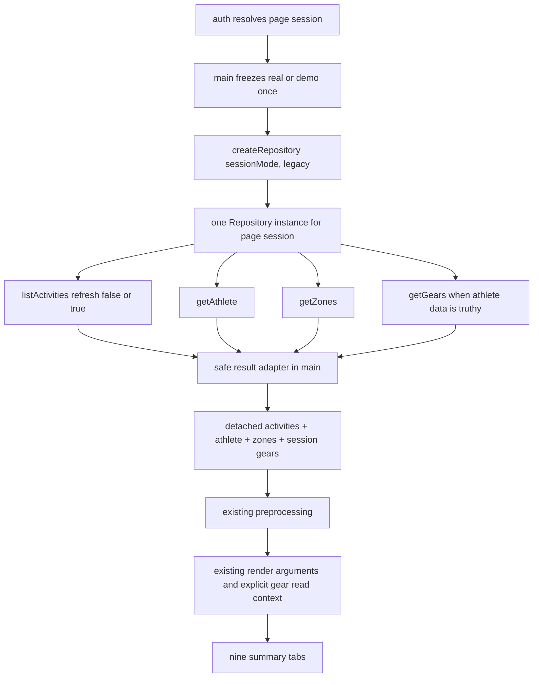

# PR-04A：汇总页面消费者迁移

## Metadata

| Field | Value |
| --- | --- |
| Status | Awaiting decision |
| Base branch | `integration/v2` |
| Base SHA | `2178858f29d6c8efe5cf45de5ff07443387d2577` |
| Feature branch | `codex/v2/summary-consumers` |
| Worktree | `/Users/wangchuanliang/Documents/StravaStats-worktrees/summary-consumers` |
| Owner | XiChuan9 |
| Reviewer | Control tower + independent review |
| Related PRD | Sections 4.1, 5, 8.4, 8.6, 11.2, 19 |
| Related plan | Sprint 2 / PR-04A |
| Related ADRs | ADR-0003 (Accepted) |
| Dependencies | PR-00, PR-01, PR-02, and PR-03 merged into `integration/v2` |
| Pull request | Draft [#8](https://github.com/XiChuan9/StravaStats/pull/8) |
| Investigation Gate | Completed |
| Implementation Gate | Not approved |
| Implementation | Not started |
| A3 | Pending control-tower approval |

## Goal

Determine the smallest safe migration that routes the summary-page consumers through the
PR-03 Repository boundary or an explicit application-layer read context while preserving
all observable output, analysis, navigation, and visual behavior.

## Why now

PR-03 has implemented the Legacy/Demo Repository, Factory, Connector boundary, cache
ownership, success envelope, and error contract. ADR-0003 requires consumers to stop
choosing providers, stores, caches, and APIs. PR-04A is the first consumer migration and
also owns the browser application-path verification deferred by PR-02 and PR-03.

## Investigation questions

- Which listed summary consumers actually depend on provider APIs or provider-owned cache?
- Where do initialize, refresh, Demo, authentication, metadata, and preprocessing flows
  currently cross source/storage boundaries?
- Should the composition root construct one Repository per page session or per operation?
- Should tabs receive Repository methods or already-loaded detached data/read context?
- How should `data`, `source`, `warnings`, and `partial` be adapted without exposing private
  payloads or changing UI output?
- Which activity, athlete, zone, and gear reads/writes become redundant after PR-03 cache
  ownership moves into LegacyRepository?
- How can browser-native ESM, application-path, network, storage, Cache Storage, IndexedDB,
  and Service Worker gates run against isolated synthetic/offline state?
- What exact files and tests are minimally necessary for implementation?

## Confirmed current-state facts

- `integration/v2` and `origin/integration/v2` both resolve to the fixed base SHA above.
- ADR-0003 is Accepted and requires Repository/read-projection consumer boundaries.
- PR-03 freezes seven Repository methods and the exact success envelope
  `{ data, source, warnings, partial }`.
- PR-03 keeps activities cache ownership in `main.js` only until PR-04A; the implemented
  LegacyRepository is cache-aware and owns the future read/write path.
- PR-02/PR-03 browser dynamic-import and application-path checks remain `Not run` and are
  explicitly carried into PR-04A.
- A0 baseline evidence and the complete consumer investigation will be recorded in A2.

## Decisions required before implementation

- Repository lifecycle and the point at which `sessionMode` is frozen.
- Whether main injects detached data/read context or tabs receive a Repository reference.
- Exact success-envelope adaptation, safe observability, warning, partial, and error policy.
- Exact initialize/refresh/Demo/auth call-count contracts.
- Exact gear/metadata injection boundary and ownership of user custom gear metadata.
- Exact browser verification execution surface and merge-blocking subset.
- Exact Allowed files and B1/B2/B3 phase scope.
- Whether any new public Repository capability is required. If so, stop for control-tower
  decision; PR-04A must not implement it without separately frozen authorization.

## In scope

- Read-only inventory of `main.js`, Dashboard, Activities, Calendar, Run/Bike/Swim summary,
  Map, Gear, Wrapped, `js/tabs/index.js`, and `js/tabs/api.js`.
- Read-only call-graph, direct API/storage boundary, cache ownership, output parity, browser
  carry-over, testing, risk, and minimal-scope analysis.
- Design-only candidate rules for `js/tabs/AGENTS.md`; do not create it in A0-A2.
- A0-A2 documentation updates to this Task Brief only.

## Out of scope

- Product or test implementation before A3 and separately authorized B phases.
- PR-04B detail pages under `js/pages/**`.
- PR-04C `js/tabs/run-plus.js` and Run Plus / NSM.
- Trends (`js/tabs/athlete.js`), Planner, Weather, AI Chat, analysis changes, visual changes,
  routing, copy, HTML, CSS, and Service Worker changes.
- Canonical Repository/IndexedDB v2, import/decoder/storage/migration, shadow writer,
  parity framework, feature-mode expansion, server proxy hardening, version/dependency update.
- Real Strava network, credentials, accounts, private fixtures, or browser-profile data.

## Candidate allowed files

The following list is an A2 proposal, not implementation approval. A3 must freeze each path
before any B phase starts:

```text
docs/tasks/pr-04a-summary-consumers.md
js/tabs/AGENTS.md
js/app/main.js
js/tabs/run-analysis.js
js/tabs/gear.js
js/tabs/index.js
tests/consumers/summary-consumers.test.js
tests/consumers/summary-boundaries.test.js
tests/consumers/summary-browser-smoke.html
tests/legacy/demo-isolation.test.js
```

Per-file justification:

| Candidate | Planned change | Why it cannot be completed elsewhere | Test mapping |
| --- | --- | --- | --- |
| Task Brief | Record A3/B evidence and closure only | Durable execution contract | All evidence |
| `js/tabs/AGENTS.md` | Add the A2-designed consumer boundary rules | Required nested governance belongs in this directory | Boundary source audit |
| `js/app/main.js` | Construct one Repository per page session; unwrap results; remove direct services/activity-cache ownership; inject detached activities/athlete/zones/gears; preserve loading/render/error behavior | Composition/source choice must remain at the composition root | lifecycle, call-count, envelope, error, Demo tests |
| `js/tabs/run-analysis.js` | Remove `getCachedGears` and `strava_gears`; consume the current session gear read context while keeping render inputs/outputs stable | Gear Gantt is implemented here; main alone cannot remove this tab-owned cache read | gear label/order and static-boundary tests |
| `js/tabs/gear.js` | Remove provider cache reads; accept current session gears; retain `gear-custom-*` and `gearEditMode` | Gear cards/charts repeatedly call the local `getGears()` helper in this module | custom-data, order, empty, and boundary tests |
| `js/tabs/index.js` | Re-export the explicit Run summary read-context setter without changing existing render exports | Keeps `main.js` on the established tab public entry while allowing the Run Plus shared renderer to see the same session gears without editing `run-plus.js` | exact export/import and Run Plus regression |
| `summary-consumers.test.js` | Deterministic orchestration, envelope, call-count, error, injection, output-input parity tests | New PR-04A behavior has no focused test home | main and consumer matrix |
| `summary-boundaries.test.js` | Static import/API/storage boundary allow/deny matrix | Prevents future provider/cache regression across exact consumer files | direct API/storage audit |
| `summary-browser-smoke.html` | Served `<script type="module">` synthetic harness for native browser imports and DOM-reported probe results | Controlled `playwright.evaluate` cannot load modules; no dependency may be added | browser application-path gate |
| `tests/legacy/demo-isolation.test.js` | Replace pre-PR-04A main cache-loader assertions with Repository construction/list/metadata assertions and preserve Demo/Run Plus guards | Existing tests compile `loadActivitiesForSession` markers and will become stale; this is the established Demo privacy regression suite | Demo zero real I/O, PR-01/PR-03 regression |

Explicitly excluded after investigation because no product diff is needed:

```text
js/tabs/dashboard.js
js/tabs/activities.js
js/tabs/calendar.js
js/tabs/bike-analysis.js
js/tabs/swim-analysis.js
js/tabs/maps.js
js/tabs/wrapped.js
```

`js/tabs/api.js` is also excluded: after PR-04A it remains an intentional PR-04C carry-over
used only by `run-plus.js`. Deleting or changing it would require modifying the prohibited
PR-04C consumer. A3 must explicitly accept this scoped exception or stop PR-04A.

## Prohibited files and operations

During A0-A2 every repository path except this Task Brief is prohibited. In particular:

```text
AGENTS.md
js/tabs/AGENTS.md
js/app/main.js
js/tabs/**
tests/**
package.json
package-lock.json
index.html
styles/**
sw.js
api/**
.github/**
js/repository/**
js/connectors/**
js/data/**
js/services/**
js/demo/**
js/pages/**
js/analysis/**
js/models/**
js/shared/**
docs/architecture/**
docs/product/**
docs/engineering/**
docs/migrations/**
all other Task Briefs
```

Also prohibited: rebase, amend, force-push, merge, Ready conversion, branch/worktree deletion,
real tokens/network/accounts/private data, private fixture enumeration, existing browser-profile
mutation, Legacy cache deletion, IndexedDB v2 creation, migration, dependency changes, and
`git add .` / `git add -A`.

## Interfaces and expected outputs

- Existing public Repository entry remains `js/repository/index.js`.
- Existing factory remains `createRepository({ sessionMode, mode: 'legacy' })`.
- Existing public methods and `{ data, source, warnings, partial }` success envelope remain
  unchanged unless the control tower separately approves a contract expansion.
- Summary consumers must preserve activity order, filters, totals, chart datasets, maps,
  labels, empty/error behavior, Demo output, DOM identifiers/classes, routes, and styles.
- Provider-owned activity/athlete/zones/gears data must originate from Repository/read context.
- UI preferences and user overrides may remain in UI-owned storage only with an explicit,
  documented boundary; Demo must never fall back to real provider storage.

## Acceptance criteria

- A0 evidence includes exact SHAs, ahead/behind, object-existence audit, actual results from
  all five baseline commands, and final clean V2 status.
- A2 contains the ten-consumer matrix, current/target call graphs, static audit, storage
  classification, Repository lifecycle/envelope/error recommendation, call-count matrix,
  gear injection, output parity, browser plan, tests, risks, exact candidate Allowed files,
  prohibited files, phased proposal, decisions, and `Not run` items.
- Investigation Gate is complete; status becomes `Awaiting decision`.
- Implementation Gate remains unapproved; Implementation remains `Not started`; A3 remains
  pending control-tower approval.
- Only this Task Brief differs from the fixed base after A2.
- Draft PR remains Draft and is neither marked Ready nor merged.

## Required automated checks

At A0 and after each documentation commit, record actual results for:

```text
npm ci
npm run check:syntax
npm run check:privacy
npm test
git diff --check
```

Also audit exact changed/staged/untracked paths and wait for GitHub Actions at each pushed
head. Future implementation tests are to be decided in A2 and require A3 approval.

## Manual/browser verification

A2 will produce an executable isolated synthetic/offline plan for native browser ESM imports,
exact validator exports/calls, application-path module loading, network instrumentation,
local/session storage, IndexedDB, Cache Storage and Service Worker snapshots, plus Manual
DevTools evidence. Nothing not actually run may be reported as Pass.

## Privacy and security impact

A0-A2 are documentation-only. They read no real Token, account, activity, GPS, heart-rate,
power, device, private fixture, or existing browser-profile data. No external activity data
or payload is logged. Browser probing, if any, must use an isolated fresh profile and fully
synthetic/offline inputs.

## Migration impact

A0-A2 perform no migration, do not create IndexedDB v2, and do not read, modify, clean, or
delete Legacy cache or any existing browser storage.

## Rollback procedure

The only repository change in A0-A2 is this Task Brief in ordinary commits. Roll back with an
ordinary revert commit. Do not delete the branch or worktree as an investigation rollback and
do not clear any browser or Legacy storage.

## A0 baseline evidence

Executed 2026-08-01 in Asia/Shanghai on macOS 15.7.3 (24G419), Node v25.8.1,
npm 11.11.0.

| Audit | Actual result |
| --- | --- |
| Main repository | `/Users/wangchuanliang/Documents/StravaStats`; `main`; clean |
| V2 worktree | `/Users/wangchuanliang/Documents/StravaStats-worktrees/v2`; locked as `Long-lived v2 integration worktree`; clean |
| Local `integration/v2` | `2178858f29d6c8efe5cf45de5ff07443387d2577` |
| `origin/integration/v2` after `git fetch origin --prune` | `2178858f29d6c8efe5cf45de5ff07443387d2577` |
| Local/remote ahead/behind | `0/0` |
| Feature worktree before A1 | Absent |
| Local feature branch before A1 | Absent |
| Remote feature branch before A1 | Absent |
| Task Brief before A1 | Absent |
| Same base/head PR before A1 | Absent (`gh pr list --repo XiChuan9/StravaStats ...` returned `[]`) |
| `npm ci` | Pass; added 6 packages; audited 7; 0 vulnerabilities |
| `npm run check:syntax` | Pass; 131 files |
| `npm run check:privacy` | Pass |
| `npm test` | Pass; 650 tests, 650 pass, 0 fail/skipped/todo |
| `git diff --check` | Pass; no output |
| V2 final status | Clean; `integration/v2...origin/integration/v2` |

The initial sandboxed fetch and `npm ci` attempts returned filesystem `EPERM`; each required
command was re-run unchanged with the approved repository/worktree permission and then passed.
This was an environment permission boundary, not a repository failure.

## A1 evidence

- Worktree: `/Users/wangchuanliang/Documents/StravaStats-worktrees/summary-consumers`.
- Branch: `codex/v2/summary-consumers`.
- Starting HEAD: exact fixed base `2178858f29d6c8efe5cf45de5ff07443387d2577`.
- Git automatically set the new branch to track the base remote; that incorrect temporary
  upstream was immediately unset before any file change. The first normal push then set the
  correct upstream `origin/codex/v2/summary-consumers`.
- Initial Task Brief commit:
  `c82ce35573f654e278446f6a768b3392d79af168`
  (`docs(v2): define PR-04A summary consumer investigation`).
- Push: normal `git push -u origin codex/v2/summary-consumers`; no force push.
- Draft PR: [#8](https://github.com/XiChuan9/StravaStats/pull/8),
  `integration/v2` <- `codex/v2/summary-consumers`.
- A1 CI Run:
  [30692237511](https://github.com/XiChuan9/StravaStats/actions/runs/30692237511).
- A1 CI Job:
  [91348880469](https://github.com/XiChuan9/StravaStats/actions/runs/30692237511/job/91348880469).
- A1 CI head: `c82ce35573f654e278446f6a768b3392d79af168`.
- Install, syntax, privacy, and tests steps: `success`; overall: `success`.
- A1 local recheck: 131 syntax files, privacy Pass, 650/650 tests, diff check Pass.

## A2 summary consumer inventory

There are ten inventory rows: one composition root plus nine summary page categories.

| Consumer | Actual path / entry | Current input and data source | Direct boundary findings | Proposed injection / actual diff need |
| --- | --- | --- | --- | --- |
| Composition root | `js/app/main.js`; DOMContentLoaded -> `initializeApp()` / `refreshActivities()` | Auth callback, `isDemoMode()`, activities via Demo or `getCachedActivities`/`fetchAllActivities`/`saveCachedActivities`; athlete/zones/gears via services; then preprocessing and tab render | Imports services facade and activity cache; owns activity cache read/write and duplicate aggregate gear write; reads UI settings/filters; no direct `/api/strava-*` literal | Construct/reuse one Repository per page session; unwrap results; inject detached session context. **Modify.** |
| Dashboard | `js/tabs/dashboard.js`; `renderDashboardTab(allActivities, from, to)` | Preprocessed activities and date filters from main | No API, services, provider cache, fetch, IndexedDB, Token, or Repository. `dashboard_readiness_hrv` and `training_goals` are user data | Continue injected activities. Preserve HRV/goals. **No product diff.** |
| Activities | `js/tabs/activities.js`; `renderActivitiesTab(allActivities)` | Preprocessed activities from main | No API/storage/fetch/Repository hit in audit | Continue injected activities. **No product diff.** |
| Calendar | `js/tabs/calendar.js`; `renderCalendarTab(allActivities)` | Preprocessed activities from main | No API/storage/fetch/Repository hit | Continue injected activities. **No product diff.** |
| Run summary | `js/tabs/run-analysis.js`; `renderRunAnalysisTab(allActivities, from, to, gearFilter, window, options)` | Activities from main; gear Gantt names from `getCachedGears()` then raw `strava_gears` fallback | Imports `./api.js` -> services; provider cache read and localStorage fallback | Receive current session gears through an explicit read context set by main; never Repository/provider/cache in tab. **Modify.** |
| Bike summary | `js/tabs/bike-analysis.js`; `renderBikeAnalysisTab(...)` | Activities/filters/window from main | No API/storage/fetch/Repository hit | Continue injected activities. **No product diff.** |
| Swim summary | `js/tabs/swim-analysis.js`; `renderSwimAnalysisTab(...)` | Activities/filters/window from main | No API/storage/fetch/Repository hit | Continue injected activities. **No product diff.** |
| Map | `js/tabs/maps.js`; `renderMapTab(activities, from, to)` | Activities/polylines and filters from main | No provider API/cache/storage/fetch/Repository; Leaflet tile construction is visual map infrastructure, not Strava data selection | Continue injected activities. **No product diff.** |
| Gear | `js/tabs/gear.js`; `renderGearTab(allActivities)` | Activity usage from main; gear metadata from `getCachedGears()` / raw `strava_gears`; user custom metadata from `gear-custom-*` | Provider cache dependency plus legitimate user/UI storage | Inject `sessionGears`; preserve user/UI keys. **Modify.** |
| Wrapped | `js/tabs/wrapped.js`; `renderWrappedTab(allActivities, options)` | Activities from main; local option recursion only | No API/storage/fetch/Repository hit | Continue injected activities. **No product diff.** |

`js/tabs/index.js` is the existing export surface and needs only the proposed read-context
setter export. `js/tabs/api.js` is a one-line `getCachedGears` re-export. After Run/Gear are
migrated, only out-of-scope `run-plus.js` still imports it.

## Static direct API and storage audit

Command family:

```text
rg -n -i "/api/strava-|fetch\s*\(|localStorage|sessionStorage|indexedDB|
strava_tokens|Authorization|services/api|tabs/api|activity-cache|
getCachedActivities|saveCachedActivities|getCachedGears|strava_gears|
createRepository|isDemoMode|demo/index|DemoRepository" <exact A2 scope>
```

Exact findings in the required scope:

| Pattern | Findings |
| --- | --- |
| `/api/strava-`, `fetch(`, `Authorization`, `strava_tokens` | No hits in main + nine summary tabs + `tabs/index.js` + `tabs/api.js` |
| `indexedDB` / `sessionStorage` | No hits in the same scope |
| `createRepository` | No current hit; confirms consumer wiring has not started |
| Activity cache | `main.js` imports and calls `getCachedActivities` / `saveCachedActivities` in the loader used by initialize and refresh |
| Demo choice | `main.js` imports `getDemoActivities` / `isDemoMode`; `isDemoMode()` occurs twice, once in initialize and once in refresh |
| Provider gear cache | Run and Gear import `getCachedGears` through `tabs/api.js`; both also read raw `strava_gears` |
| UI settings | `main.js`: `dashboard_settings` and `dashboard_filters` reads/writes |
| User readiness/goals | Dashboard: `dashboard_readiness_hrv` get/remove/set and `training_goals` get/set |
| User gear metadata/UI state | Gear: `gear-custom-${gearId}` get/set and `gearEditMode` get/set |

Broader call-graph inspection (outside the summary scan) confirms that `services/api.js` owns
direct `/api/strava-*`, Authorization, Token, and metadata cache behavior, while
`services/activity-cache.js` owns Legacy activity IndexedDB/localStorage. PR-03's Connector,
LegacyRepository, and cache adapter already encapsulate these capabilities.

Hidden dependency to freeze: `js/shared/preprocessing/core.js` reads
`strava_athlete_data` when the injected athlete lacks identity and reads
`strava_demo_mode` to suppress direct Open-Meteo weather fetches. This is neither a summary
tab nor Strava API call, but the Demo-mode read conflicts with a literal interpretation of
“session mode only at composition root.” `js/shared/**` is prohibited in PR-04A. A3 must either
accept this documented preprocessing-policy carry-over or stop and create a separately scoped
task; PR-04A must not modify it silently.

## Provider, UI, user, and Demo storage classification

| Class | Keys / storage | Owner after PR-04A | Rule |
| --- | --- | --- | --- |
| Provider-owned activities | Legacy activity IndexedDB entry and fallback `strava_activities`, timestamp, cache version | LegacyRepository through injected activity cache | main/tab direct reads and writes become zero |
| Provider-owned metadata | `strava_athlete_data`, `strava_training_zones`, aggregate/per-ID `strava_gears` keys and timestamps | LegacyRepository/LegacyCacheAdapter | main/tab direct reads/writes become zero; main must not call `setCachedGears` |
| Authentication | `strava_tokens` | Connector/auth lifecycle only | tabs/main summary loader do not read/write; Token failure remains redacted |
| Session source flag | `strava_demo_mode` | auth + composition root; preprocessing exception pending A3 | Freeze once for the page session; refresh must not reselect source |
| Demo provider namespace | Frozen nine `strava_demo_*` / `strava_tokens_demo` keys | Demo provider/DemoRepository/auth | no fallback to any real key, Connector, activity cache, or metadata cache |
| UI preference | `dashboard_settings`, `dashboard_filters`, `gearEditMode` | main/Gear UI | Preserve exact keys and behavior; not provider data |
| User analysis input | `dashboard_readiness_hrv`, `training_goals` | Dashboard | Preserve; do not migrate/delete or confuse with provider cache |
| User custom metadata | `gear-custom-*` | Gear UI/UserOverride candidate for future architecture | Preserve price/durationKm, labels, and writes exactly; do not move in PR-04A |
| Out-of-scope feature state | Run Plus/NSM keys, Planner, AI key, etc. | Their existing modules | No read, migration, or modification in PR-04A |

## Current initialize and refresh call graph

```mermaid
flowchart TD
    Auth[handleAuth / loginWithDemo] --> Init[initializeApp]
    Init --> Mode[isDemoMode: freeze only for this call]
    Mode --> Loader[loadActivitiesForSession]
    Loader -->|Demo| DemoActivities[getDemoActivities]
    Loader -->|Real initialize| ActivityCache[getCachedActivities]
    ActivityCache -->|miss| Facade[fetchAllActivities]
    Loader -->|Real refresh| Facade
    Facade --> Connector[StravaApiConnector]
    Connector --> ActivityApi[/api/strava-activities]
    Facade --> CacheWrite[saveCachedActivities]
    DemoActivities --> Metadata
    CacheWrite --> Metadata[fetchAthleteData + fetchTrainingZones]
    Metadata --> GearFacade[fetchAllGears athlete]
    GearFacade --> GearCache[per-ID/provider cache and network]
    GearFacade --> DuplicateWrite[main setCachedGears aggregate write]
    DuplicateWrite --> Prep[preprocessActivities]
    Prep --> Render[setup + Run eager render + lazy summary tabs]

    Refresh[refreshActivities] --> Mode2[isDemoMode reselected]
    Mode2 --> Loader2[list path refresh]
    Loader2 --> Metadata2[athlete then zones required]
    Metadata2 --> Gear2[gear optional]
    Gear2 --> Prep2[preprocess]
    Prep2 --> Reset[clear renderedTabs and rerender]
```

Authentication/error behavior today:

- `handleAuth` chooses OAuth, persisted Demo, valid real Token, expiry, or unauthenticated path
  before calling initialize.
- Activity failure or preprocessing failure reaches the top-level generic `handleError`.
- Initialize athlete/zones use two 8-second races and `Promise.allSettled`; failures are optional.
- Initialize gears are attempted only when athlete is truthy and are optional.
- Refresh athlete/zones are sequential required calls; failure aborts refresh; gear remains optional.
- Connector refresh Token write failure withholds data; 401/403 are generic app errors and do
  not clear Local Library.

## Target call graph candidate



Decision recommendation:

- Construct exactly one Repository per authenticated/Demo page session, not once per operation
  and not once per refresh. This preserves PR-03 athlete memo/coalescing and gives a stable
  source boundary.
- Freeze `sessionMode` when initialize starts; create the Repository then. Refresh reuses both
  values and calls `listActivities({ refresh: true })`. Source-mode changes already reload via
  login/logout and therefore create a new page session.
- Tabs do not hold Repository and never call `createRepository`. Main loads detached data and
  injects a read context. This best matches ADR-0003 and minimizes output changes.
- No new public Repository method/export/source/warning/error is needed. Discovery of such a
  need is a stop condition.

## Repository success envelope and error recommendation

Add a private/testable application helper in `js/app/main.js`; do not add a Repository API.
For every result it must:

1. validate only the frozen `{ data, source, warnings, partial }` envelope shape;
2. return `data` without sorting, normalizing, or cloning again (Repository already detaches);
3. use `source` only for approved generic loading text (`cache`, `network`, `demo`, `mixed`);
4. observe warnings only as `{ code, operation, retryable, itemIndex? }` or aggregated counts;
5. never log data, payload, raw errors, Token, IDs, activity names, locations, or health data;
6. treat `partial` by operation, not as a generic error.

Operation policy:

| Result | Candidate handling |
| --- | --- |
| Activities complete | Preserve array order and current loading count/message; preprocess |
| Activities unexpected partial/shape | Fail closed into existing generic initialization/refresh error |
| Athlete/zones warning/failure | Preserve current optional initialize behavior; null context and generic warning |
| Gear complete | Inject ordered array |
| Gear partial | Inject successful items in Repository order, show/log only safe generic partial warning, never fallback or aggregate-write |
| Empty gear array | Legitimate complete empty state; not partial |
| `UNAUTHENTICATED` / `FORBIDDEN` | Preserve generic error and Local Library; do not invent logout/cache deletion in PR-04A |
| `TOKEN_WRITE_FAILED` | Operation fails with no false-success data and no main retry/write |
| Rate/network/provider/response errors | Use stable code only for safe control flow; no raw cause/payload |
| Preprocessing failure | Preserve existing generic top-level error; do not render partial processed output |

## Initialize, refresh, Demo, and call-count matrix

Candidate counts below are observable contracts. Metadata network/Token counts are conditional
on cache state and gear cardinality, so the exact formula is recorded instead of a false fixed
number.

| Scenario | Repository construction | listActivities | Activity cache R/N/W | Metadata/Gear | Demo provider | Token/network |
| --- | ---: | ---: | --- | --- | --- | --- |
| Real initialize cache hit | 1 per page session | 1 with `refresh:false` | `1/0/0` | getAthlete 1; getZones 1; getGears 1 only if athlete data truthy | 0 | activity Token/network 0; each metadata miss owns exactly one Connector request |
| Real initialize cache miss/empty/expired/version mismatch | same instance | 1 with `refresh:false` | `1/1/1` | same policy | 0 | activity Token read 1, network 1, refreshed Token write 0 or 1 |
| Real initialize activity cache read failure | same | 1 | `1 failed/1/1`; safe `CACHE_READ_FAILED` | same policy after activity success | 0 | one activity Connector request |
| Real refresh | 0 new; reuse session instance | 1 with `refresh:true` | `0/1/1` | preserve current required athlete/zones refresh semantics; gear optional | 0 | one activity Connector request plus conditional metadata requests |
| Demo initialize | 1 DemoRepository | 1 with `refresh:false` | `0/0/0` real cache | getAthlete/getZones once; getGears only if athlete data truthy | activities/athlete/zones/gears only | Connector 0; Token R/W 0; real metadata R/W 0 |
| Demo refresh | reuse DemoRepository | 1 with `refresh:true` | `0/0/0` | same calls, Demo-only | Demo namespace only | Connector/network/Token/real cache 0 |
| Athlete/zones initialize failure | same | unchanged | unchanged | each promise settles independently after existing timeout; missing value injected as null | no fallback real in Demo | no main retry |
| Gear item failure | same | unchanged | unchanged | one getGears; successful items retained; `partial:true`; aggregate write 0, successful per-ID writes may exist inside Repository | no real fallback | one request per missing gear ID only |
| Token write failure | same | one attempted operation | activity cache write 0 because Repository has no success data | downstream loading not started if activities fail | n/a | one network; one failed Token write; no second write |
| 401/403 | same | one attempted operation | no activity cache write | initialization/refresh stops if activity call; metadata remains operation-specific | n/a | one request; no cache/library deletion |
| Other Repository error | same | one attempted operation | no false-success write | current generic optional/top-level behavior | n/a | no duplicate request by main |
| Preprocessing failure | same | already complete | Repository ownership unchanged | already loaded context remains memory-only | isolated | zero retry; generic error |

For any Connector-backed public operation: Token read is exactly one per actual network request;
refreshed Token write is at most one and occurs only when the response supplies valid refreshed
tokens. `getGears()` aggregate hit causes zero gear-item network/cache reads; aggregate miss
preserves shoes-before-bikes order, duplicate IDs, per-ID one-read/at-most-one-network/write,
and safe item-index warnings. main performs no extra activity/metadata cache read or write.

## Gear and metadata injection recommendation

- main stores only the Repository-returned `sessionGears` array for the current page session.
- main must remove `fetchAllGears` and `setCachedGears`; Repository owns aggregate/per-ID cache.
- `buildSessionGearNameMap()` remains order-compatible: Repository preserves shoes then bikes
  and duplicates; the current `Map` continues last-write-wins for duplicate IDs.
- Run summary receives an explicit module read context before any main/Run Plus render. Its
  gear Gantt keeps activity-derived gear ID order, current labels, datasets, and ID fallback.
- Gear tab accepts current session gears when rendered and its internal helpers use only that
  array. No `getCachedGears()` or `strava_gears` fallback remains in PR-04A consumers.
- Demo missing/malformed gears becomes empty; it never falls back to real gears.
- `gear-custom-*` price/durationKm remains user-owned and unchanged.
- `gearEditMode` remains UI state and unchanged.
- Gear `type` inference, sort (`lastUse` default), retired filter, duplicate behavior, card
  labels, charts, HTML, classes, and notification behavior remain unchanged.
- `tabs/api.js` remains only because `run-plus.js` is prohibited; boundary tests must assert
  Run/Gear no longer import it while recording the PR-04C exception.

## Summary output parity freeze

No implementation may change algorithms, numeric thresholds, chart configuration, HTML/CSS,
copy, routes, or navigation.

| Page | Observable outputs that must remain identical for the same synthetic input |
| --- | --- |
| Dashboard | Input order; effective date windows; totals/current-vs-previous; TSS/PMC, readiness, HRV, goals; chart labels/datasets; cards; empty/error states; DOM IDs/classes |
| Activities | Row order after existing sort; grouping/aggregation; visible columns/cells; filters; CSV content/order; links; empty state |
| Calendar | Date grouping, streaks, period totals, sport colors/icons, calendar cells and activity links |
| Run | Date/gear filters; run order; summary cards; all current chart datasets; tables/top runs; gear Gantt month/gear order and labels; Run Plus embedded render compatibility |
| Bike | Sport/type filters, gear filter, totals, histograms/scatters/trends/Eddington datasets, tables and labels |
| Swim | Pool/open-water classification, pool estimate, pace/efficiency, all charts/Eddington/tables and labels |
| Map | Filter result, marker/polyline count/order/coordinates, popups, tile behavior, empty state |
| Gear | Gear order/duplicates/labels, filters, retired/edit modes, custom values, metrics, cards, cumulative/Gantt datasets, empty/error state |
| Wrapped | Year options, category/type totals, streaks, records, best week/month, top activities, chart/table/export output |
| Shared shell | Routes, active tab, lazy/eager render sequence, DOM IDs/classes, visual styles, loading/error copy and Demo output |

Any discovered existing defect (including unrelated UI quirks or the preprocessing weather/
identity fallback) is backlog evidence only and must not be fixed opportunistically.

## Candidate `js/tabs/AGENTS.md` rules

Design only in A2; A3 decides whether the file is allowed:

- Tabs do not call `/api/strava-*` or read/write Token/Authorization.
- Tabs do not select provider, Repository implementation, Connector, cache, IndexedDB, or
  storage implementation and do not call `createRepository`.
- Provider activity/athlete/zones/gears data comes only from injected Repository/read context.
- UI preferences/filter state and user overrides must use explicit names/ownership and must
  never be confused with provider cache.
- Demo input must never fall back to real storage or Connector.
- Tests and evidence must use synthetic deterministic data; no private fixtures or payload logs.
- Boundary migration must not change algorithms, thresholds, HTML, CSS, routes, copy, chart
  configuration, DOM IDs/classes, ordering, or visual output.
- Missing capabilities and partial metadata degrade through existing empty/fallback behavior.
- Each changed page requires focused browser application-path evidence and parity evidence;
  visual checks not run must be marked `Not run`.
- Nested rules add to and never weaken root `AGENTS.md`.

## Browser application-path carry-over plan

### A2 capability probe

- Server actually started with `npm run dev` at fixed
  `http://127.0.0.1:3001` from the feature worktree, then stopped.
- Direct module URL `/js/data/contracts/index.js` loaded in the in-app browser: Pass.
- Browser native dynamic import through controlled `playwright.evaluate`: `Not run`; the
  execution surface returned exactly `module loading is not available in playwright.evaluate`.
- Exact exports and three validator calls in browser: `Not run`.
- Full app/storage/network/Service Worker instrumentation: `Not run` in A2.
- No user profile storage was inspected, written, or cleared; no app page was initialized.

### B3 executable plan

1. Use feature worktree `npm run dev`, fixed port `3001` and paths `/`,
   `/js/data/contracts/index.js`, and `/tests/consumers/summary-browser-smoke.html`.
2. Use a new disposable browser profile/context created specifically for the test; never attach
   to, inspect, mutate, or clear the user's existing profile. Delete nothing as part of the test.
3. The served smoke HTML uses `<script type="module">` (not `evaluate import`) to import the
   exact contract public entry, the approved application orchestration helper, and consumer
   entry. It writes only synthetic pass/fail records to its own DOM.
4. Inline synthetic activities contain no real names, GPS, HR, Power, device, or IDs. Demo data
   uses only the frozen Demo namespace. Real synthetic mode uses isolated seeded Legacy cache
   objects and a fake Repository/orchestration seam; no actual provider network is allowed.
5. Install fetch, XMLHttpRequest, and WebSocket sentinels before application import. Record only
   method/origin/path and counts, never headers/body/payload. Demo must record zero requests.
6. Snapshot before/after: localStorage/sessionStorage key names and byte counts, IndexedDB
   database names/versions, Cache Storage keys, and Service Worker scope/script/status. Because
   the profile is disposable and synthetic, snapshots contain no user data.
7. Demo assertion: only approved Demo keys plus explicitly expected UI keys may change; real
   Token/activity/athlete/zones/gears keys, IndexedDB, Connector, fetch/XHR/WS remain zero.
8. Real synthetic assertion: all provider-data calls are observed at the injected Repository
   seam; main/tab direct storage/API counts are zero; `listActivities({refresh:true})` is used on
   refresh; no actual network is permitted.
9. Validator assertion: exact exports are
   `validateCanonicalActivity`, `validateCanonicalStreamSet`, and
   `validateImportedActivityBundle`; invoke all three with valid inline synthetic values and
   require `{ok:true, errors:[], warnings:[]}`.
10. Capture DOM result JSON, console errors, network count, and storage snapshots as evidence.
    Use Manual DevTools Network/Application panels in the same disposable profile to confirm
    the automated evidence; do not use a real account.
11. If the controlled browser still cannot execute module loading, the served module harness is
    the required alternative execution surface. If that also cannot run, B3 is blocked; Node
    tests are not a substitute.

Merge blockers: served native ESM imports, exact validator calls, application orchestration
load, Demo zero real I/O, Real synthetic Repository-only boundary, before/after snapshots,
console/network cleanliness, and synthetic visual/navigation parity for changed Run/Gear paths.
Manual DevTools is required unless the control tower explicitly accepts equivalent automated
evidence. Real Strava account/network/private-data testing, user's existing profile, Safari/
Firefox matrix, and production Service Worker deployment remain `Not run` and are not required
for PR-04A.

## Testing matrix proposal

All tests remain offline, deterministic, synthetic, dependency-free, and use `node:test` plus
existing tools.

| Test area | Required assertions |
| --- | --- |
| Composition root | Factory called once per page session with exact `{sessionMode, mode:'legacy'}`; refresh reuses instance; tabs never construct Repository |
| Activity paths | initialize cache hit/miss/read/write warning and refresh `listActivities({refresh:true})`; main direct cache R/W zero |
| Envelope | exact data/source/warnings/partial handling; safe logging; malformed/partial fail-closed policy |
| Errors | 401/403, Token read/encode/write, network/rate/provider/response, metadata optionality, preprocessing failure; no Local Library deletion |
| Metadata | athlete/zones injection; initialize timeout/allSettled parity; refresh parity; gear complete/empty/partial/error |
| Gear consumers | Run/Gear do not read `strava_gears`; order, duplicate IDs, labels, custom data, edit mode, datasets unchanged |
| Demo/Real Factory | exact branch selection at initialization, stable through refresh |
| Demo isolation | Connector construction 0; Token/network/real activity and metadata cache I/O 0; no real fallback |
| Static boundary | summary tabs contain no Token, Authorization, `/api/strava-*`, fetch, IndexedDB, provider cache, Repository creation; UI/user key allowlist remains explicit |
| Side effects | Repository/factory/consumer import and constructor zero I/O; no logging of payloads |
| Browser | native ESM/validators/application path, network/storage/SW snapshots, Demo and Real synthetic smoke |
| Regression | all PR-03 Repository/Connector tests; all PR-01 Demo/Auth tests; existing 650-test suite |

Proposed focused commands after A3 implementation:

```text
node --test tests/consumers/summary-consumers.test.js
node --test tests/consumers/summary-boundaries.test.js
node --test tests/legacy/demo-isolation.test.js
node --test tests/repository/*.test.js
node --test tests/legacy/auth-lifecycle.test.js tests/legacy/demo-isolation.test.js
npm ci
npm run check:syntax
npm run check:privacy
npm test
git diff --check
```

## Risk register

### P0

- Demo mode can leak into real cache/Token/Connector if session mode is reselected or a tab
  falls back; merge blocker is zero-real-I/O browser + Node evidence.
- Leaving main cache ownership after Repository wiring would double read/write and can return
  stale or conflicting data; remove all main activity and aggregate gear cache operations.
- A required eighth Repository API or Repository/Connector/Factory modification is outside the
  frozen PR-03 contract and immediately blocks implementation.
- `run-analysis.js` is shared by Run Plus. A direct signature-only gear injection can silently
  remove embedded Run Plus gear labels; the proposed session read context and regression test
  are mandatory, while `run-plus.js` remains untouched.
- The preprocessing Demo/storage/weather exception may make the literal source-freeze goal
  impossible inside the allowed boundary; A3 must explicitly accept or stop.

### P1

- Dropping `warnings`/`partial` can hide gear loss; logging payloads can leak privacy. Observe
  only stable safe fields.
- Changing initialize/refresh metadata optionality, timeout order, or 401/403 behavior changes
  visible error/empty states.
- Gear Repository order, duplicate IDs, Map last-write behavior, and user custom overrides can
  drift during injection.
- A module-level read context can retain stale gears across re-auth/failed refresh unless main
  clears it before load and resets it on failure.
- Controlled browser module-loading limitation requires the served harness; without it the
  carried browser gate remains blocked.

### P2

- `tabs/api.js` and Run Plus provider cache remain an explicit PR-04C backlog; broad directory
  scans need a scoped exception until that PR.
- Existing direct Open-Meteo preprocessing and special-athlete fallback remain backlog; do not
  change algorithms in PR-04A.
- Cross-browser and production Service Worker evidence remain later release work.

## Suggested B1/B2/B3 phases

This is a recommendation only; A3 must approve exact phase files.

- **B1 — governance and composition/loading boundary:** create `js/tabs/AGENTS.md`; update
  main Repository lifecycle/result adapter/cache ownership; add orchestration and boundary
  tests; update the existing Demo regression. Stop for control-tower review.
- **B2 — provider metadata isolation and parity:** update Run summary read context,
  `tabs/index.js` export, and Gear injection; prove labels/order/duplicates/custom UI state and
  all unchanged summary inputs/outputs. Stop for review.
- **B3 — browser application path and closure:** add the served synthetic module harness; run
  native validator/application imports, Demo/Real instrumentation, storage/network/SW snapshots,
  Manual DevTools and visual/navigation parity; run full regression and record evidence.

## Decisions required from the control tower for A3

1. Approve one Repository per page session and refresh reuse.
2. Approve freezing Demo/Real in main at initialize and not re-reading it on refresh.
3. Approve main-loaded detached read context rather than Repository references in tabs.
4. Approve the private/testable main envelope helper and safe warning/partial policy.
5. Approve exact call-count/error parity, including current refresh athlete/zones behavior.
6. Approve the proposed Run summary session read context needed to avoid editing Run Plus.
7. Accept `tabs/api.js`/Run Plus as an explicit PR-04C exception.
8. Accept the preprocessing `strava_demo_mode`/athlete-cache/Open-Meteo carry-over, or stop and
   create a separate authorized task; do not expand PR-04A silently.
9. Approve the ten exact candidate Allowed files and all exclusions.
10. Approve the served browser harness and the listed merge blockers/allowed `Not run` items.
11. Confirm no Repository public API, Repository/Connector/Factory, dependency, or prohibited
    path change is authorized.

## Not run and known limitations

- A2 did not run full application Demo or Real initialization in a browser.
- Browser native dynamic import, exact exports, three validator calls, application orchestration,
  network/storage/IndexedDB/Cache/Service Worker instrumentation, and Manual DevTools are
  `Not run`; the controlled evaluate surface cannot load modules.
- Browser direct contract-module URL load passed, but URL load alone is not ESM execution.
- No screenshots or visual regression evidence were produced in A2.
- No real Token, account, Strava/provider network, activity, GPS, HR, Power, device data, private
  fixture, or existing browser profile was used.
- No Safari/Firefox/mobile/production Service Worker verification ran.
- Node boundary tests from the existing suite passed but do not satisfy browser gates.
- A2 did not resolve the preprocessing source-selection exception; it is an A3 decision.

## Independent review checklist

- [x] Fixed base/local/remote/worktree/branch/PR audit is complete.
- [x] Five A0 baseline commands passed with actual evidence.
- [x] Only this Task Brief changed in A0-A2.
- [x] Consumer inventory and current/target call graphs are evidence-backed.
- [x] Provider, UI preference, user override, and Demo storage are distinctly classified.
- [x] Repository lifecycle, success envelope, errors, and call counts are explicit.
- [x] Gear and metadata injection preserves custom data and observable output.
- [x] Browser carry-over plan is executable and does not use a real profile or private data.
- [x] Test plan is deterministic, offline, dependency-free, and does not claim Node as browser.
- [x] Exact candidate Allowed and Prohibited files are justified.
- [x] P0/P1/P2 risks, privacy, migration, rollback, and `Not run` evidence are complete.
- [x] Investigation Gate is complete.
- [ ] Implementation Gate is approved (pending control tower).
- [x] Implementation remains Not started and no A3/B phase has started.

## Completion evidence

```text
A0:
  Date/environment — 2026-08-01 CST; macOS 15.7.3; Node v25.8.1; npm 11.11.0
  Fixed local/remote SHA — 2178858f29d6c8efe5cf45de5ff07443387d2577
  Ahead/behind — 0/0
  Same-name worktree/branch/remote/Task Brief/PR — absent before A1
  npm ci — Pass; 6 packages; 0 vulnerabilities
  syntax — Pass; 131 files
  privacy — Pass
  full tests — Pass; 650/650
  diff check — Pass
  V2 worktree final — clean

A1:
  Worktree — /Users/wangchuanliang/Documents/StravaStats-worktrees/summary-consumers
  Branch — codex/v2/summary-consumers
  Task Brief commit — c82ce35573f654e278446f6a768b3392d79af168
  Push — Success; correct origin feature upstream; no force push
  Draft PR — https://github.com/XiChuan9/StravaStats/pull/8
  Base/head — integration/v2 <- codex/v2/summary-consumers
  A1 CI Run — https://github.com/XiChuan9/StravaStats/actions/runs/30692237511
  A1 CI Job — https://github.com/XiChuan9/StravaStats/actions/runs/30692237511/job/91348880469
  A1 CI — Success; syntax/privacy/tests success

A2:
  Product/runtime/test/AGENTS/dependency changes — None
  Investigation Gate — Completed
  Implementation Gate — Not approved
  Implementation — Not started
  A3 — Pending control-tower approval
  Browser server — http://127.0.0.1:3001 (started for probe, then stopped)
  Direct contract module URL — Pass
  Controlled browser native dynamic import — Not run; module loading unavailable
  Exact browser exports/validators/application/storage/network/SW — Not run
  Private/user data/profile — Not read or modified
```

## Stop conditions

Stop immediately if the fixed base differs, V2 is dirty, a same-name object/PR exists, a
baseline or CI fails, any non-Task-Brief diff appears, real credentials/private data/profile
access is needed, provider-vs-UI ownership cannot be determined, Repository public API or
Repository/Connector/Factory changes are required, a dependency or prohibited path is needed,
or PR base/head/Draft state is wrong. Preserve evidence; do not self-expand scope.
