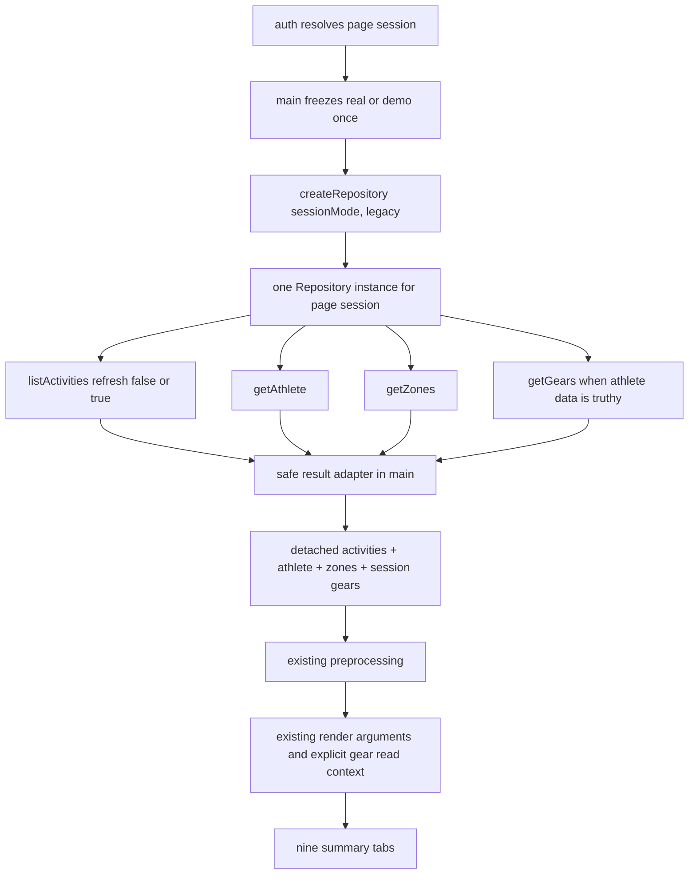

# PR-04A：汇总页面消费者迁移

## Metadata

| Field | Value |
| --- | --- |
| Status | In progress |
| Base branch | `integration/v2` |
| Base SHA | `2178858f29d6c8efe5cf45de5ff07443387d2577` |
| Feature branch | `codex/v2/summary-consumers` |
| Worktree | `/Users/wangchuanliang/Documents/StravaStats-worktrees/summary-consumers` |
| Owner | XiChuan9 |
| Reviewer | Control tower + independent review |
| Related PRD | Sections 4.1, 5, 8.4, 8.6, 11.2, 19 |
| Related plan | Sprint 2 / PR-04A |
| Related ADRs | ADR-0003 (Accepted) |
| Dependencies | PR-00, PR-01, PR-02, and PR-03 merged into `integration/v2` |
| Pull request | Draft [#8](https://github.com/XiChuan9/StravaStats/pull/8) |
| Investigation Gate | Completed / PASS |
| Implementation Gate | Approved by control tower |
| Implementation | B1/B1.1 and B2 completed; B3 not authorized |
| A3 | Completed |
| A3.1 | Completed / Accepted |
| B1 | Completed / PASS |
| B1.1 | Completed / PASS |
| B2 | Completed / PASS |
| B3 | Not authorized / not started |

## Goal

Determine the smallest safe migration that routes the summary-page consumers through the
PR-03 Repository boundary or an explicit application-layer read context while preserving
all observable output, analysis, navigation, and visual behavior.

## Why now

PR-03 has implemented the Legacy/Demo Repository, Factory, Connector boundary, cache
ownership, success envelope, and error contract. ADR-0003 requires consumers to stop
choosing providers, stores, caches, and APIs. PR-04A is the first consumer migration and
also owns the browser application-path verification deferred by PR-02 and PR-03.

## Investigation questions

- Which listed summary consumers actually depend on provider APIs or provider-owned cache?
- Where do initialize, refresh, Demo, authentication, metadata, and preprocessing flows
  currently cross source/storage boundaries?
- Should the composition root construct one Repository per page session or per operation?
- Should tabs receive Repository methods or already-loaded detached data/read context?
- How should `data`, `source`, `warnings`, and `partial` be adapted without exposing private
  payloads or changing UI output?
- Which activity, athlete, zone, and gear reads/writes become redundant after PR-03 cache
  ownership moves into LegacyRepository?
- How can browser-native ESM, application-path, network, storage, Cache Storage, IndexedDB,
  and Service Worker gates run against isolated synthetic/offline state?
- What exact files and tests are minimally necessary for implementation?

## Confirmed current-state facts

- `integration/v2` and `origin/integration/v2` both resolve to the fixed base SHA above.
- ADR-0003 is Accepted and requires Repository/read-projection consumer boundaries.
- PR-03 freezes seven Repository methods and the exact success envelope
  `{ data, source, warnings, partial }`.
- PR-03 keeps activities cache ownership in `main.js` only until PR-04A; the implemented
  LegacyRepository is cache-aware and owns the future read/write path.
- PR-02/PR-03 browser dynamic-import and application-path checks remain `Not run` and are
  explicitly carried into PR-04A.
- A0-A2 passed control-tower review. No A2.1 is required.
- A3 freezes decisions and implementation scope only; it does not start implementation.
- The pull request remains Draft. Ready, merge, PR-04B, PR-04C, and PR-05 are not authorized.

## A3 authorization boundary

- A3 records control-tower decisions and freezes the total and phase-specific scopes.
- `Approved for implementation` did not itself authorize immediate B1 execution. B1 later
  received separate control-tower authorization for local implementation only.
- A3.1 and B2 passed control-tower review. B2 Finalization is authorized; B3 remains
  unauthorized and not started.
- After local implementation of each authorized phase, stop and return evidence for
  control-tower review before staging, committing, or pushing that phase implementation.
- Ready, merge, PR-04B, PR-04C, and PR-05 remain unauthorized.
- If implementation requires a new Repository public capability, an eleventh total path, or a
  path outside the authorized phase allowlist, stop and request a new control-tower decision.

## In scope

- Read-only inventory of `main.js`, Dashboard, Activities, Calendar, Run/Bike/Swim summary,
  Map, Gear, Wrapped, `js/tabs/index.js`, and `js/tabs/api.js`.
- Read-only call-graph, direct API/storage boundary, cache ownership, output parity, browser
  carry-over, testing, risk, and minimal-scope analysis.
- Design-only candidate rules for `js/tabs/AGENTS.md`; do not create it in A0-A2.
- A0-A2 documentation updates to this Task Brief only.

## Out of scope

- Product or test implementation before separately authorized B phases.
- PR-04B detail pages under `js/pages/**`.
- PR-04C `js/tabs/run-plus.js` and Run Plus / NSM.
- Trends (`js/tabs/athlete.js`), Planner, Weather, AI Chat, analysis changes, visual changes,
  routing, copy, HTML, CSS, and Service Worker changes.
- Canonical Repository/IndexedDB v2, import/decoder/storage/migration, shadow writer,
  parity framework, feature-mode expansion, server proxy hardening, version/dependency update.
- Real Strava network, credentials, accounts, private fixtures, or browser-profile data.

## Frozen total Allowed files

The control tower freezes the following as the complete PR-04A total allowlist. There is no
eleventh path. This total allowlist does not override a narrower phase-specific allowlist:

```text
docs/tasks/pr-04a-summary-consumers.md
js/tabs/AGENTS.md
js/app/main.js
js/tabs/run-analysis.js
js/tabs/gear.js
js/tabs/index.js
tests/consumers/summary-consumers.test.js
tests/consumers/summary-boundaries.test.js
tests/consumers/summary-browser-smoke.html
tests/legacy/demo-isolation.test.js
```

Per-file justification:

| Allowed path | Planned change | Why it cannot be completed elsewhere | Test mapping |
| --- | --- | --- | --- |
| Task Brief | Record A3/B evidence and closure only | Durable execution contract | All evidence |
| `js/tabs/AGENTS.md` | Add the A2-designed consumer boundary rules | Required nested governance belongs in this directory | Boundary source audit |
| `js/app/main.js` | Construct one Repository per page session; unwrap results; remove direct services/activity-cache ownership; inject detached activities/athlete/zones/gears; preserve loading/render/error behavior | Composition/source choice must remain at the composition root | lifecycle, call-count, envelope, error, Demo tests |
| `js/tabs/run-analysis.js` | Remove `getCachedGears` and `strava_gears`; consume the current session gear read context while keeping render inputs/outputs stable | Gear Gantt is implemented here; main alone cannot remove this tab-owned cache read | gear label/order and static-boundary tests |
| `js/tabs/gear.js` | Remove provider cache reads; accept current session gears; retain `gear-custom-*` and `gearEditMode` | Gear cards/charts repeatedly call the local `getGears()` helper in this module | custom-data, order, empty, and boundary tests |
| `js/tabs/index.js` | Re-export the explicit Run summary read-context setter without changing existing render exports | Keeps `main.js` on the established tab public entry while allowing the Run Plus shared renderer to see the same session gears without editing `run-plus.js` | exact export/import and Run Plus regression |
| `summary-consumers.test.js` | Deterministic orchestration, envelope, call-count, error, injection, output-input parity tests | New PR-04A behavior has no focused test home | main and consumer matrix |
| `summary-boundaries.test.js` | Static import/API/storage boundary allow/deny matrix | Prevents future provider/cache regression across exact consumer files | direct API/storage audit |
| `summary-browser-smoke.html` | Served `<script type="module">` synthetic harness for native browser imports and DOM-reported probe results | Controlled `playwright.evaluate` cannot load modules; no dependency may be added | browser application-path gate |
| `tests/legacy/demo-isolation.test.js` | Replace pre-PR-04A main cache-loader assertions with Repository construction/list/metadata assertions and preserve Demo/Run Plus guards | Existing tests compile `loadActivitiesForSession` markers and will become stale; this is the established Demo privacy regression suite | Demo zero real I/O, PR-01/PR-03 regression |

Explicitly excluded after investigation because no product diff is needed:

```text
js/tabs/dashboard.js
js/tabs/activities.js
js/tabs/calendar.js
js/tabs/bike-analysis.js
js/tabs/swim-analysis.js
js/tabs/maps.js
js/tabs/wrapped.js
```

`js/tabs/api.js` is also excluded: after PR-04A it remains an intentional PR-04C carry-over
used only by `run-plus.js`. Deleting or changing it would require modifying the prohibited
PR-04C consumer. The control tower accepts only this scoped exception; no other tab may use it.

## Prohibited files and operations

All paths outside the frozen ten-path total allowlist are prohibited. In A3, the only allowed
path is this Task Brief. Prohibited paths include, without limitation:

```text
AGENTS.md
package.json
package-lock.json
index.html
styles/**
sw.js
api/**
.github/**
js/app/auth.js
js/app/auth-lifecycle.js
js/app/feature-flags.js
js/connectors/**
js/repository/**
js/services/**
js/demo/**
js/data/**
js/shared/**
js/pages/**
js/models/**
js/analysis/**
js/tabs/api.js
js/tabs/run-plus.js
js/tabs/athlete.js
js/tabs/planner.js
js/tabs/weather.js
js/tabs/ai-chat.js
docs/architecture/**
docs/product/**
docs/engineering/**
docs/migrations/**
all other Task Briefs
```

Also prohibited: rebase, amend, force-push, merge, Ready conversion, branch/worktree deletion,
real tokens/network/accounts/private data, private fixture enumeration, existing browser-profile
mutation, Legacy cache deletion, IndexedDB v2 creation, migration, dependency changes, and
`git add .` / `git add -A`.

The following investigated consumers need no product diff and remain explicitly excluded:

```text
js/tabs/dashboard.js
js/tabs/activities.js
js/tabs/calendar.js
js/tabs/bike-analysis.js
js/tabs/swim-analysis.js
js/tabs/maps.js
js/tabs/wrapped.js
```

## Interfaces and expected outputs

- Existing public Repository entry remains `js/repository/index.js`.
- Existing factory remains `createRepository({ sessionMode, mode: 'legacy' })`.
- Existing public methods and `{ data, source, warnings, partial }` success envelope remain
  unchanged unless the control tower separately approves a contract expansion.
- Summary consumers must preserve activity order, filters, totals, chart datasets, maps,
  labels, empty/error behavior, Demo output, DOM identifiers/classes, routes, and styles.
- Provider-owned activity/athlete/zones/gears data must originate from Repository/read context.
- UI preferences and user overrides may remain in UI-owned storage only with an explicit,
  documented boundary; Demo must never fall back to real provider storage.

## A3 frozen implementation contract

This section is the authoritative implementation contract and supersedes any A2 wording such
as “candidate”, “proposal”, or “recommendation”. It approves scope and decisions only; it does
not authorize B1, B2, or B3 execution.

### Repository lifecycle and composition boundary

- Each authenticated or Demo page session creates exactly one Repository with:

  ```js
  createRepository({
    sessionMode,
    mode: 'legacy'
  })
  ```

- `sessionMode` is frozen during initialize. Refresh reuses the same Repository and must not
  call `isDemoMode()` to reselect the source or create a second Repository.
- Login, logout, or Demo/Real switching continues to rely on the existing reload/new page
  session to create a new Repository.
- `main.js` is the only composition root:

  ```text
  auth/session
  → freeze sessionMode
  → create Repository
  → Repository methods
  → main result adapter
  → preprocessing/session context
  → summary renderers
  ```

- Activities, athlete, zones, and gears are provider-owned and come only from Repository.
- Tabs receive detached data/read context from main. They neither construct nor retain a
  Repository reference and cannot select Connector, provider, services API, Repository
  implementation, activity/metadata cache, IndexedDB, or Token storage.

### Cache ownership and frozen Repository contract

- Activities cache reads/writes belong only to LegacyRepository.
- Metadata and gear cache operations belong only to LegacyRepository/LegacyCacheAdapter.
- main no longer calls `getCachedActivities`, `saveCachedActivities`, `fetchAllActivities`,
  `fetchAthleteData`, `fetchTrainingZones`, `fetchAllGears`, or `setCachedGears`, and does not
  repeat the aggregate gear write.
- DemoRepository performs zero real Token, Connector, activity-cache, and metadata-cache I/O.
- No Legacy data is deleted, cleaned, or migrated.
- The PR-03 public API remains frozen: `createRepository`, `listActivities`, `getAthlete`,
  `getZones`, and `getGears`, with `{ data, source, warnings, partial }`.
- Do not add or change any public export/method, success field, `source`, warning/error code,
  Factory mode, or Connector contract. A real need for expansion is a stop condition.

### Main result adapter and error parity

The control tower approves a private, testable application result adapter in `main.js`. It:

- validates the envelope shape and fails closed for malformed envelopes;
- does not sort, normalize, mutate, or reorder Repository data;
- uses `source` only for approved generic loading copy;
- observes warnings only through stable safe fields or counts, never payload, activity name,
  ID, location, HR, Power, Token, raw error, or private data;
- handles `partial` per operation; activity partial/malformed data cannot reach preprocessing,
  while gear partial may use the successful Repository items without storage fallback;
- does not retry Repository operations in main;
- never turns `TOKEN_WRITE_FAILED` into false-success data;
- does not delete Local Library or invent logout behavior for 401/403.

Initialize retains the current athlete/zones timeout plus `Promise.allSettled` optionality;
each may independently degrade to `null`, and gear remains optional. Refresh retains the
current required athlete/zones behavior and optional gear behavior. Preprocessing failures
continue to the existing generic top-level error. User-visible errors, loading copy, routes,
and page structure remain unchanged except an approved safe source-copy substitution backed by
exact parity evidence.

### Preprocessing identity correction

PR-04A does not modify `js/shared/preprocessing/**`, but main must always pass an explicit
Repository-derived athlete context that prevents preprocessing from reading the real
`strava_athlete_data` fallback.

- Demo may use an explicit safe Demo display identity. Missing, malformed, empty, or ID-only
  Demo athlete data receives an anonymous, non-persistent Demo preprocessing context containing
  no real identity. It is not rendered, persisted, or logged.
- Real mode preserves valid Repository `id`, `max_hr`, and all existing preprocessing fields.
  A missing athlete receives a non-persistent local sentinel. An ID-only or identity-incomplete
  athlete receives a new object preserving Repository fields plus a non-identity sentinel.
- Repository return objects are never mutated. Sentinels are never rendered, stored, or logged.
- Tests must send at least one non-empty synthetic activity through
  `preprocessActivities → applyIndoorSwimPool20mCorrection → isTargetAthleteAlexGascon` and prove
  for Demo and Real missing-identity cases: zero `strava_athlete_data` reads, normal activity
  return, preserved Repository ID/max_hr, no persistence, and no identity leakage.
- Open-Meteo and preprocessing weather algorithms remain unchanged. `strava_demo_mode` and
  Open-Meteo behavior are a recorded Legacy enrichment carry-over, not Repository contract.
  B3 must prove Demo external fetch, Token, Connector, and real-cache I/O are all zero. Any
  Demo Open-Meteo or external request blocks PR-04A Final Review.

### Run and Gear session context

The internal Run boundary is frozen as `setRunSessionGears(gears)`.

- It accepts only Repository session gears, stores a detached read-only array snapshot, and
  fails closed to `[]` for non-array input.
- It never reads `getCachedGears()` or `strava_gears` and never falls back to real storage.
- Initialize and refresh clear it before loading. Failures leave it empty. Successful gears are
  set before any Run or Run Plus render.
- `js/tabs/index.js` only re-exports this internal boundary. `run-plus.js` remains unchanged,
  while its embedded `renderRunAnalysisTab()` must retain identical gear labels.
- Tests cover re-auth, refresh failure, empty/malformed gears, duplicate IDs, and stale-context
  prevention.

`renderGearTab` receives the current session gear snapshot. Its handlers and rerenders use only
that snapshot and never provider cache. `gear-custom-*`, `gearEditMode`, price/durationKm,
sort/filter, retired state, labels, charts, notifications, order, and duplicate behavior remain
unchanged. Missing/malformed Demo gears become `[]` without real-storage fallback.

### `tabs/api.js` PR-04C exception

`js/tabs/api.js` is prohibited in PR-04A and temporarily remains solely for PR-04C
`js/tabs/run-plus.js`. Static tests must prove Run, Gear, and every other PR-04A summary
consumer no longer imports it and that `run-plus.js` is its only remaining importer. This
exception authorizes no other provider-cache consumer.

### Frozen phase-specific allowlists

A3 allows only:

```text
docs/tasks/pr-04a-summary-consumers.md
```

B1 scope, completed and accepted by the control tower:

```text
docs/tasks/pr-04a-summary-consumers.md
js/tabs/AGENTS.md
js/app/main.js
tests/consumers/summary-consumers.test.js
tests/consumers/summary-boundaries.test.js
tests/legacy/demo-isolation.test.js
```

B2 scope, completed and accepted by the control tower:

```text
docs/tasks/pr-04a-summary-consumers.md
js/app/main.js
js/tabs/run-analysis.js
js/tabs/gear.js
js/tabs/index.js
tests/consumers/summary-consumers.test.js
tests/consumers/summary-boundaries.test.js
tests/legacy/demo-isolation.test.js
```

B3 candidate scope, not authorized:

```text
docs/tasks/pr-04a-summary-consumers.md
tests/consumers/summary-browser-smoke.html
```

Each B phase requires separate authorization and must stop for control-tower review after its
local implementation. No implementation may be staged, committed, or pushed before that
review authorizes publication. If B3 finds a product defect, stop and request a separate
correction phase; do not reopen B1/B2 paths implicitly.

### A3.1 B2 phase-allowlist correction — Completed / Accepted

The control tower approved A3.1 before B2 implementation because the frozen B2 lifecycle
contract requires the composition root to clear and set Run session gear context and inject
`sessionGears` into Gear rendering. A3.1 adds `js/app/main.js` to the B2 phase allowlist. This is
not a total-scope expansion: `main.js` was already one of the ten frozen PR-04A paths, the total
allowlist remains exactly ten paths, B2 is limited to the eight paths above, and B3 remains
unchanged and unauthorized.

B2 implements `setRunSessionGears(gears)`, re-exports it only through `js/tabs/index.js`, clears
both main and Run gear state before initialize/refresh loads, sets successful session gears
before any Run/Run Plus/Gear render, and injects the same current session snapshot into
`renderGearTab`. Control-tower code re-verification and an independent focused run of 71/71
tests passed. B2 is `Completed / PASS`; this does not authorize B3, Ready, or merge.

## Acceptance criteria

- A0 evidence includes exact SHAs, ahead/behind, object-existence audit, actual results from
  all five baseline commands, and final clean V2 status.
- A2 contains the ten-consumer matrix, current/target call graphs, static audit, storage
  classification, Repository lifecycle/envelope/error recommendation, call-count matrix,
  gear injection, output parity, browser plan, tests, risks, exact candidate Allowed files,
  prohibited files, phased proposal, decisions, and `Not run` items.
- A0-A2 passed control-tower review; no A2.1 is required.
- Investigation Gate is `Completed / PASS`; Implementation Gate is `Approved by control tower`.
- A3 is Completed; B1 and B1.1 are `Completed / PASS` after control-tower re-review.
- A3.1 and B2 are Completed/PASS after control-tower review; B3 is not authorized.
- The B1 change is limited to the exact six-path B1 allowlist.
- Draft PR remains Draft and is neither marked Ready nor merged.

## Required automated checks

At A0 and after each documentation commit, record actual results for:

```text
npm ci
npm run check:syntax
npm run check:privacy
npm test
git diff --check
```

Also audit exact changed/staged/untracked paths and wait for GitHub Actions at each pushed
head. Future B-phase tests must be offline, deterministic, synthetic, dependency-free, use
existing `node:test`, and never enumerate or read `tests/fixtures/private/**`.

## Manual/browser verification

A3 approves the B3 served `<script type="module">` synthetic/offline plan for native browser
ESM imports, exact validator exports/calls, application-path module loading, network
instrumentation, local/session storage, IndexedDB, Cache Storage and Service Worker snapshots.
Nothing not actually run may be reported as Pass; Node and direct module-URL loading are not
substitutes for browser ESM execution.

## Privacy and security impact

A0-A3 are documentation-only. They read no real Token, account, activity, GPS, heart-rate,
power, device, private fixture, or existing browser-profile data. No external activity data
or payload is logged. Browser probing, if any, must use an isolated fresh profile and fully
synthetic/offline inputs.

## Migration impact

A0-A3 perform no migration, do not create IndexedDB v2, and do not read, modify, clean, or
delete Legacy cache or any existing browser storage.

## Rollback procedure

The only repository change in A0-A3 is this Task Brief in ordinary commits. Roll back with an
ordinary revert commit. Do not delete the branch or worktree as an investigation rollback and
do not clear any browser or Legacy storage.

## A0 baseline evidence

Executed 2026-08-01 in Asia/Shanghai on macOS 15.7.3 (24G419), Node v25.8.1,
npm 11.11.0.

| Audit | Actual result |
| --- | --- |
| Main repository | `/Users/wangchuanliang/Documents/StravaStats`; `main`; clean |
| V2 worktree | `/Users/wangchuanliang/Documents/StravaStats-worktrees/v2`; locked as `Long-lived v2 integration worktree`; clean |
| Local `integration/v2` | `2178858f29d6c8efe5cf45de5ff07443387d2577` |
| `origin/integration/v2` after `git fetch origin --prune` | `2178858f29d6c8efe5cf45de5ff07443387d2577` |
| Local/remote ahead/behind | `0/0` |
| Feature worktree before A1 | Absent |
| Local feature branch before A1 | Absent |
| Remote feature branch before A1 | Absent |
| Task Brief before A1 | Absent |
| Same base/head PR before A1 | Absent (`gh pr list --repo XiChuan9/StravaStats ...` returned `[]`) |
| `npm ci` | Pass; added 6 packages; audited 7; 0 vulnerabilities |
| `npm run check:syntax` | Pass; 131 files |
| `npm run check:privacy` | Pass |
| `npm test` | Pass; 650 tests, 650 pass, 0 fail/skipped/todo |
| `git diff --check` | Pass; no output |
| V2 final status | Clean; `integration/v2...origin/integration/v2` |

The initial sandboxed fetch and `npm ci` attempts returned filesystem `EPERM`; each required
command was re-run unchanged with the approved repository/worktree permission and then passed.
This was an environment permission boundary, not a repository failure.

## A1 evidence

- Worktree: `/Users/wangchuanliang/Documents/StravaStats-worktrees/summary-consumers`.
- Branch: `codex/v2/summary-consumers`.
- Starting HEAD: exact fixed base `2178858f29d6c8efe5cf45de5ff07443387d2577`.
- Git automatically set the new branch to track the base remote; that incorrect temporary
  upstream was immediately unset before any file change. The first normal push then set the
  correct upstream `origin/codex/v2/summary-consumers`.
- Initial Task Brief commit:
  `c82ce35573f654e278446f6a768b3392d79af168`
  (`docs(v2): define PR-04A summary consumer investigation`).
- Push: normal `git push -u origin codex/v2/summary-consumers`; no force push.
- Draft PR: [#8](https://github.com/XiChuan9/StravaStats/pull/8),
  `integration/v2` <- `codex/v2/summary-consumers`.
- A1 CI Run:
  [30692237511](https://github.com/XiChuan9/StravaStats/actions/runs/30692237511).
- A1 CI Job:
  [91348880469](https://github.com/XiChuan9/StravaStats/actions/runs/30692237511/job/91348880469).
- A1 CI head: `c82ce35573f654e278446f6a768b3392d79af168`.
- Install, syntax, privacy, and tests steps: `success`; overall: `success`.
- A1 local recheck: 131 syntax files, privacy Pass, 650/650 tests, diff check Pass.

## A2 summary consumer inventory

There are ten inventory rows: one composition root plus nine summary page categories.

| Consumer | Actual path / entry | Current input and data source | Direct boundary findings | Proposed injection / actual diff need |
| --- | --- | --- | --- | --- |
| Composition root | `js/app/main.js`; DOMContentLoaded -> `initializeApp()` / `refreshActivities()` | Auth callback, `isDemoMode()`, activities via Demo or `getCachedActivities`/`fetchAllActivities`/`saveCachedActivities`; athlete/zones/gears via services; then preprocessing and tab render | Imports services facade and activity cache; owns activity cache read/write and duplicate aggregate gear write; reads UI settings/filters; no direct `/api/strava-*` literal | Construct/reuse one Repository per page session; unwrap results; inject detached session context. **Modify.** |
| Dashboard | `js/tabs/dashboard.js`; `renderDashboardTab(allActivities, from, to)` | Preprocessed activities and date filters from main | No API, services, provider cache, fetch, IndexedDB, Token, or Repository. `dashboard_readiness_hrv` and `training_goals` are user data | Continue injected activities. Preserve HRV/goals. **No product diff.** |
| Activities | `js/tabs/activities.js`; `renderActivitiesTab(allActivities)` | Preprocessed activities from main | No API/storage/fetch/Repository hit in audit | Continue injected activities. **No product diff.** |
| Calendar | `js/tabs/calendar.js`; `renderCalendarTab(allActivities)` | Preprocessed activities from main | No API/storage/fetch/Repository hit | Continue injected activities. **No product diff.** |
| Run summary | `js/tabs/run-analysis.js`; `renderRunAnalysisTab(allActivities, from, to, gearFilter, window, options)` | Activities from main; gear Gantt names from `getCachedGears()` then raw `strava_gears` fallback | Imports `./api.js` -> services; provider cache read and localStorage fallback | Receive current session gears through an explicit read context set by main; never Repository/provider/cache in tab. **Modify.** |
| Bike summary | `js/tabs/bike-analysis.js`; `renderBikeAnalysisTab(...)` | Activities/filters/window from main | No API/storage/fetch/Repository hit | Continue injected activities. **No product diff.** |
| Swim summary | `js/tabs/swim-analysis.js`; `renderSwimAnalysisTab(...)` | Activities/filters/window from main | No API/storage/fetch/Repository hit | Continue injected activities. **No product diff.** |
| Map | `js/tabs/maps.js`; `renderMapTab(activities, from, to)` | Activities/polylines and filters from main | No provider API/cache/storage/fetch/Repository; Leaflet tile construction is visual map infrastructure, not Strava data selection | Continue injected activities. **No product diff.** |
| Gear | `js/tabs/gear.js`; `renderGearTab(allActivities)` | Activity usage from main; gear metadata from `getCachedGears()` / raw `strava_gears`; user custom metadata from `gear-custom-*` | Provider cache dependency plus legitimate user/UI storage | Inject `sessionGears`; preserve user/UI keys. **Modify.** |
| Wrapped | `js/tabs/wrapped.js`; `renderWrappedTab(allActivities, options)` | Activities from main; local option recursion only | No API/storage/fetch/Repository hit | Continue injected activities. **No product diff.** |

`js/tabs/index.js` is the existing export surface and needs only the proposed read-context
setter export. `js/tabs/api.js` is a one-line `getCachedGears` re-export. After Run/Gear are
migrated, only out-of-scope `run-plus.js` still imports it.

## Static direct API and storage audit

Command family:

```text
rg -n -i "/api/strava-|fetch\s*\(|localStorage|sessionStorage|indexedDB|
strava_tokens|Authorization|services/api|tabs/api|activity-cache|
getCachedActivities|saveCachedActivities|getCachedGears|strava_gears|
createRepository|isDemoMode|demo/index|DemoRepository" <exact A2 scope>
```

Exact findings in the required scope:

| Pattern | Findings |
| --- | --- |
| `/api/strava-`, `fetch(`, `Authorization`, `strava_tokens` | No hits in main + nine summary tabs + `tabs/index.js` + `tabs/api.js` |
| `indexedDB` / `sessionStorage` | No hits in the same scope |
| `createRepository` | No current hit; confirms consumer wiring has not started |
| Activity cache | `main.js` imports and calls `getCachedActivities` / `saveCachedActivities` in the loader used by initialize and refresh |
| Demo choice | `main.js` imports `getDemoActivities` / `isDemoMode`; `isDemoMode()` occurs twice, once in initialize and once in refresh |
| Provider gear cache | Run and Gear import `getCachedGears` through `tabs/api.js`; both also read raw `strava_gears` |
| UI settings | `main.js`: `dashboard_settings` and `dashboard_filters` reads/writes |
| User readiness/goals | Dashboard: `dashboard_readiness_hrv` get/remove/set and `training_goals` get/set |
| User gear metadata/UI state | Gear: `gear-custom-${gearId}` get/set and `gearEditMode` get/set |

Broader call-graph inspection (outside the summary scan) confirms that `services/api.js` owns
direct `/api/strava-*`, Authorization, Token, and metadata cache behavior, while
`services/activity-cache.js` owns Legacy activity IndexedDB/localStorage. PR-03's Connector,
LegacyRepository, and cache adapter already encapsulate these capabilities.

Resolved preprocessing boundary: `js/shared/preprocessing/core.js` reads
`strava_athlete_data` when the injected athlete lacks identity and reads
`strava_demo_mode` to suppress direct Open-Meteo weather fetches. This is neither a summary
tab nor Strava API call, but the Demo-mode read conflicts with a literal interpretation of
“session mode only at composition root.” `js/shared/**` remains prohibited. A3 requires main to
pass the explicit non-persistent Repository-derived athlete/sentinel context described above,
so identity fallback is never reached. The `strava_demo_mode`/Open-Meteo behavior remains the
explicit Legacy enrichment carry-over and is guarded by the B3 zero-external-I/O blocker.

## Provider, UI, user, and Demo storage classification

| Class | Keys / storage | Owner after PR-04A | Rule |
| --- | --- | --- | --- |
| Provider-owned activities | Legacy activity IndexedDB entry and fallback `strava_activities`, timestamp, cache version | LegacyRepository through injected activity cache | main/tab direct reads and writes become zero |
| Provider-owned metadata | `strava_athlete_data`, `strava_training_zones`, aggregate/per-ID `strava_gears` keys and timestamps | LegacyRepository/LegacyCacheAdapter | main/tab direct reads/writes become zero; main must not call `setCachedGears` |
| Authentication | `strava_tokens` | Connector/auth lifecycle only | tabs/main summary loader do not read/write; Token failure remains redacted |
| Session source flag | `strava_demo_mode` | auth + composition root; preprocessing exception pending A3 | Freeze once for the page session; refresh must not reselect source |
| Demo provider namespace | Frozen nine `strava_demo_*` / `strava_tokens_demo` keys | Demo provider/DemoRepository/auth | no fallback to any real key, Connector, activity cache, or metadata cache |
| UI preference | `dashboard_settings`, `dashboard_filters`, `gearEditMode` | main/Gear UI | Preserve exact keys and behavior; not provider data |
| User analysis input | `dashboard_readiness_hrv`, `training_goals` | Dashboard | Preserve; do not migrate/delete or confuse with provider cache |
| User custom metadata | `gear-custom-*` | Gear UI/UserOverride candidate for future architecture | Preserve price/durationKm, labels, and writes exactly; do not move in PR-04A |
| Out-of-scope feature state | Run Plus/NSM keys, Planner, AI key, etc. | Their existing modules | No read, migration, or modification in PR-04A |

## Current initialize and refresh call graph

```mermaid
flowchart TD
    Auth[handleAuth / loginWithDemo] --> Init[initializeApp]
    Init --> Mode[isDemoMode: freeze only for this call]
    Mode --> Loader[loadActivitiesForSession]
    Loader -->|Demo| DemoActivities[getDemoActivities]
    Loader -->|Real initialize| ActivityCache[getCachedActivities]
    ActivityCache -->|miss| Facade[fetchAllActivities]
    Loader -->|Real refresh| Facade
    Facade --> Connector[StravaApiConnector]
    Connector --> ActivityApi[/api/strava-activities]
    Facade --> CacheWrite[saveCachedActivities]
    DemoActivities --> Metadata
    CacheWrite --> Metadata[fetchAthleteData + fetchTrainingZones]
    Metadata --> GearFacade[fetchAllGears athlete]
    GearFacade --> GearCache[per-ID/provider cache and network]
    GearFacade --> DuplicateWrite[main setCachedGears aggregate write]
    DuplicateWrite --> Prep[preprocessActivities]
    Prep --> Render[setup + Run eager render + lazy summary tabs]

    Refresh[refreshActivities] --> Mode2[isDemoMode reselected]
    Mode2 --> Loader2[list path refresh]
    Loader2 --> Metadata2[athlete then zones required]
    Metadata2 --> Gear2[gear optional]
    Gear2 --> Prep2[preprocess]
    Prep2 --> Reset[clear renderedTabs and rerender]
```

Authentication/error behavior today:

- `handleAuth` chooses OAuth, persisted Demo, valid real Token, expiry, or unauthenticated path
  before calling initialize.
- Activity failure or preprocessing failure reaches the top-level generic `handleError`.
- Initialize athlete/zones use two 8-second races and `Promise.allSettled`; failures are optional.
- Initialize gears are attempted only when athlete is truthy and are optional.
- Refresh athlete/zones are sequential required calls; failure aborts refresh; gear remains optional.
- Connector refresh Token write failure withholds data; 401/403 are generic app errors and do
  not clear Local Library.

## Frozen target call graph



Frozen decisions:

- Construct exactly one Repository per authenticated/Demo page session, not once per operation
  and not once per refresh. This preserves PR-03 athlete memo/coalescing and gives a stable
  source boundary.
- Freeze `sessionMode` when initialize starts; create the Repository then. Refresh reuses both
  values and calls `listActivities({ refresh: true })`. Source-mode changes already reload via
  login/logout and therefore create a new page session.
- Tabs do not hold Repository and never call `createRepository`. Main loads detached data and
  injects a read context. This best matches ADR-0003 and minimizes output changes.
- No new public Repository method/export/source/warning/error is needed. Discovery of such a
  need is a stop condition.

## Frozen Repository success envelope and error policy

Add a private/testable application helper in `js/app/main.js`; do not add a Repository API.
For every result it must:

1. validate only the frozen `{ data, source, warnings, partial }` envelope shape;
2. return `data` without sorting, normalizing, or cloning again (Repository already detaches);
3. use `source` only for approved generic loading text (`cache`, `network`, `demo`, `mixed`);
4. observe warnings only as `{ code, operation, retryable, itemIndex? }` or aggregated counts;
5. never log data, payload, raw errors, Token, IDs, activity names, locations, or health data;
6. treat `partial` by operation, not as a generic error.

Operation policy:

| Result | Frozen handling |
| --- | --- |
| Activities complete | Preserve array order and current loading count/message; preprocess |
| Activities unexpected partial/shape | Fail closed into existing generic initialization/refresh error |
| Athlete/zones warning/failure | Preserve current optional initialize behavior; null context and generic warning |
| Gear complete | Inject ordered array |
| Gear partial | Inject successful items in Repository order, show/log only safe generic partial warning, never fallback or aggregate-write |
| Empty gear array | Legitimate complete empty state; not partial |
| `UNAUTHENTICATED` / `FORBIDDEN` | Preserve generic error and Local Library; do not invent logout/cache deletion in PR-04A |
| `TOKEN_WRITE_FAILED` | Operation fails with no false-success data and no main retry/write |
| Rate/network/provider/response errors | Use stable code only for safe control flow; no raw cause/payload |
| Preprocessing failure | Preserve existing generic top-level error; do not render partial processed output |

## Initialize, refresh, Demo, and call-count matrix

The counts below are frozen observable contracts. Metadata network/Token counts are conditional
on cache state and gear cardinality, so the exact formula is recorded instead of a false fixed
number.

| Scenario | Repository construction | listActivities | Activity cache R/N/W | Metadata/Gear | Demo provider | Token/network |
| --- | ---: | ---: | --- | --- | --- | --- |
| Real initialize cache hit | 1 per page session | 1 with `refresh:false` | `1/0/0` | getAthlete 1; getZones 1; getGears 1 only if athlete data truthy | 0 | activity Token/network 0; each metadata miss owns exactly one Connector request |
| Real initialize cache miss/empty/expired/version mismatch | same instance | 1 with `refresh:false` | `1/1/1` | same policy | 0 | activity Token read 1, network 1, refreshed Token write 0 or 1 |
| Real initialize activity cache read failure | same | 1 | `1 failed/1/1`; safe `CACHE_READ_FAILED` | same policy after activity success | 0 | one activity Connector request |
| Real refresh | 0 new; reuse session instance | 1 with `refresh:true` | `0/1/1` | preserve current required athlete/zones refresh semantics; gear optional | 0 | one activity Connector request plus conditional metadata requests |
| Demo initialize | 1 DemoRepository | 1 with `refresh:false` | `0/0/0` real cache | getAthlete/getZones once; getGears only if athlete data truthy | activities/athlete/zones/gears only | Connector 0; Token R/W 0; real metadata R/W 0 |
| Demo refresh | reuse DemoRepository | 1 with `refresh:true` | `0/0/0` | same calls, Demo-only | Demo namespace only | Connector/network/Token/real cache 0 |
| Athlete/zones initialize failure | same | unchanged | unchanged | each promise settles independently after existing timeout; missing value injected as null | no fallback real in Demo | no main retry |
| Gear item failure | same | unchanged | unchanged | one getGears; successful items retained; `partial:true`; aggregate write 0, successful per-ID writes may exist inside Repository | no real fallback | one request per missing gear ID only |
| Token write failure | same | one attempted operation | activity cache write 0 because Repository has no success data | downstream loading not started if activities fail | n/a | one network; one failed Token write; no second write |
| 401/403 | same | one attempted operation | no activity cache write | initialization/refresh stops if activity call; metadata remains operation-specific | n/a | one request; no cache/library deletion |
| Other Repository error | same | one attempted operation | no false-success write | current generic optional/top-level behavior | n/a | no duplicate request by main |
| Preprocessing failure | same | already complete | Repository ownership unchanged | already loaded context remains memory-only | isolated | zero retry; generic error |

For any Connector-backed public operation: Token read is exactly one per actual network request;
refreshed Token write is at most one and occurs only when the response supplies valid refreshed
tokens. `getGears()` aggregate hit causes zero gear-item network/cache reads; aggregate miss
preserves shoes-before-bikes order, duplicate IDs, per-ID one-read/at-most-one-network/write,
and safe item-index warnings. main performs no extra activity/metadata cache read or write.

## Frozen Gear and metadata injection

- main stores only the Repository-returned `sessionGears` array for the current page session.
- main must remove `fetchAllGears` and `setCachedGears`; Repository owns aggregate/per-ID cache.
- `buildSessionGearNameMap()` remains order-compatible: Repository preserves shoes then bikes
  and duplicates; the current `Map` continues last-write-wins for duplicate IDs.
- Run summary receives an explicit module read context before any main/Run Plus render. Its
  gear Gantt keeps activity-derived gear ID order, current labels, datasets, and ID fallback.
- Gear tab accepts current session gears when rendered and its internal helpers use only that
  array. No `getCachedGears()` or `strava_gears` fallback remains in PR-04A consumers.
- Demo missing/malformed gears becomes empty; it never falls back to real gears.
- `gear-custom-*` price/durationKm remains user-owned and unchanged.
- `gearEditMode` remains UI state and unchanged.
- Gear `type` inference, sort (`lastUse` default), retired filter, duplicate behavior, card
  labels, charts, HTML, classes, and notification behavior remain unchanged.
- `tabs/api.js` remains only because `run-plus.js` is prohibited; boundary tests must assert
  Run/Gear no longer import it while recording the PR-04C exception.

## Summary output parity freeze

No implementation may change algorithms, numeric thresholds, chart configuration, HTML/CSS,
copy, routes, or navigation.

| Page | Observable outputs that must remain identical for the same synthetic input |
| --- | --- |
| Dashboard | Input order; effective date windows; totals/current-vs-previous; TSS/PMC, readiness, HRV, goals; chart labels/datasets; cards; empty/error states; DOM IDs/classes |
| Activities | Row order after existing sort; grouping/aggregation; visible columns/cells; filters; CSV content/order; links; empty state |
| Calendar | Date grouping, streaks, period totals, sport colors/icons, calendar cells and activity links |
| Run | Date/gear filters; run order; summary cards; all current chart datasets; tables/top runs; gear Gantt month/gear order and labels; Run Plus embedded render compatibility |
| Bike | Sport/type filters, gear filter, totals, histograms/scatters/trends/Eddington datasets, tables and labels |
| Swim | Pool/open-water classification, pool estimate, pace/efficiency, all charts/Eddington/tables and labels |
| Map | Filter result, marker/polyline count/order/coordinates, popups, tile behavior, empty state |
| Gear | Gear order/duplicates/labels, filters, retired/edit modes, custom values, metrics, cards, cumulative/Gantt datasets, empty/error state |
| Wrapped | Year options, category/type totals, streaks, records, best week/month, top activities, chart/table/export output |
| Shared shell | Routes, active tab, lazy/eager render sequence, DOM IDs/classes, visual styles, loading/error copy and Demo output |

Any discovered existing defect (including unrelated UI quirks or the preprocessing weather/
identity fallback) is backlog evidence only and must not be fixed opportunistically.

## Frozen candidate `js/tabs/AGENTS.md` rules for B1

The rule design was frozen in A3 and the file is created locally under the separate B1
authorization:

- Tabs do not call `/api/strava-*` or read/write Token/Authorization.
- Tabs do not select provider, Repository implementation, Connector, cache, IndexedDB, or
  storage implementation and do not call `createRepository`.
- Provider activity/athlete/zones/gears data comes only from injected Repository/read context.
- UI preferences/filter state and user overrides must use explicit names/ownership and must
  never be confused with provider cache.
- Demo input must never fall back to real storage or Connector.
- Tests and evidence must use synthetic deterministic data; no private fixtures or payload logs.
- Boundary migration must not change algorithms, thresholds, HTML, CSS, routes, copy, chart
  configuration, DOM IDs/classes, ordering, or visual output.
- Missing capabilities and partial metadata degrade through existing empty/fallback behavior.
- Each changed page requires focused browser application-path evidence and parity evidence;
  visual checks not run must be marked `Not run`.
- Nested rules add to and never weaken root `AGENTS.md`.

## Browser application-path carry-over plan

### A2 capability probe

- Server actually started with `npm run dev` at fixed
  `http://127.0.0.1:3001` from the feature worktree, then stopped.
- Direct module URL `/js/data/contracts/index.js` loaded in the in-app browser: Pass.
- Browser native dynamic import through controlled `playwright.evaluate`: `Not run`; the
  execution surface returned exactly `module loading is not available in playwright.evaluate`.
- Exact exports and three validator calls in browser: `Not run`.
- Full app/storage/network/Service Worker instrumentation: `Not run` in A2.
- No user profile storage was inspected, written, or cleared; no app page was initialized.

### B3 executable plan

1. Use feature worktree `npm run dev`, fixed port `3001` and paths `/`,
   `/js/data/contracts/index.js`, and `/tests/consumers/summary-browser-smoke.html`.
2. Use a new disposable browser profile/context created specifically for the test; never attach
   to, inspect, mutate, or clear the user's existing profile. Delete nothing as part of the test.
3. The served smoke HTML uses `<script type="module">` (not `evaluate import`) to import the
   exact contract public entry, actual served application/consumer modules, and any approved
   application orchestration helper. It writes only synthetic pass/fail records to its own DOM.
4. Inline synthetic activities contain no real names, GPS, HR, Power, device, or IDs. Demo data
   uses only the frozen Demo namespace. Real synthetic mode uses isolated seeded Legacy cache
   objects and a fake Repository/orchestration seam; no actual provider network is allowed.
5. Install fetch, XMLHttpRequest, and WebSocket sentinels before application import. Record only
   method/origin/path and counts, never headers/body/payload. Demo must record zero requests.
6. Snapshot before/after: localStorage/sessionStorage key names and byte counts, IndexedDB
   database names/versions, Cache Storage keys, and Service Worker scope/script/status. Because
   the profile is disposable and synthetic, snapshots contain no user data.
7. Demo assertion: only approved Demo keys plus explicitly expected UI keys may change; real
   Token/activity/athlete/zones/gears keys, Connector, external fetch, XHR, WebSocket, and real
   cache I/O remain zero; no real IndexedDB is created or modified.
8. Real synthetic assertion: all provider-data calls are observed at the injected Repository
   seam; main/tab direct storage/API counts are zero; `listActivities({refresh:true})` is used on
   refresh; no actual network is permitted.
9. Validator assertion: exact exports are
   `validateCanonicalActivity`, `validateCanonicalStreamSet`, and
   `validateImportedActivityBundle`; invoke all three with valid inline synthetic values and
   require `{ok:true, errors:[], warnings:[]}`.
10. Capture DOM result JSON, console errors, network count, and storage snapshots as evidence.
    Use Manual DevTools Network/Application panels in the same disposable profile to confirm
    the automated evidence; do not use a real account.
11. If the controlled browser still cannot execute module loading, the served module harness is
    the required alternative execution surface. If that also cannot run, B3 is blocked; Node
    tests are not a substitute.
12. A fake Repository seam is supplemental contract evidence only. It cannot by itself prove
    actual application-path loading or replace the actual served app/consumer-module evidence.
13. Navigate the synthetic Run and Gear paths and compare observable input order, labels,
    duplicate behavior, empty/error states, DOM contracts, and visual/navigation output.

Merge blockers: served native ESM imports, exact validator calls, application orchestration
load, Demo zero real I/O, Real synthetic Repository-only boundary, before/after snapshots,
console/network cleanliness, and synthetic visual/navigation parity for changed Run/Gear paths.
Manual DevTools is required unless the control tower explicitly accepts equivalent automated
evidence. Real Strava account/network/private-data testing, user's existing profile, Safari/
Firefox matrix, and production Service Worker deployment remain `Not run` and are not required
for PR-04A.

## Frozen testing matrix for authorized B phases

All tests remain offline, deterministic, synthetic, dependency-free, and use `node:test` plus
existing tools.

| Test area | Required assertions |
| --- | --- |
| Composition root | Factory called once per page session with exact `{sessionMode, mode:'legacy'}`; refresh reuses instance; tabs never construct Repository |
| Activity paths | initialize cache hit/miss/read/write warning and refresh `listActivities({refresh:true})`; main direct cache R/W zero |
| Envelope | exact data/source/warnings/partial handling; safe logging; malformed/partial fail-closed policy |
| Errors | 401/403, Token read/encode/write, network/rate/provider/response, metadata optionality, preprocessing failure; no Local Library deletion |
| Metadata | athlete/zones injection; initialize timeout/allSettled parity; refresh parity; gear complete/empty/partial/error |
| Gear consumers | Run/Gear do not read `strava_gears`; order, duplicate IDs, labels, custom data, edit mode, datasets unchanged |
| Preprocessing identity | A non-empty synthetic activity reaches `preprocessActivities → applyIndoorSwimPool20mCorrection → isTargetAthleteAlexGascon`; Demo/Real missing identity reads real athlete cache zero times, preserves Repository ID/max_hr, and persists/logs no sentinel or identity |
| Demo/Real Factory | exact branch selection at initialization, stable through refresh |
| Demo isolation | Connector construction 0; Token/network/real activity and metadata cache I/O 0; no real fallback |
| Static boundary | summary tabs contain no Token, Authorization, `/api/strava-*`, fetch, IndexedDB, provider cache, Repository creation; UI/user key allowlist remains explicit; `tabs/api.js` has only `run-plus.js` as importer |
| Side effects | Repository/factory/consumer import and constructor zero I/O; no logging of payloads |
| Browser | native ESM/validators/application path, network/storage/SW snapshots, Demo and Real synthetic smoke |
| Regression | all PR-03 Repository/Connector tests; all PR-01 Demo/Auth tests; existing 650-test suite |

Focused commands for separately authorized B-phase implementation:

```text
node --test tests/consumers/summary-consumers.test.js
node --test tests/consumers/summary-boundaries.test.js
node --test tests/legacy/demo-isolation.test.js
node --test tests/repository/*.test.js
node --test tests/legacy/auth-lifecycle.test.js tests/legacy/demo-isolation.test.js
npm ci
npm run check:syntax
npm run check:privacy
npm test
git diff --check
```

## Risk register

### P0

- Demo mode can leak into real cache/Token/Connector if session mode is reselected or a tab
  falls back; merge blocker is zero-real-I/O browser + Node evidence.
- Leaving main cache ownership after Repository wiring would double read/write and can return
  stale or conflicting data; remove all main activity and aggregate gear cache operations.
- A required eighth Repository API or Repository/Connector/Factory modification is outside the
  frozen PR-03 contract and immediately blocks implementation.
- `run-analysis.js` is shared by Run Plus. A direct signature-only gear injection can silently
  remove embedded Run Plus gear labels; the proposed session read context and regression test
  are mandatory, while `run-plus.js` remains untouched.
- A missing-identity preprocessing context can fall back to real athlete storage unless main's
  explicit Repository-derived sentinel contract is tested through the real preprocessing path.

### P1

- Dropping `warnings`/`partial` can hide gear loss; logging payloads can leak privacy. Observe
  only stable safe fields.
- Changing initialize/refresh metadata optionality, timeout order, or 401/403 behavior changes
  visible error/empty states.
- Gear Repository order, duplicate IDs, Map last-write behavior, and user custom overrides can
  drift during injection.
- A module-level read context can retain stale gears across re-auth/failed refresh unless main
  clears it before load and resets it on failure.
- Controlled browser module-loading limitation requires the served harness; without it the
  carried browser gate remains blocked.

### P2

- `tabs/api.js` and Run Plus provider cache remain an explicit PR-04C backlog; broad directory
  scans need a scoped exception until that PR.
- Existing direct Open-Meteo preprocessing remains a recorded Legacy enrichment carry-over;
  the internal special-athlete fallback remains unchanged but must be bypassed by main's frozen
  explicit context. Do not change either algorithm in PR-04A.
- Cross-browser and production Service Worker evidence remain later release work.

## Frozen B1/B2/B3 phase plan

The phase plan and candidate per-phase paths are frozen, but execution still requires separate
control-tower authorization for every phase.

- **B1 — governance and composition/loading boundary (Completed / PASS):** create `js/tabs/AGENTS.md`; update
  main Repository lifecycle/result adapter/cache ownership; add orchestration and boundary
  tests; update the existing Demo regression. The initial `REVISE` findings were corrected in
  B1.1 and the control-tower re-review passed.
- **B2 — provider metadata isolation and parity (Completed / PASS):** update Run summary read context,
  `tabs/index.js` export, and Gear injection; prove labels/order/duplicates/custom UI state and
  all unchanged summary inputs/outputs. Stop for review.
- **B3 — browser application path and closure:** add the served synthetic module harness; run
  native validator/application imports, Demo/Real instrumentation, storage/network/SW snapshots,
  Manual DevTools and visual/navigation parity; run full regression and record evidence.

## A3 control-tower decision record

1. Approved: one Repository per page session, frozen mode, and refresh reuse.
2. Approved: main-loaded detached context; tabs do not hold Repository references.
3. Approved: private/testable envelope adapter and frozen warning/partial/error policy.
4. Approved: initialize/refresh call-count and optional/required parity.
5. Approved: explicit preprocessing athlete/sentinel correction in main; no shared-file change.
6. Approved: `setRunSessionGears(gears)` and Gear session snapshot boundaries.
7. Approved: `tabs/api.js`/Run Plus as the sole scoped PR-04C exception.
8. Approved: ten-path total allowlist and exact phase-specific candidate allowlists.
9. Approved: dependency-free served browser harness and the listed merge blockers/allowed
   `Not run` items.
10. Confirmed: no Repository public API, Repository/Connector/Factory, dependency, or
    prohibited-path change is authorized.
11. Confirmed: A0-A2 PASS; no A2.1; B1/B2/B3 require separate authorization.

## B1/B1.1 finalization evidence — Completed / PASS

B1 was separately authorized and implemented locally. The control tower's initial B1 review
returned `REVISE`. The authorized B1.1 repair resolved all three findings, and control-tower
re-review returned `PASS`. B1 and B1.1 are `Completed / PASS`; this does not authorize B2, B3,
Ready, or merge. PR #8 must remain Draft.

### B1.1 revision record

B1.1 changes only these four paths within the existing six-path B1 worktree diff:

```text
docs/tasks/pr-04a-summary-consumers.md
js/app/main.js
tests/consumers/summary-consumers.test.js
tests/legacy/demo-isolation.test.js
```

`js/tabs/AGENTS.md` and `tests/consumers/summary-boundaries.test.js` remain byte-for-byte
unchanged during B1.1. B2/B3 paths remain untouched and unauthorized.

The three review findings and repairs are:

1. **Unsafe record copy:** ordinary assignment to an arbitrary own `__proto__` key invoked the
   inherited legacy setter on the temporary result, allowing prototype data to masquerade as
   display identity. `readPlainDataRecord` now creates every copied key with an explicit own
   enumerable data-property descriptor. `__proto__` and `constructor` remain ordinary own data
   keys; input accessors are not executed and reflection failures still fail closed.
2. **Inconsistent array validation:** `readDenseDataArray` and `isDenseDataArray` checked dense
   indexes independently but did not enforce the same prototype, exact own-key, symbol/extra-key,
   or standard length-descriptor contract. Both now share one reflection validator. Only arrays
   with exact `Array.prototype`, primitive safe non-negative length, standard length descriptor,
   and own keys `0..length-1` plus `length` are accepted. Activities retain their original
   Repository array reference/order; warning values alone are copied into a safe internal array.
3. **Tautological Demo evidence:** the fake session harness initialized Connector, Token, fetch,
   cache, and IndexedDB counters that no executed dependency could update. Those fields and their
   assertions were deleted. The fake seam remains only for orchestration call evidence. A new
   test uses the actual public `createRepository({ sessionMode:'demo', mode:'legacy' })` through
   main's session facade with synthetic Demo and real namespaces plus storage/fetch/btoa/
   IndexedDB traps. It proves Demo results, one Factory construction, initialize/refresh reuse,
   zero real-library reads/writes/removes, zero fetch/btoa/IndexedDB access, and a byte-identical
   real snapshot. Existing `repository-factory.test.js` remains the independent DI proof that the
   Demo branch does not construct real Connector dependencies. This Node evidence does not claim
   the B3 browser gate.

Directed reproductions cover safe dense arrays, enumerable/non-enumerable/symbol extras, sparse
arrays, custom prototypes, subclasses, accessor indexes/extras, non-standard length, revoked and
throwing-reflection Proxies, and the same strict container rules for warnings. Custom `forEach`
and iterator functions are never invoked. The `__proto__` case uses the exact JSON-parsed athlete,
also covers an own `constructor` key, and enters the real non-empty indoor-swim preprocessing
path. The temporary record and Real sentinel retain `Object.prototype`, injected prototype
identity is not treated as display identity or emitted in logs/results, input/Object.prototype
remain unchanged, and forbidden `strava_athlete_data` reads plus storage writes are both zero.

### Actual B1 paths

The local worktree changes are limited to the exact six-path B1 allowlist:

```text
docs/tasks/pr-04a-summary-consumers.md
js/tabs/AGENTS.md
js/app/main.js
tests/consumers/summary-consumers.test.js
tests/consumers/summary-boundaries.test.js
tests/legacy/demo-isolation.test.js
```

No B2/B3, Repository, Connector, Factory, shared preprocessing, auth, package, configuration,
HTML, CSS, Service Worker, migration, or other documentation path is changed.

### Final main/session helper API

`main.js` imports `createRepository`, `REPOSITORY_SOURCE`, and
`REPOSITORY_WARNING_CODE` from the Repository public entry. The actual controlled seams are:

```text
adaptRepositoryResult
createSummaryRepositorySession
establishSummaryRepositorySession
requireSummaryRepositorySession
loadActivitiesForSession
loadInitializeAthleteAndZones
loadRefreshAthleteAndZones
loadOptionalSessionGears
activityLoadingMessage
selectPreprocessingAthlete
```

`createSummaryRepositorySession` calls the Factory once with exact
`{ sessionMode, mode: 'legacy' }` and closes over the Repository; no tab receives it.
`establishSummaryRepositorySession` creates or reuses that session and fails closed on mode
mismatch. `requireSummaryRepositorySession` makes refresh fail safely if initialize did not
establish a matching session. `activeSessionMode`, `sessionRepository`, `sessionAthlete`,
`sessionZones`, and `sessionGears` remain page-session state. B1 does not call or create
`setRunSessionGears`; Run/Gear cache isolation remains B2 pending.

### Repository call-count matrix

| Path | Factory | listActivities | getAthlete | getZones | getGears | main cache/provider I/O |
| --- | ---: | --- | ---: | ---: | --- | ---: |
| Real/Demo initialize | 1 per page session | 1, `{ refresh:false }` | 1 optional/timeout | 1 optional/timeout | 1 only when athlete data is truthy; optional | 0 |
| Same-session refresh | 0 new | 1, `{ refresh:true }` | 1 required | 1 required | 1 only when athlete data is truthy; optional | 0 |
| Failed/missing session refresh | 0 | 0 | 0 | 0 | 0 | 0; safe failure |
| Session-mode mismatch | 0 replacement | 0 | 0 | 0 | 0 | 0; safe failure |
| Demo initialize/refresh | 1 total | same contracts | same contracts | same contracts | conditional | Connector/Token/fetch/real cache/real IndexedDB 0 |

Refresh does not invoke `isDemoMode()` and never creates a second Repository. main no longer
imports or calls `fetchAllActivities`, `fetchAthleteData`, `fetchTrainingZones`,
`fetchAllGears`, `setCachedGears`, `getCachedActivities`, `saveCachedActivities`, or
`getDemoActivities`. UI-owned `dashboard_settings` and `dashboard_filters` remain unchanged.

### Envelope, warning, partial, and error behavior

- The adapter accepts the exact `{ data, source, warnings, partial }` data-descriptor envelope,
  approved Repository sources, operation-specific data shape, and strict standard dense arrays
  with exact own keys and `Array.prototype`.
- Activities preserve the Repository array identity/order; malformed or partial activity
  results fail closed before preprocessing.
- Athlete/zones use nullable plain data records. Initialize keeps independent timeout plus
  `Promise.allSettled` optionality; refresh remains sequential and required.
- Complete/empty gears are valid. Gear partial uses successful Repository items; gear failure
  and no-athlete cases safely yield `[]` without storage fallback or cache write.
- Warnings are reduced to the approved code/operation/retryable/itemIndex fields; malformed
  warnings are ignored without executing accessors. Runtime observability receives only
  operation plus aggregate count, never the raw warning.
- Envelope/warning/data accessors are not executed. Revoked or throwing Proxy/reflection input
  fails closed with deterministic `OperationalError` at the validation boundary.
- Repository errors are not retried or logged raw. `TOKEN_WRITE_FAILED` cannot produce
  activities; 401/403 do not trigger Local Library deletion or new auth lifecycle behavior.

### Preprocessing context

`selectPreprocessingAthlete` reads only plain own data descriptors and never mutates the input.
Valid display identity is preserved. Demo null, array, empty, ID-only, accessor, or Proxy input
uses an anonymous non-persistent Demo context. Real missing/invalid identity uses a new
non-persistent sentinel object while retaining safe Repository fields such as `id` and
`max_hr`. No context is rendered, persisted, or logged.

Tests use a fresh non-empty deterministic indoor-swim activity for every Demo/Real `null`,
`[]`, `{}`, and ID-only case and execute the real
`preprocessActivities → applyIndoorSwimPool20mCorrection → isTargetAthleteAlexGascon` path.
All cases return one activity with zero `strava_athlete_data` reads, zero context writes,
unmodified athlete input, preserved Real ID/max_hr, and no real identity in Demo context.

### Tests and actual local results

B1 Finalization reran the complete gate set on 2026-08-02 CST and confirmed the frozen
baseline without changing product or test code:

```text
node --test tests/consumers/summary-consumers.test.js — 32/32 PASS
node --test tests/consumers/summary-boundaries.test.js — 8/8 PASS
node --test tests/legacy/demo-isolation.test.js — 26/26 PASS
node --test tests/repository/*.test.js — 252/252 PASS
node --test tests/legacy/auth-lifecycle.test.js tests/legacy/demo-isolation.test.js — 54/54 PASS
npm ci — B1.1 initial sandboxed attempt was blocked with EPERM at
  node_modules/.package-lock.json; the exact approved rerun passed. B1 Finalization rerun:
  6 packages, 0 vulnerabilities PASS
npm run check:syntax — 133 files PASS
npm run check:privacy — PASS
npm test — 692/692 PASS
git diff --check — PASS
```

The consumer suite covers lifecycle, exact Factory/options/calls, source mapping, order,
envelope/accessor/Proxy behavior, warnings, errors, metadata parity, gear outcomes,
preprocessing, no retry, no false success, and zero constructor/import I/O. Boundary tests
record the approved B1 Run/Gear temporary exception rather than claiming B2 completion. Demo
isolation retains the existing auth, namespace, Run Plus, Token, cache, and privacy regression.

Scope/hash audit records exactly the six paths above and no staged paths. Current Git object
hashes match `HEAD` for `package.json`, `package-lock.json`, `js/repository/index.js`,
`js/repository/factory.js`, and `js/connectors/strava/strava-api-connector.js`:

```text
package.json — 6243c97f34b7bc9c6a2457cc43303709123ba8e0
package-lock.json — 4763d5ae7ace98f6a64861dea435c1137c2d0c43
repository/index.js — ab650a3fdaae36764b7b16282ab83d800e6b4b19
repository/factory.js — c1fe06ef7a82425d73ca4216c33f56eb135b49ff
strava-api-connector.js — 2557ab8ee7f6e643f9bcbef0036aa20aedfd9806
```

Protected Repository/Connector/Factory, package, B2/B3, shared, and auth path status is empty.
Static scans find zero old services/cache symbols in main, zero direct Strava API/Token/
Authorization/IndexedDB/fetch boundaries in main, and zero direct API/Token/Authorization/
IndexedDB/Repository construction in the nine summary tabs. Only the approved B1 Run/Gear
provider-gear-cache exception remains; diff secret-pattern scanning reports zero matches.

### Privacy, migration, rollback, and current publication state

B1 uses only offline deterministic synthetic data and existing `node:test`; it adds no
dependency and does not enumerate or read `tests/fixtures/private/**`. It uses no real Token,
account, provider network, activity, GPS, HR, Power, or browser profile. It performs no
migration, Legacy cleanup, IndexedDB v2 creation, or Service Worker change.

Rollback is an ordinary revert of the single B1 six-path commit after control-tower direction;
do not delete the branch/worktree or clear browser/Legacy storage. PR #8 remains Draft, and
B2 is Completed/PASS and authorized for Finalization; B3 remains unauthorized/not started.

## B2 finalization evidence — Completed / PASS

B2 implements only the A3.1-corrected eight-path phase allowlist. Control-tower code
re-verification passed, and the independent focused verification passed 71/71. Finalization is
authorized to publish the exact eight-path B2 commit while keeping PR #8 Draft. The ten-path
total allowlist and B3 scope remain unchanged.

### Run, main, and Gear session boundary

- `setRunSessionGears(gears)` stores a detached, frozen native-array container, preserves input
  order, duplicate IDs, and record references, and fails closed to a shared empty array for
  non-arrays or unsafe array shapes. Reflection does not execute an input iterator, `forEach`,
  index accessor, or extra-key accessor. Caller mutation of the original container cannot alter
  the session snapshot; gear records are not deep-frozen or modified.
- `js/tabs/index.js` re-exports the setter without changing existing render exports. `main.js`
  imports it only from that public entry. Initialize and refresh both reset main and Run gear
  state before any asynchronous Repository load, then apply only a fulfilled safe gear result
  before Run, Run Plus, or Gear can render. Rejected, skipped, malformed, and failed refresh
  loads remain empty; no stale gear context survives.
- `renderGearTab(allActivities, sessionGears)` creates one detached render snapshot. Initial
  cards/charts/Gantt and every filter, retired-toggle, edit, and rerender callback close over that
  snapshot. Empty or malformed gear input displays the established empty state and never falls
  back to provider storage. `gear-custom-*` and `gearEditMode` remain the only Gear-tab storage
  families and retain read/write behavior.
- Run and Gear no longer import `tabs/api.js`, call `getCachedGears`, or read `strava_gears`.
  Static enumeration proves the sole remaining `tabs/api.js` importer is prohibited PR-04C
  `run-plus.js`. Run Plus still imports the same queryless `run-analysis.js` module used by the
  public setter and invokes the unchanged `renderRunAnalysisTab` signature; no Run Plus code was
  changed.

### Directed B2 reproductions

1. A stale Run context followed by refresh reset and rejected/malformed/skipped gear load ends
   with the setter receiving `[]`; no stale item reaches a render event.
2. Ordered synthetic duplicate gears produce Run Gantt labels
   `Second Shoe Duplicate`, then `First Shoe`, preserving activity gear order and existing
   last-duplicate label behavior.
3. Gear filter click and rerender continue using the captured snapshot after the caller empties
   its original array; forbidden `strava_gears` reads remain zero.
4. Empty, null, object, and missing Demo gear inputs leave Run/Gear context empty and preserve
   the existing Gear empty state; malformed Demo Repository payload regression and forbidden
   real-gear storage reads both pass with zero fallback.
5. Mutating the caller gear array after `setRunSessionGears` does not alter the frozen Run
   snapshot or its labels.
6. The Run Plus source imports and calls the unchanged Run renderer from the exact same
   queryless module that owns the tested session snapshot; the actual module label test and
   static import/call test jointly prove the shared live-module boundary without editing
   `run-plus.js`.

### B2 tests and actual local gates

Final local verification on 2026-08-02 CST produced, without changing the accepted test counts:

```text
npm ci — initial sandboxed attempt: EPERM at node_modules/.package-lock.json;
  approved exact rerun: PASS, 6 packages added, 0 vulnerabilities
npm run check:syntax — PASS, 133 files
npm run check:privacy — PASS
node --test tests/consumers/summary-consumers.test.js — 34/34 PASS
node --test tests/consumers/summary-boundaries.test.js — 9/9 PASS
node --test tests/legacy/demo-isolation.test.js — 28/28 PASS
node --test tests/repository/*.test.js — 252/252 PASS
node --test tests/legacy/auth-lifecycle.test.js tests/legacy/demo-isolation.test.js — 56/56 PASS
npm test — 697/697 PASS; skipped 0; cancelled 0; todo 0
git diff --check — PASS
```

All new evidence is deterministic, offline, and synthetic. No real Token, provider network,
account, activity/GPS/HR/Power data, private fixture, or browser profile was read. There is no
migration, Legacy data cleanup, IndexedDB v2 creation, Service Worker change, dependency change,
or public Repository/Connector/Factory/API change. Rollback after Finalization is an ordinary
revert of the exact B2 commit on control-tower instruction. Never delete the worktree/branch or
clear user/Legacy storage as rollback.

## Not run and known limitations

- A2 did not run full application Demo or Real initialization in a browser.
- Browser native dynamic import, exact exports, three validator calls, application orchestration,
  network/storage/IndexedDB/Cache/Service Worker instrumentation, and Manual DevTools are
  `Not run`; the controlled evaluate surface cannot load modules.
- Browser direct contract-module URL load passed, but URL load alone is not ESM execution.
- No screenshots or visual regression evidence were produced in A2.
- No real Token, account, Strava/provider network, activity, GPS, HR, Power, device data, private
  fixture, or existing browser profile was used.
- No Safari/Firefox/mobile/production Service Worker verification ran.
- Node boundary tests from the existing suite passed but do not satisfy browser gates.
- A3 resolves the preprocessing identity fallback through main's explicit non-persistent
  Repository-derived context. B1/B1.1 and B2 are Completed/PASS, while B3 browser proof remains
  `Not run` / not started.

## Independent review checklist

- [x] Fixed base/local/remote/worktree/branch/PR audit is complete.
- [x] Five A0 baseline commands passed with actual evidence.
- [x] Only this Task Brief changed in A0-A3.
- [x] Consumer inventory and current/target call graphs are evidence-backed.
- [x] Provider, UI preference, user override, and Demo storage are distinctly classified.
- [x] Repository lifecycle, success envelope, errors, and call counts are explicit.
- [x] Gear and metadata injection preserves custom data and observable output.
- [x] Browser carry-over plan is executable and does not use a real profile or private data.
- [x] Test plan is deterministic, offline, dependency-free, and does not claim Node as browser.
- [x] Exact frozen Allowed and Prohibited files are justified.
- [x] P0/P1/P2 risks, privacy, migration, rollback, and `Not run` evidence are complete.
- [x] Investigation Gate is complete.
- [x] Implementation Gate is Approved by control tower.
- [x] A3 is complete; B1 and B1.1 passed control-tower review and are Completed / PASS.
- [x] B1 finalization is limited to the exact six-path allowlist and PR remains Draft.
- [x] A3.1 and B2 passed control-tower review and are Completed/PASS; B3 is not authorized.

## Completion evidence

```text
A0:
  Date/environment — 2026-08-01 CST; macOS 15.7.3; Node v25.8.1; npm 11.11.0
  Fixed local/remote SHA — 2178858f29d6c8efe5cf45de5ff07443387d2577
  Ahead/behind — 0/0
  Same-name worktree/branch/remote/Task Brief/PR — absent before A1
  npm ci — Pass; 6 packages; 0 vulnerabilities
  syntax — Pass; 131 files
  privacy — Pass
  full tests — Pass; 650/650
  diff check — Pass
  V2 worktree final — clean

A1:
  Worktree — /Users/wangchuanliang/Documents/StravaStats-worktrees/summary-consumers
  Branch — codex/v2/summary-consumers
  Task Brief commit — c82ce35573f654e278446f6a768b3392d79af168
  Push — Success; correct origin feature upstream; no force push
  Draft PR — https://github.com/XiChuan9/StravaStats/pull/8
  Base/head — integration/v2 <- codex/v2/summary-consumers
  A1 CI Run — https://github.com/XiChuan9/StravaStats/actions/runs/30692237511
  A1 CI Job — https://github.com/XiChuan9/StravaStats/actions/runs/30692237511/job/91348880469
  A1 CI — Success; syntax/privacy/tests success

A2:
  Investigation commit — 543bcf944e29a38065b0b31f6098cab9f24a26b4
  Investigation CI Run — https://github.com/XiChuan9/StravaStats/actions/runs/30692960795
  Investigation CI Job — https://github.com/XiChuan9/StravaStats/actions/runs/30692960795/job/91350882798
  Investigation CI — Success; syntax/privacy/tests success
  Product/runtime/test/AGENTS/dependency changes — None
  Investigation Gate — Completed
  Implementation Gate — Not approved
  Implementation — Not started
  A3 — Pending control-tower approval
  Browser server — http://127.0.0.1:3001 (started for probe, then stopped)
  Direct contract module URL — Pass
  Controlled browser native dynamic import — Not run; module loading unavailable
  Exact browser exports/validators/application/storage/network/SW — Not run
  Private/user data/profile — Not read or modified

A3:
  Control-tower decision — A0-A2 PASS; no A2.1
  Status — Approved for implementation
  Investigation Gate — Completed / PASS
  Implementation Gate — Approved by control tower
  Implementation — Not started
  B1 — Pending separate control-tower authorization
  B2/B3 — Not authorized
  Total Allowed files — Frozen at exactly ten paths
  npm ci — Pass; 6 packages; 0 vulnerabilities
  syntax — Pass; 131 files
  privacy — Pass
  full tests — Pass; 650/650
  diff check — Pass
  Repository changes — Task Brief only
  PR state — Draft; Ready/merge not authorized

B1 local:
  Authorization — Separate control-tower local-implementation authorization received
  Initial review — REVISE
  Control-tower re-review — PASS
  B1.1 status — Completed / PASS
  B1 status — Completed / PASS
  Paths — Exact six-path B1 allowlist only
  B1.1 revision paths — Exact four-path B1.1 allowlist only
  Consumer focused tests — 32/32 Pass
  Boundary focused tests — 8/8 Pass
  Demo isolation — 26/26 Pass
  Repository regression — 252/252 Pass
  Auth + Demo regression — 54/54 Pass
  Syntax — 133 files Pass
  Full tests — 692/692 Pass
  Finalization — Authorized for one exact six-path commit, normal push, and Draft PR body update
  B2/B3 at B1 close — Not authorized / Not started

B2 local:
  Authorization — Separate control-tower local-implementation authorization received
  A3.1 — Completed / Accepted; main.js added to B2 phase allowlist; total ten-path allowlist unchanged
  Control-tower code re-verification — PASS
  Independent focused verification — 71/71 PASS
  Status — Completed / PASS; Finalization authorized
  Paths — Exact eight-path B2 allowlist only
  Consumer focused tests — 34/34 Pass
  Boundary focused tests — 9/9 Pass
  Demo isolation — 28/28 Pass
  Repository regression — 252/252 Pass
  Auth + Demo regression — 56/56 Pass
  Syntax — 133 files Pass
  Privacy — Pass
  Full tests — 697/697 Pass
  Diff check — Pass
  Publication — Exact eight-path ordinary commit and normal push authorized; PR remains Draft
  B3 — Not authorized / Not started
```

## Stop conditions

For B1, stop immediately if the fixed head/branch/PR state differs, a check fails, a seventh
path or other prohibited diff appears, real credentials/private data/profile access is needed,
provider-vs-UI ownership cannot be determined, Repository public API or
Repository/Connector/Factory/shared/auth changes are required, a dependency is needed, or PR
base/head/Draft state is wrong. Preserve evidence; do not self-expand scope, stage, commit,
push, update the PR, or begin B2/B3.
